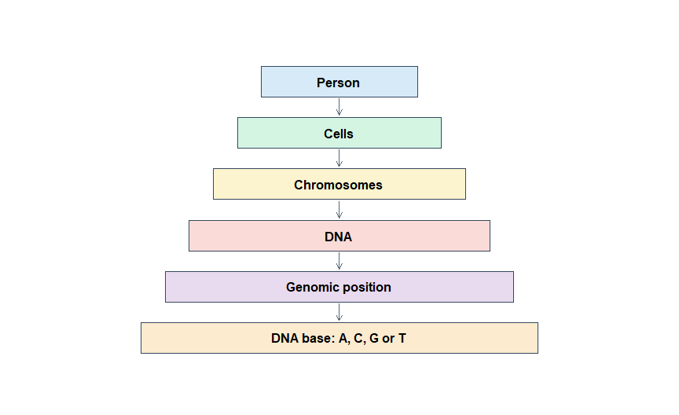
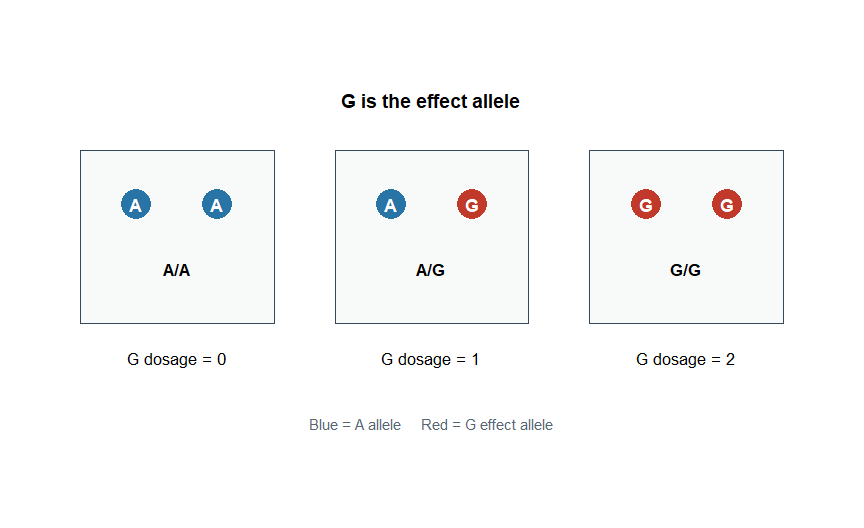
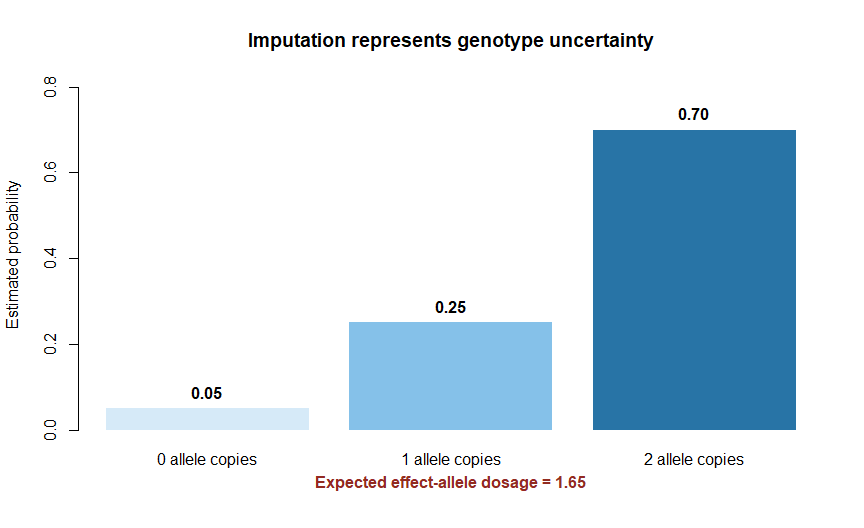

Chapter 2: Genetic Foundations for PRS
================

> **Course edition:** Foundation examples in Chapters 1–7 are
> self-contained mini-exercises. The shared synthetic CAD project starts
> in Chapter 8. They are not different versions of one clinical dataset.
> No miniature example provides clinical evidence.

# Why do we need genetics before calculating PRS?

In Chapter 1, we learned that a polygenic risk score combines
information from many genetic variants. To calculate that score
correctly, we must know exactly what is being counted.

This chapter explains the minimum genetics needed for PRS analysis. It
does not attempt to teach all of molecular biology. The aim is to help a
beginner understand genotype files, scoring files and later
quality-control steps. The worked examples assume biallelic variants
(two possible alleles) on diploid autosomes (two chromosome copies). Sex
chromosomes, copy-number changes and sites with more than two alleles
require additional handling. All sample genotypes and weights in the
exercises are fictional.

> **Central idea:** A PRS does not simply count “bad genes.” It counts
> copies—or estimated copies—of specifically defined effect alleles and
> multiplies those dosages by corresponding weights.

# Learning objectives

By the end of this chapter, you should be able to:

1.  describe the relationship between DNA, chromosomes and the genome;
2.  explain what a genetic variant, SNP, allele and genotype are;
3.  distinguish homozygous and heterozygous genotypes;
4.  code a genotype as 0, 1 or 2 copies of an effect allele;
5.  distinguish reference, alternate, minor and effect alleles;
6.  calculate an allele frequency from observed genotypes;
7.  explain why imputed dosage can be a decimal;
8.  distinguish genotype from phenotype;
9.  describe why ancestry and linkage disequilibrium matter for PRS; and
10. recognize the essential columns in simple genotype and scoring data.

# 1. From a person to a genetic variant

The following hierarchy helps us move from the whole organism to the
small genetic units used in PRS.

<div class="figure" style="text-align: center">


<p class="caption">

Figure 2.1: A simplified hierarchy from a person to a DNA base. A PRS
uses variation observed at many genomic positions.
</p>

</div>

## 1.1 DNA

**DNA**, or deoxyribonucleic acid, stores biological information. DNA
can be thought of as a very long text written with four chemical
letters:

- A: adenine
- C: cytosine
- G: guanine
- T: thymine

The order of these letters is called the **DNA sequence**.

A tiny section might look like this:

``` text
... A C T G A A C T G ...
```

Most DNA sequence is shared among people, but some positions vary. Those
differences are the raw material used in GWAS and PRS.

## 1.2 Chromosomes

DNA is packaged into structures called **chromosomes**. Most nucleated
human body cells contain 23 chromosome pairs:

- 22 pairs of autosomes, numbered 1 to 22; and
- one pair of sex chromosomes.

For each autosomal pair, one chromosome was inherited from the person’s
biological mother and one from the biological father. This is why a
person usually has two allele copies at an autosomal position.

Sex chromosomes require additional handling because copy number differs
among individuals. Most beginner PRS examples therefore start with
autosomal variants.

## 1.3 Genome

The **genome** is the complete set of a person’s genetic material. A
genomic analysis does not necessarily measure every DNA base directly.
Genotyping arrays, sequencing and statistical imputation provide
different types and levels of coverage.

## 1.4 Gene

A **gene** is a DNA sequence that contributes to a functional product,
such as a protein or functional RNA. However, a PRS is not simply a list
of genes.

Variants used in a PRS may be:

- inside genes;
- near genes;
- between genes;
- regulatory; or
- correlated with an unmeasured functional variant.

Therefore, the phrase “gene score” is usually an inaccurate description
of a genome-wide PRS.

# 2. What is a genetic variant?

A **genetic variant** is a difference in DNA sequence at a genomic
location. Variants can include:

- single-base changes;
- short insertions;
- short deletions;
- copy-number changes; and
- larger structural changes.

Most standard PRS analyses focus primarily on single-base variants.

## 2.1 Single-nucleotide variant and SNP

A **single-nucleotide variant**, or SNV, is a difference at one DNA
base.

For example, compare one chromosome sequence from each of two people:

| Base position in this short sequence | 1   | 2   | 3   | 4     | 5   |
|--------------------------------------|-----|-----|-----|-------|-----|
| Sequence from person 1               | A   | C   | T   | **A** | G   |
| Sequence from person 2               | A   | C   | T   | **G** | G   |

At position 4, one sequence contains A and the other contains G. This
shows one sequence per person, not their full two-copy genotype.

The term **single-nucleotide polymorphism**, or **SNP**, is commonly
used for a single-base variant observed in a population. “SNP” is
pronounced *snip*.

In contemporary genomic writing, **variant** is often the safest general
term. The exact historical distinction between *mutation* and
*polymorphism* is not needed to calculate a PRS.

## 2.2 Genomic coordinates

A variant can be identified using:

- chromosome;
- base-pair position; and
- alleles.

For example:

``` text
Illustrative coordinate only; not an identified biological variant
Chromosome: 6
Position:   32,626,565
Build:      GRCh38
Alleles:    A and G
```

The position is meaningful only when the **reference-genome build** is
stated. Common human builds include GRCh37, often called hg19, and
GRCh38, often called hg38.

The same biological variant can have different numerical positions in
different genome builds. Treating GRCh37 coordinates as GRCh38
coordinates can match the wrong position or lose the variant entirely.

## 2.3 rs identifiers

Many variants have a dbSNP identifier beginning with `rs`, such as
`rs123456`.

An rs identifier is convenient, but a robust workflow should still
record:

- chromosome;
- position;
- genome build;
- effect allele; and
- the other allele.

Some variants have no rs identifier, and identifiers can occasionally be
merged or updated.

# 3. What is an allele?

An **allele** is one possible DNA sequence observed at a genomic
location.

Suppose a variant has two alleles:

``` text
A and G
```

At an autosomal position, a person normally receives one allele copy
from each biological parent. The possible unordered genotypes are:

``` text
A/A
A/G
G/G
```

The slash separates the two inherited copies. In most unphased genotype
data, A/G and G/A mean the same observed genotype because the data do
not assign alleles to particular chromosome copies. **Phasing**
estimates which alleles at different positions lie together on the same
chromosome; it does not automatically identify which parent supplied
that chromosome.

A variant with two possible alleles in the population is **biallelic**.
A site can have more than two alleles across a population even though a
diploid person ordinarily carries only two copies at that site. The
simple tables below assume biallelic sites. \[2,5\]

## 3.1 Homozygous and heterozygous

| Genotype | Term             | Meaning                    |
|----------|------------------|----------------------------|
| A/A      | Homozygous for A | Both copies are A          |
| A/G      | Heterozygous     | One copy is A and one is G |
| G/G      | Homozygous for G | Both copies are G          |

These words describe the genotype. They do not indicate whether the
genotype is harmful, protective or clinically important.

# 4. The allele labels that beginners commonly confuse

One allele can have several labels depending on the purpose of the
dataset. These labels are not synonyms.

| Label | What it means | Important warning |
|----|----|----|
| **Reference allele** | The allele represented in the chosen reference genome | It is not automatically the common, healthy or ancestral allele |
| **Alternate allele** | An allele different from the reference allele in a variant record | It is not automatically the effect or risk allele |
| **Minor allele** | The less frequent allele in a specified population or dataset | It may differ between populations and is not automatically the effect allele |
| **Major allele** | The more frequent allele in a specified population or dataset | It is not automatically the reference allele |
| **Effect allele** | The allele whose copies are counted and multiplied by the reported weight | This is the critical allele for PRS calculation |
| **Other allele** | The allele against which the effect allele is defined | It helps detect alignment errors |
| **Ancestral allele** | An estimate of the allele present in a common ancestor | It is not automatically the reference or non-risk allele |

> **PRS rule:** Count the allele explicitly defined as the effect allele
> in the scoring file. Never assume that it is the alternate or minor
> allele.

# 5. From genotype to effect-allele dosage

Suppose the alleles are A and G, and **G is the effect allele**.

| Genotype | Number of G copies | PRS dosage for G |
|----------|-------------------:|-----------------:|
| A/A      |                  0 |                0 |
| A/G      |                  1 |                1 |
| G/G      |                  2 |                2 |

This is called **additive coding** because each additional effect-allele
copy adds one more unit of dosage before multiplication by the variant
weight.

<div class="figure" style="text-align: center">


<p class="caption">

Figure 2.2: Effect-allele dosage depends on which allele is counted.
Here, G is the effect allele.
</p>

</div>

## 5.1 Why the effect allele changes everything

If **A** were the effect allele instead, the coding would reverse:

| Genotype | G as effect allele | A as effect allele |
|----------|-------------------:|-------------------:|
| A/A      |                  0 |                  2 |
| A/G      |                  1 |                  1 |
| G/G      |                  2 |                  0 |

The genotype has not changed. Only the definition of the counted allele
has changed.

This is why a PRS calculation can be seriously wrong even when the
correct variants are present: counting the wrong allele with the
original weight can reverse which genotypes receive the larger
contribution.

For a biallelic diploid site, A dosage = 2 - G dosage. If a model is
deliberately rewritten to count A instead of G, its coefficient changes
sign and its constant term must also be accounted for. Simply swapping
the allele label is not a valid conversion. When applying a published
score, retain its specified allele and weight. \[7,11\]

## 5.2 Connecting dosage to the score

Suppose G has a weight of 0.12.

``` text
Variant contribution = G dosage × 0.12
```

| Genotype | G dosage | Weight | Contribution |
|----------|---------:|-------:|-------------:|
| A/A      |        0 |   0.12 |         0.00 |
| A/G      |        1 |   0.12 |         0.12 |
| G/G      |        2 |   0.12 |         0.24 |

Now suppose G has a weight of -0.12.

| Genotype | G dosage | Weight | Contribution |
|----------|---------:|-------:|-------------:|
| A/A      |        0 |  -0.12 |         0.00 |
| A/G      |        1 |  -0.12 |        -0.12 |
| G/G      |        2 |  -0.12 |        -0.24 |

The number of G copies is unchanged. The sign of the published weight
determines whether G raises or lowers that score.

# 6. Genotype call versus imputed dosage

## 6.1 Genotype calls

A genotyping array measures a selected set of variants. Software may
assign the most likely genotype as:

``` text
0, 1 or 2 effect-allele copies
```

This discrete result is often called a **hard call**. It is an inference
from measurement data and can contain errors. Hard calls can also be
derived from imputation probabilities, so ‘hard-called’ does not
necessarily mean directly genotyped.

## 6.2 Why are genotypes imputed?

No genotyping array directly measures every common variant. **Genotype
imputation** uses observed genotype patterns and a reference panel to
estimate unmeasured genotypes.

An everyday analogy is completing a partly missing sentence from
familiar language patterns. The missing word is not directly observed;
it is inferred from surrounding information and a reference.

Imputation can improve genomic coverage, but its accuracy varies across
variants, reference panels and populations. Poorly imputed variants
should not be treated as perfectly measured.

## 6.3 Genotype probabilities

For an imputed variant, software may estimate the probabilities of
carrying 0, 1 or 2 effect-allele copies.

Consider:

``` text
Probability of genotype with 0 copies = 0.05
Probability of genotype with 1 copy = 0.25
Probability of genotype with 2 copies = 0.70
```

The expected dosage is:

``` text
Dosage = (0 × 0.05) + (1 × 0.25) + (2 × 0.70)
       = 0.00 + 0.25 + 1.40
       = 1.65
```

<div class="figure" style="text-align: center">


<p class="caption">

Figure 2.3: Example genotype probabilities for an imputed variant. Their
probability-weighted average produces an effect-allele dosage of 1.65.
</p>

</div>

A dosage of 1.65 does **not** mean that the person physically has 1.65
allele copies. It is the expected number of copies after accounting for
uncertainty.

## 6.4 Hard call versus dosage

Using the preceding probabilities:

- the most likely hard call is 2;
- the expected dosage is 1.65.

The dosage uses the genotype probabilities instead of discarding them to
select a single genotype. However, it does not preserve the full
uncertainty: probabilities (0, 1, 0) and (0.5, 0, 0.5) both give dosage
1, despite very different confidence. Many PRS tools can use dosage data
directly. \[6,7\]

Imputation quality metrics, often reported using names such as INFO or
imputation R-squared, summarize how reliably a variant was imputed
across the sample. Exact definitions differ between software, so
thresholds and metric names must be documented.

# 7. Allele frequency

**Allele frequency** is the proportion of observed chromosome copies
carrying a particular allele in a defined sample or population.

Suppose five people have these genotypes:

``` text
Person 1: A/A
Person 2: A/G
Person 3: G/G
Person 4: A/G
Person 5: A/A
```

Each person contributes two autosomal allele copies, giving 10 copies in
total.

The number of G copies is:

``` text
0 + 1 + 2 + 1 + 0 = 4
```

Therefore:

``` text
Frequency of G = 4 / 10 = 0.40
Frequency of A = 6 / 10 = 0.60
```

``` r
genotype_data <- data.frame(
  Person = paste("Person", 1:5),
  Genotype = c("A/A", "A/G", "G/G", "A/G", "A/A"),
  G_dosage = c(0, 1, 2, 1, 0)
)

genotype_data
#>     Person Genotype G_dosage
#> 1 Person 1      A/A        0
#> 2 Person 2      A/G        1
#> 3 Person 3      G/G        2
#> 4 Person 4      A/G        1
#> 5 Person 5      A/A        0

observed <- !is.na(genotype_data$G_dosage)
number_of_people <- sum(observed)
stopifnot(number_of_people > 0)
total_allele_copies <- 2 * number_of_people
number_of_G_alleles <- sum(genotype_data$G_dosage[observed])
frequency_G <- number_of_G_alleles / total_allele_copies
frequency_A <- 1 - frequency_G

frequency_G
#> [1] 0.4
frequency_A
#> [1] 0.6
```

The denominator includes only people with a non-missing genotype at this
site. If one genotype is missing, its two copies are excluded from both
numerator and denominator. Missing is not the same as zero copies. With
imputed dosages, the same calculation estimates frequency using expected
rather than observed counts.

## 7.1 Minor allele frequency

For a biallelic variant, the **minor allele frequency**, abbreviated as
**MAF**, is the frequency of the less common allele in the specified
dataset or population.

In the example:

- G frequency is 0.40;
- A frequency is 0.60; and
- G is the minor allele in this small sample.

But G could be the major allele in another population. “Minor allele” is
therefore not a permanent biological identity.

## 7.2 Why allele frequency matters for PRS

Allele frequency affects:

- how much a variant contributes to differences between people;
- the precision of its GWAS effect estimate;
- quality-control decisions;
- the ability to align ambiguous variants; and
- score distributions across populations.

A rare effect allele may have a large published weight but occur in very
few target participants. A common effect allele with a modest weight may
influence the score distribution more broadly.

# 8. Common and rare variants

Variants are often described as common, low-frequency or rare. Exact
cutoffs vary by study and purpose. A commonly used practical convention
is:

| Informal category | Example frequency range |
|-------------------|------------------------:|
| Common            |      MAF of at least 5% |
| Low-frequency     | MAF from 1% to below 5% |
| Rare              |            MAF below 1% |

These are conventions, not laws of biology. Always state the population
and cutoff. At a biallelic site with both allele frequencies equal to
0.50, neither allele is uniquely the minor allele.

Historically, many PRSs have focused on common variants because GWAS and
genotyping arrays were designed to study them efficiently.
Sequencing-based scores may also include rarer variants, but
rare-variant estimation requires suitable sample size, quality control
and modelling.

# 9. Genotype versus phenotype

These two words must remain distinct.

## 9.1 Genotype

A **genotype** is the allele combination observed or estimated for a
person at a genetic location.

Examples:

``` text
A/A
A/G
G/G
```

Genotype can also refer more broadly to a person’s genetic profile
across many locations.

## 9.2 Phenotype

A **phenotype** is an observable or measured trait or outcome.

Examples include:

- disease status;
- height;
- blood pressure;
- cholesterol level;
- age at disease onset; and
- response to a medicine.

## 9.3 Why the distinction matters

GWAS estimates associations between genotype and phenotype. PRS then
combines genotype information using weights learned for a specific
phenotype.

``` text
Genotypes + GWAS-derived weights → PRS

PRS + phenotype data → evaluation of prediction
```

The target phenotype must match the score’s intended outcome. A score
developed for type 2 diabetes should not be relabelled as a general
“metabolic disease score.”

# 10. Inheritance, recombination and polygenic variation

A person inherits chromosome segments from each biological parent.
During the production of egg and sperm cells, paired chromosomes
exchange segments through **recombination**.

As a result:

- siblings usually inherit different combinations of parental chromosome
  segments;
- siblings can have different PRSs;
- a child’s PRS is not necessarily the exact average of the parents’
  standardized scores; and
- genetic variants located near one another may be inherited together.

PRS is therefore not a simple count of whether a disease “runs in the
family.” It uses the particular collection of alleles observed in the
individual.

# 11. Linkage disequilibrium: a first introduction

Nearby variants are sometimes correlated because particular allele
combinations are inherited together more often than expected by chance.
This non-random correlation is called **linkage disequilibrium**,
abbreviated as **LD**.

Imagine three nearby spelling differences that almost always travel
together on the same copied page. Observing one difference provides
information about the others. Counting all three as completely
independent evidence could overcount the same regional signal.

Different PRS methods handle LD differently:

- clumping removes many correlated variants;
- LDpred2 and PRS-CS model correlation using an LD reference; and
- a published fixed score uses whatever LD strategy its developers
  selected.

Physical proximity does not guarantee strong LD, and correlation can
also occur over longer distances. Later chapters will explain LD and
reference panels in detail. \[5,7\]

# 12. Genetic ancestry and population structure

Human populations have shared history, migration, mixing and differences
in average allele frequencies and LD patterns. These continuous patterns
of genetic similarity are relevant to PRS development and
transferability.

**Genetic ancestry is not the same as race.** Race is a social
classification that changes across place and time. Genetic ancestry is
estimated from genetic similarity to reference samples and depends on
the available reference data and analytic method.

An ancestry label is also not a guarantee that every individual in that
group has the same genetic background.

Ancestry matters because a PRS developed in one population may perform
differently in another due to:

- different allele frequencies;
- different LD patterns;
- differences in GWAS sample size and representation;
- environmental and healthcare differences;
- phenotype-definition differences; and
- statistical interactions among these factors.

**Population structure** means systematic genetic differences within a
sample, often related to ancestry. If disease occurrence also differs
between those groups for other reasons, an unadjusted GWAS can mistake
those group differences for a variant–disease association.

**Principal components**, or PCs, are numerical summaries of major
patterns of genetic variation. Researchers often adjust for them, but
PCs do not solve every confounding, portability or equity problem.
\[7,12\]

# 13. What genetic data look like

## 13.1 A simplified target-genotype table

| Person | Variant   | Allele 1 | Allele 2 | G dosage |
|--------|-----------|----------|----------|---------:|
| P001   | rsExample | A        | A        |        0 |
| P002   | rsExample | A        | G        |        1 |
| P003   | rsExample | G        | G        |        2 |

Real genotype data are stored in efficient formats such as PLINK
BED/BIM/FAM, PGEN/PVAR/PSAM, VCF or BCF rather than a simple
spreadsheet.

For a real file, check the meaning of its allele columns rather than
assuming ‘allele 1’ means the PRS effect allele. PLINK BED stores hard
calls; dosage-preserving formats are needed when retaining imputation
dosage. Consult the format and import documentation for the chosen tool.
\[13\]

## 13.2 A simplified scoring file

| Variant   | Effect allele | Other allele | Effect weight |
|-----------|---------------|--------------|--------------:|
| rsExample | G             | A            |          0.12 |

To calculate the contribution for P002:

``` text
G dosage = 1
Effect weight = 0.12
Contribution = 1 × 0.12 = 0.12
```

## 13.3 The same data coded incorrectly

Suppose an analyst mistakenly counts A instead of G for P002. Because
P002 is heterozygous, the dosage remains 1 and the mistake is hidden.

For P001 and P003, however, the error reverses the coding:

| Person    | True G dosage | Incorrect A dosage |
|-----------|--------------:|-------------------:|
| P001: A/A |             0 |                  2 |
| P002: A/G |             1 |                  1 |
| P003: G/G |             2 |                  0 |

Looking only at heterozygous samples is therefore insufficient for
validating allele alignment.

# 14. Practical protocol: interpret one variant correctly

Use this protocol before calculating any PRS contribution.

## Step 1: Confirm variant identity

Record:

``` text
Chromosome
Position
Genome build
rs identifier, when available
```

Do not match variants by position without confirming the genome build.

## Step 2: Read both alleles in the target data

For example:

``` text
Target alleles: A and G
```

Do not assume the target alternate allele is the scoring effect allele.

## Step 3: Read the scoring effect allele

For example:

``` text
Effect allele: G
Other allele:  A
```

The effect allele is the one to count.

## Step 4: Confirm allele compatibility

The target and scoring alleles should represent the same biological
alleles after appropriate strand and genome-build checks.

Possible matches include direct and strand-complement matches. Ambiguous
A/T and C/G variants require particular care because strand reversal
does not change the unordered allele pair.

DNA has two complementary strands: A pairs with T, and C pairs with G.
Thus an A/G allele pair on one strand can be represented as T/C on the
other. A strand complement is different from swapping the effect allele
with the other allele.

For A/T and C/G sites, the allele letters alone cannot resolve strand
orientation. Frequency information from a suitable comparison sample can
sometimes help, but is less informative near frequency 0.50. Unresolved
variants should be excluded or handled using a documented method, rather
than guessed. Full harmonization will be covered in a later chapter.
\[7\]

## Step 5: Count or estimate effect-allele copies

For G as the effect allele:

``` text
A/A → 0
A/G → 1
G/G → 2
```

If dosage data are available, use the estimated dosage according to the
selected software protocol.

## Step 6: Multiply dosage by weight

``` text
Contribution = effect-allele dosage × effect weight
```

## Step 7: Record uncertainty and quality

Check whether the genotype was:

- directly genotyped;
- imputed with high quality;
- imputed with low quality; or
- missing.

Do not silently convert poor-quality or missing information into a
confident genotype.

# 15. Worked practice example

Consider this scoring information:

``` text
Variant:       rsPractice
Genome build:  GRCh38
Alleles:       C and T
Effect allele: T
Weight:        -0.07
```

Three people have these genotypes:

``` r
practice_data <- data.frame(
  Person = c("P101", "P102", "P103"),
  Genotype = c("C/C", "C/T", "T/T"),
  T_dosage = c(0, 1, 2),
  Weight = rep(-0.07, 3)
)

practice_data$Contribution <- practice_data$T_dosage * practice_data$Weight
practice_data
#>   Person Genotype T_dosage Weight Contribution
#> 1   P101      C/C        0  -0.07         0.00
#> 2   P102      C/T        1  -0.07        -0.07
#> 3   P103      T/T        2  -0.07        -0.14
```

Interpretation:

- P101 contributes 0.00 from this variant.
- P102 contributes -0.07.
- P103 contributes -0.14.

This does not prove that T biologically protects against disease. It
means that T has a negative weight in this particular score under the
model and allele definition used by its developers.

# 16. Common mistakes

| Mistake | Why it is wrong | Safer practice |
|----|----|----|
| Treating reference allele as effect allele | The labels serve different purposes | Read the effect-allele column explicitly |
| Assuming the minor allele is always risky | Frequency and effect direction are different concepts | Keep frequency and weight information separate |
| Forgetting the genome build | Coordinates can differ between GRCh37 and GRCh38 | Record the build for every positional dataset |
| Calling an imputed dosage a physical allele count | A decimal dosage represents an expectation under uncertainty | Distinguish hard calls, probabilities and dosage |
| Treating an rs identifier as sufficient | IDs can be absent, changed or merged | Confirm position, build and alleles |
| Ignoring the other allele | Allele alignment errors become harder to detect | Retain both effect and other alleles |
| Interpreting a negative contribution as proof of protection | PRS weights are predictive association estimates | Interpret within the documented scoring model |
| Equating genetic ancestry with race | They are different biological and social concepts | Describe ancestry estimation and reference data transparently |
| Assuming all nearby variants are independent | LD creates correlation among variants | Use the LD strategy appropriate to the PRS method |
| Treating missing genotype as dosage zero | Missing information is not evidence of zero copies | Follow and report an explicit missing-data rule |

# 17. Knowledge check

## Question 1

At an autosomal A/G variant, G is the effect allele. What are the
dosages for A/A, A/G and G/G?

<details>

<summary>

Show answer
</summary>

``` text
A/A = 0
A/G = 1
G/G = 2
```

</details>

## Question 2

If A becomes the effect allele at the same variant, what happens to the
coding?

<details>

<summary>

Show answer
</summary>

``` text
A/A = 2
A/G = 1
G/G = 0
```

The observed genotypes have not changed. Only the counted allele has
changed.

</details>

## Question 3

Ten unrelated diploid people have a total of six copies of allele T at
an autosomal variant. What is the frequency of T in this sample?

<details>

<summary>

Show answer
</summary>

Ten people provide 20 allele copies.

``` text
T frequency = 6 / 20 = 0.30
```

</details>

## Question 4

An imputed dosage is 1.72. Does the person physically carry 1.72 copies
of the allele?

<details>

<summary>

Show answer
</summary>

No. The dosage is the expected number of effect-allele copies calculated
from genotype uncertainty. The physical genotype still has a discrete
number of copies.

</details>

## Question 5

Why must a chromosome position include a genome build?

<details>

<summary>

Show answer
</summary>

The numerical coordinate of the same biological variant can differ
between reference-genome builds. Without the build, the position is
incomplete and may be matched incorrectly.

</details>

## Question 6

Which allele should be counted for a PRS?

A. Always the minor allele  
B. Always the alternate allele  
C. The allele explicitly defined as the effect allele in the scoring
file  
D. Whichever allele has a positive name

<details>

<summary>

Show answer
</summary>

**Answer: C.** The scoring effect allele is the allele whose dosage is
multiplied by the corresponding weight.

</details>

# 18. Key takeaways

1.  DNA is packaged into chromosomes, and the genome contains a person’s
    complete genetic material.
2.  A genetic variant is a DNA-sequence difference at a genomic
    location.
3.  A SNP is a common type of single-base genetic variant used widely in
    PRS.
4.  An allele is one possible sequence at a location; a genotype is a
    person’s allele combination.
5.  For an autosomal biallelic variant, effect-allele dosage is commonly
    coded as 0, 1 or 2.
6.  Reference, alternate, minor and effect alleles describe different
    properties.
7.  The effect allele—not automatically the minor or alternate allele—is
    counted for PRS.
8.  An imputed dosage can be decimal because it represents an expected
    allele count under uncertainty.
9.  Allele frequency is population- and dataset-specific.
10. PRS weights relate genotype information to a defined phenotype.
11. LD means that nearby variants may be correlated rather than
    independent.
12. Genetic ancestry influences allele frequencies, LD and PRS
    portability, but it is not the same as race.

# 19. What comes next?

Chapter 3 will explain how a genome-wide association study produces
effect estimates used to develop PRS weights. Final weights may differ
from the original GWAS estimates because PRS methods can adjust them. We
will introduce cases, controls, quantitative traits, beta coefficients,
odds ratios, standard errors, confidence intervals, P values and sample
size using beginner-friendly examples.

# References

1.  National Human Genome Research Institute. **Chromosome.** Talking
    Glossary of Genomic and Genetic Terms. Available at:
    <https://www.genome.gov/genetics-glossary/Chromosome>

2.  National Human Genome Research Institute. **Allele.** Talking
    Glossary of Genomic and Genetic Terms. Available at:
    <https://www.genome.gov/genetics-glossary/Allele>

3.  National Human Genome Research Institute. **Single Nucleotide
    Polymorphisms (SNPs).** Talking Glossary of Genomic and Genetic
    Terms. Available at:
    <https://www.genome.gov/genetics-glossary/Single-Nucleotide-Polymorphisms-SNPs>

4.  National Human Genome Research Institute. **Genome-Wide Association
    Studies (GWAS).** Talking Glossary of Genomic and Genetic Terms.
    Available at:
    <https://www.genome.gov/genetics-glossary/Genome-Wide-Association-Studies-GWAS>

5.  Auton A, Brooks LD, Durbin RM, et al. **A global reference for human
    genetic variation.** *Nature.* 2015;526:68–74.
    <https://doi.org/10.1038/nature15393>

6.  Browning BL, Zhou Y, Browning SR. **A one-penny imputed genome from
    next-generation reference panels.** *American Journal of Human
    Genetics.* 2018;103:338–348.
    <https://doi.org/10.1016/j.ajhg.2018.07.015>

7.  Choi SW, Mak TSH, O’Reilly PF. **Tutorial: a guide to performing
    polygenic risk score analyses.** *Nature Protocols.*
    2020;15:2759–2772. <https://doi.org/10.1038/s41596-020-0353-1>

8.  Lambert SA, Gil L, Jupp S, et al. **The Polygenic Score Catalog as
    an open database for reproducibility and systematic evaluation.**
    *Nature Genetics.* 2021;53:420–425.
    <https://doi.org/10.1038/s41588-021-00783-5>

9.  Lambert SA, Wingfield B, Gibson JT, et al. **Enhancing the Polygenic
    Score Catalog with tools for score calculation and ancestry
    normalization.** *Nature Genetics.* 2024.
    <https://doi.org/10.1038/s41588-024-01937-x>

10. European Bioinformatics Institute. **Calculating PGS: a worked
    example.** PGS Catalog training course. Available at:
    <https://www.ebi.ac.uk/training/online/courses/polygenic-scores-pgs-catalog/what-polygenic-scores/developing-calculating-pgs/calculating-pgs/>

11. Polygenic Score Catalog. **Scoring file format and download
    information.** Available at: <https://www.pgscatalog.org/downloads/>

12. Martin AR, Kanai M, Kamatani Y, Okada Y, Neale BM, Daly MJ.
    **Clinical use of current polygenic risk scores may exacerbate
    health disparities.** *Nature Genetics.* 2019;51:584–591.
    <https://doi.org/10.1038/s41588-019-0379-x>

13. PLINK 2.0. **File format reference.** Available at:
    <https://www.cog-genomics.org/plink/2.0/formats>
