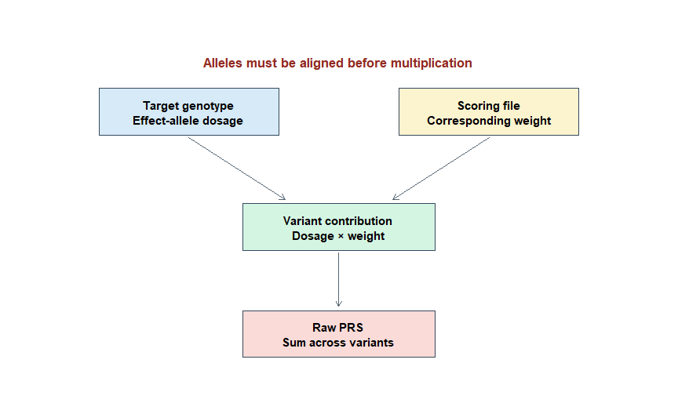
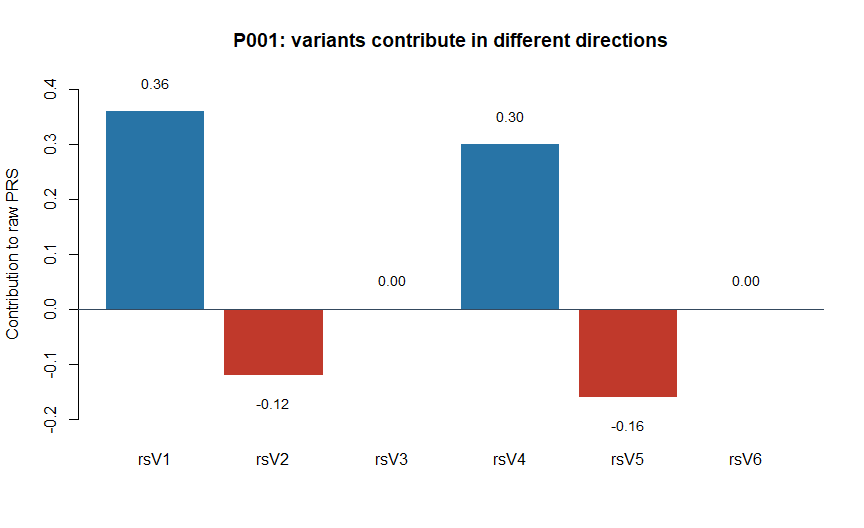
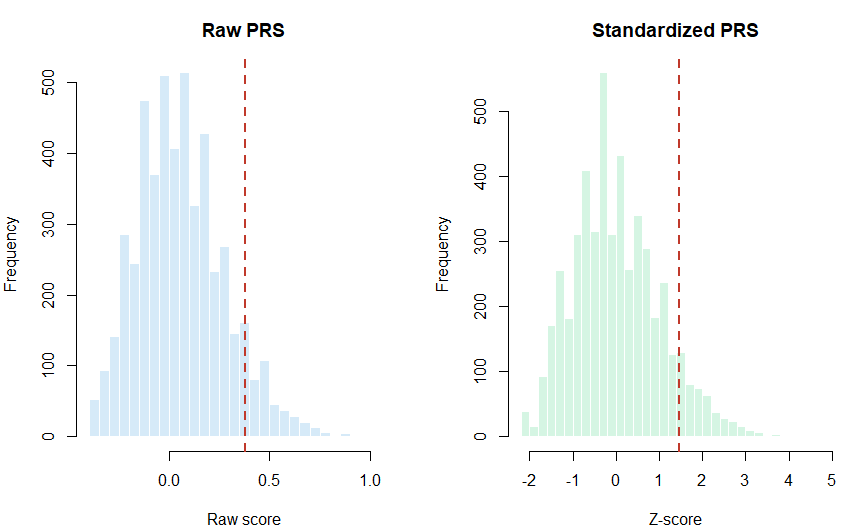
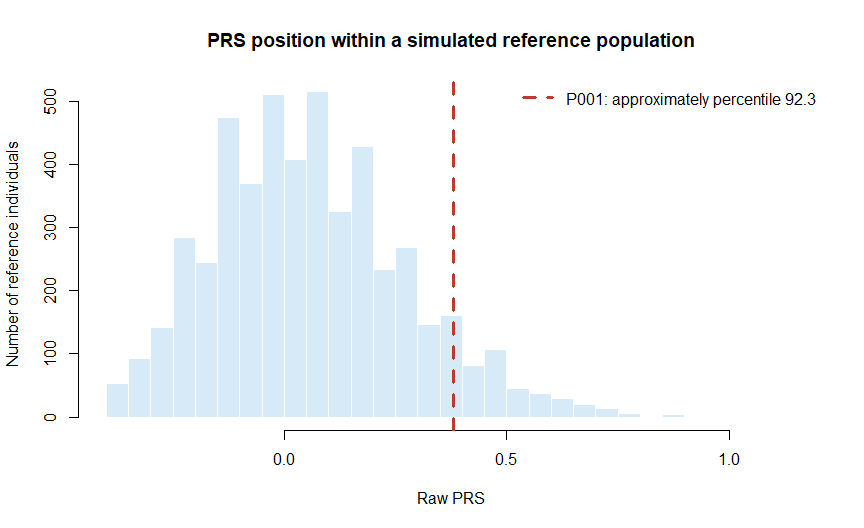
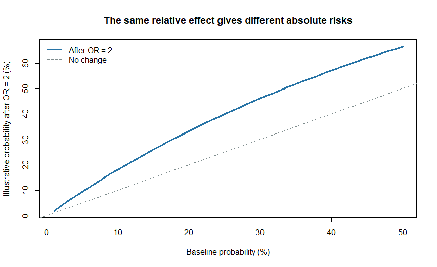

Chapter 4: How Is a PRS Calculated?
================

# Why devote a complete chapter to one calculation?

The basic PRS formula is short. That can make the analysis appear easier
than it is.

In practice, every part of the calculation contains a scientific
decision:

- Which variants are included?
- Which allele is counted?
- Are genotypes observed or imputed?
- Which weights are used?
- How are missing variants handled?
- Is the reported value a sum, average, standardized score or
  percentile?
- Which population provides the reference distribution?

If any of these questions is answered incorrectly, the software may
still produce a number. The number may simply be wrong or
uninterpretable.

> **Central idea:** The raw PRS is a weighted sum. Its interpretation
> depends on the scoring model, variant coverage and a relevant
> reference population.

# Learning objectives

By the end of this chapter, you should be able to:

1.  calculate a raw PRS by hand;
2.  calculate scores for several people using R;
3.  explain positive, negative and zero variant contributions;
4.  distinguish a score sum from a score average;
5.  explain how imputed dosages enter the calculation;
6.  describe why missing scoring variants matter;
7.  calculate centred and standardized scores;
8.  calculate an empirical percentile;
9.  explain why different PRS models have different scales;
10. distinguish raw PRS, relative genetic position and absolute disease
    risk; and
11. report a PRS calculation reproducibly.

# 1. The basic calculation

For one person, the additive PRS is:

``` text
PRS = sum of (effect-allele dosage × variant weight)
```

Expanded across M variants:

``` text
PRS = (dosage at variant 1 × weight 1)
    + (dosage at variant 2 × weight 2)
    + ...
    + (dosage at variant M × weight M)
```

Where:

- **M** is the number of scoring variants;
- **dosage** is the observed or estimated number of effect-allele
  copies; and
- **weight** is the coefficient assigned to that effect allele by the
  PRS model.

The multiplication occurs variant by variant. The products are then
added. All worked genotypes and weights here are fictional. The examples
assume diploid autosomal sites, one scoring effect allele per variant,
and completed allele harmonization. They do not assess anyone’s health.
\[1,2\]

<div class="figure" style="text-align: center">


<p class="caption">

Figure 4.1: Anatomy of an additive PRS calculation. Each matched
effect-allele dosage is multiplied by its corresponding weight before
the contributions are summed.
</p>

</div>

# 2. What stays fixed and what can change?

For a given person and genetic position, the biological genotype is
fixed. Other parts of the score depend on the model and dataset.

| Component | Fixed or variable? | Explanation |
|----|----|----|
| Person’s genotype | Biologically fixed | The inherited alleles do not change because a different PRS method is selected |
| Imputed dosage | Can vary | It depends on genotype data, reference panel and imputation method |
| Effect allele | Defined by the score | A different scoring file may count the opposite allele |
| Variant weight | Model-dependent | Different GWAS or PRS methods can assign different weights |
| Included variants | Model-dependent | Methods select or shrink variants differently |
| Raw-score scale | Model-dependent | It depends on the variants and weights |
| Standardized score | Reference-dependent | It depends on the reference mean and standard deviation |
| Percentile | Reference-dependent | It depends on the chosen comparison population |

This explains why the same person can receive different numerical scores
from different valid PRS models for the same disease.

# 3. Calculate one person’s PRS by hand

Consider a fictional six-variant scoring file.

| Variant | Effect allele | Other allele | Weight |
|---------|---------------|--------------|-------:|
| rsV1    | G             | A            |   0.18 |
| rsV2    | T             | C            |  -0.12 |
| rsV3    | A             | G            |   0.05 |
| rsV4    | C             | T            |   0.30 |
| rsV5    | G             | C            |  -0.08 |
| rsV6    | A             | T            |   0.10 |

Person P001 has the following effect-allele dosages:

| Variant | Effect-allele dosage | Weight | Contribution |
|---------|---------------------:|-------:|-------------:|
| rsV1    |                    2 |   0.18 |         0.36 |
| rsV2    |                    1 |  -0.12 |        -0.12 |
| rsV3    |                    0 |   0.05 |         0.00 |
| rsV4    |                    1 |   0.30 |         0.30 |
| rsV5    |                    2 |  -0.08 |        -0.16 |
| rsV6    |                    0 |   0.10 |         0.00 |

The calculation is:

``` text
PRS = (2 × 0.18)
    + (1 × -0.12)
    + (0 × 0.05)
    + (1 × 0.30)
    + (2 × -0.08)
    + (0 × 0.10)

PRS = 0.36 - 0.12 + 0.00 + 0.30 - 0.16 + 0.00
PRS = 0.38
```

## 3.1 The same calculation in R

``` r
score_file <- data.frame(
  Variant = c("rsV1", "rsV2", "rsV3", "rsV4", "rsV5", "rsV6"),
  Effect_allele = c("G", "T", "A", "C", "G", "A"),
  Other_allele = c("A", "C", "G", "T", "C", "T"),
  Weight = c(0.18, -0.12, 0.05, 0.30, -0.08, 0.10)
)

p001_dosage <- c(2, 1, 0, 1, 2, 0)

p001_calculation <- data.frame(
  score_file,
  Dosage = p001_dosage
)

p001_calculation$Contribution <-
  p001_calculation$Dosage * p001_calculation$Weight

p001_calculation
#>   Variant Effect_allele Other_allele Weight Dosage Contribution
#> 1    rsV1             G            A   0.18      2         0.36
#> 2    rsV2             T            C  -0.12      1        -0.12
#> 3    rsV3             A            G   0.05      0         0.00
#> 4    rsV4             C            T   0.30      1         0.30
#> 5    rsV5             G            C  -0.08      2        -0.16
#> 6    rsV6             A            T   0.10      0         0.00

p001_raw_prs <- sum(p001_calculation$Contribution)
p001_raw_prs
#> [1] 0.38
```

The R result should equal 0.38 to numerical precision.

``` r
stopifnot(isTRUE(all.equal(p001_raw_prs, 0.38)))
```

# 4. Positive, negative and zero contributions

A variant’s contribution depends on both dosage and weight.

``` text
Contribution = dosage × weight
```

Therefore:

- positive weight and positive dosage produce a positive contribution;
- negative weight and positive dosage produce a negative contribution;
- dosage zero produces zero contribution regardless of weight; and
- weight zero produces zero contribution regardless of dosage.

<div class="figure" style="text-align: center">


<p class="caption">

Figure 4.2: Variant-level contributions to P001’s raw score. Positive
bars raise this score and negative bars lower it.
</p>

</div>

## 4.1 A negative weight is not automatically “protective biology”

A negative weight means that the effect allele lowers the numerical
value of this particular score. It may reflect a negative association
with the phenotype under the model used to develop the score.

It does not prove that:

- the allele directly prevents disease;
- the variant is causal;
- carrying the allele removes other risk; or
- the same effect applies equally in every population.

# 5. Calculating PRS for several people

Suppose five people have dosages for the same six variants.

``` r
dosage_matrix <- matrix(
  c(
    2, 1, 0, 1, 2, 0,
    0, 2, 1, 0, 1, 2,
    1, 1, 2, 2, 0, 1,
    0, 0, 1, 1, 1, 0,
    2, 2, 2, 0, 2, 2
  ),
  nrow = 5,
  byrow = TRUE
)

rownames(dosage_matrix) <- paste0("P00", 1:5)
colnames(dosage_matrix) <- score_file$Variant

dosage_matrix
#>      rsV1 rsV2 rsV3 rsV4 rsV5 rsV6
#> P001    2    1    0    1    2    0
#> P002    0    2    1    0    1    2
#> P003    1    1    2    2    0    1
#> P004    0    0    1    1    1    0
#> P005    2    2    2    0    2    2
```

The score for every person can be calculated using matrix
multiplication.

``` r
weight_vector <- score_file$Weight

raw_scores <- as.numeric(dosage_matrix %*% weight_vector)

person_scores <- data.frame(
  Person = rownames(dosage_matrix),
  Raw_PRS = raw_scores
)

person_scores
#>   Person Raw_PRS
#> 1   P001    0.38
#> 2   P002   -0.07
#> 3   P003    0.86
#> 4   P004    0.27
#> 5   P005    0.26
```

For this matrix, the expected scores for P001 to P005 are 0.38, -0.07,
0.86, 0.27 and 0.26, respectively.

Matrix multiplication is only a fast way of performing the same
variant-by-variant calculation. It does not solve allele alignment,
missing variants or inappropriate weights.

## 5.1 Verify the dimensions

Before multiplication:

``` r
number_of_people <- nrow(dosage_matrix)
number_of_dosage_variants <- ncol(dosage_matrix)
number_of_weights <- length(weight_vector)

number_of_people
#> [1] 5
number_of_dosage_variants
#> [1] 6
number_of_weights
#> [1] 6

stopifnot(number_of_dosage_variants == number_of_weights)
stopifnot(identical(colnames(dosage_matrix), score_file$Variant))
```

The second check is more important than matching dimensions. Two vectors
can have the same length while their variants are in different orders.

Never assume row order is correct merely because the software does not
report an error.

# 6. Why variant matching must occur before multiplication

Consider two weight vectors:

``` r
correct_weights <- score_file$Weight

wrong_order <- score_file[c(2, 1, 3, 4, 5, 6), ]
incorrect_weights <- wrong_order$Weight

correct_score <- as.numeric(dosage_matrix["P001", ] %*% correct_weights)
incorrect_score <- as.numeric(dosage_matrix["P001", ] %*% incorrect_weights)

correct_score
#> [1] 0.38
incorrect_score
#> [1] 0.08
```

Both vectors contain six weights. The second calculation is wrong
because the first two weights were exchanged.

A safe workflow should:

1.  match variants using validated identifiers or coordinates;
2.  confirm genome build;
3.  align effect and other alleles;
4.  reorder the scoring file to match genotype columns;
5.  verify the match programmatically; and
6.  only then multiply dosage by weight.

A later chapter will provide a complete harmonization protocol. Matching
names alone cannot establish that the counted alleles are correct.

# 7. Observed genotype and imputed dosage

Effect-allele dosage does not have to be an integer.

| Data type | Example dosage | Interpretation |
|----|---:|----|
| Hard-called genotype | 0 | Most likely zero effect-allele copies |
| Hard-called genotype | 1 | Most likely one effect-allele copy |
| Hard-called genotype | 2 | Most likely two effect-allele copies |
| Imputed dosage | 1.73 | Expected allele count after accounting for genotype uncertainty |

Suppose the weight is 0.18:

``` r
imputed_dosage <- 1.73
weight <- 0.18

imputed_contribution <- imputed_dosage * weight
imputed_contribution
#> [1] 0.3114
```

The imputed contribution is:

``` text
1.73 × 0.18 = 0.3114
```

This retains more information than replacing 1.73 with the most likely
hard call of 2. However, poorly imputed variants can still introduce
error and require quality control.

# 8. Raw PRS

The **raw PRS** is the direct sum of weighted contributions.

For P001:

``` text
Raw PRS = 0.38
```

The raw value is useful because it preserves the score exactly as
calculated. But its numerical scale is usually not intuitive.

The value 0.38 is not automatically:

- 38% disease probability;
- 38% greater risk;
- the number of risk alleles;
- a percentile; or
- comparable with 0.38 from another scoring model.

## 8.1 Why raw scales differ

Raw scales differ because PRS models can contain:

- different numbers of variants;
- different effect alleles;
- different weight units;
- different levels of shrinkage;
- different phenotype transformations; and
- different missing-data rules.

A score containing two million tiny weights may have a smaller raw
numerical range than a score containing 100 larger weights. The raw
magnitude does not indicate model quality.

# 9. Score sum versus score average

Some software reports both a weighted sum and a weighted average.

Conceptually:

``` text
Score sum = sum of dosage × weight

Score average = score sum / software-defined denominator
```

The denominator may depend on the program, version, missing-genotype
handling and command options. It might involve the number of non-missing
alleles rather than simply the number of variants.

Therefore:

- do not call an average a sum;
- do not compare a sum from one program with an average from another;
- report the exact output field and options; and
- preserve the original score output before additional transformation.

For six fully observed diploid variants, PLINK 2’s usual allele
denominator is 12: a sum of 0.38 corresponds to an average of about
0.03167. Check options and missingness before assuming this denominator.
\[11\]

# 10. Centred PRS

A centred score subtracts a reference mean:

``` text
Centred PRS = raw PRS - reference mean
```

Interpretation:

- positive centred score: above the reference mean;
- zero: equal to the reference mean; and
- negative centred score: below the reference mean.

Centering changes the location of the scale but not the ordering or
spread.

``` r
small_reference_mean <- mean(person_scores$Raw_PRS)

person_scores$Centred_PRS <-
  person_scores$Raw_PRS - small_reference_mean

person_scores
#>   Person Raw_PRS Centred_PRS
#> 1   P001    0.38        0.04
#> 2   P002   -0.07       -0.41
#> 3   P003    0.86        0.52
#> 4   P004    0.27       -0.07
#> 5   P005    0.26       -0.08
```

The five-person dataset is too small to be a meaningful real reference
population. It is used only to demonstrate the arithmetic.

# 11. Standardized PRS

A standardized PRS, often called a Z-score, is:

``` text
Standardized PRS = (raw PRS - reference mean) / reference standard deviation
```

Interpretation:

- 0 means equal to the reference mean;
- +1 means one reference standard deviation above the mean;
- -1 means one reference standard deviation below the mean; and
- +2 means two reference standard deviations above the mean.

## 11.1 Simulate a larger reference population

We will create a teaching reference population using the six fictional
variants. The simulation draws variants independently and assumes
Hardy–Weinberg genotype proportions within each site. Real scoring
variants can be correlated through LD; this is an arithmetic
demonstration, not a realistic population-genetics model.

``` r
set.seed(404)

reference_n <- 5000
effect_allele_frequencies <- c(0.35, 0.45, 0.20, 0.10, 0.55, 0.30)

reference_dosage <- sapply(
  effect_allele_frequencies,
  function(p) rbinom(reference_n, size = 2, prob = p)
)

colnames(reference_dosage) <- score_file$Variant

reference_raw_prs <- as.numeric(reference_dosage %*% score_file$Weight)

reference_mean <- mean(reference_raw_prs)
reference_sd <- sd(reference_raw_prs)
stopifnot(is.finite(reference_sd), reference_sd > 0)

reference_mean
#> [1] 0.063576
reference_sd
#> [1] 0.2156169
```

Standardize P001 using the **reference** mean and standard deviation:

``` r
p001_z <- (p001_raw_prs - reference_mean) / reference_sd
p001_z
#> [1] 1.467529
```

## 11.2 Raw and standardized distributions

<div class="figure" style="text-align: center">


<p class="caption">

Figure 4.3: Raw and standardized PRS distributions for the same
simulated reference population. Standardization changes the units, not
the ordering of people.
</p>

</div>

The red line represents P001 in both panels.

A single fixed, positive rescaling preserves ranking and adds no
predictive information. It preserves AUC and the R-squared of an
otherwise equivalent fitted linear model with an intercept. It does not
make the score normally distributed.

**Standardize the intended quantity.** PLINK 2’s `variance-standardize`
scoring option standardizes each variant’s dosage before summation. That
is different from converting the final PRS to a Z-score and can change
variant contributions and rankings. Do not apply it to a published score
unless its model requires it. \[11\]

# 12. Percentile

A percentile describes a person’s position relative to a reference
distribution.

The empirical percentile can be estimated as:

``` text
Percentage of reference scores less than or equal to the person's score
```

``` r
## Round only for tie comparison: these toy weights have two decimal places.
## Retain the unrounded scores for all other calculations.
reference_for_rank <- round(reference_raw_prs, 10)
person_for_rank <- round(p001_raw_prs, 10)
p001_percentile <- mean(reference_for_rank <= person_for_rank) * 100
p001_percentile
#> [1] 92.32
```

<div class="figure" style="text-align: center">


<p class="caption">

Figure 4.4: P001’s empirical percentile in the simulated reference
population. A percentile describes ranking, not disease probability.
</p>

</div>

Here we use the empirical cumulative proportion: ties count as ‘at or
below’. A midpoint convention would count half of tied scores instead.
Ties are common in this six-variant example; the convention must be
reported. For real data, any numerical tolerance should match the
score’s precision rather than be chosen to change rankings.

As a separate interpretation example, if someone is at the 80th
percentile, it means that their score is greater than or equal to
approximately 80% of scores in this particular reference dataset.

It does **not** mean:

- 80% probability of disease;
- 80% certainty of future disease;
- 80% of disease risk is genetic; or
- 80% accuracy.

# 13. Z-score and percentile are not interchangeable concepts

A Z-score measures distance from a reference mean in standard-deviation
units. A percentile measures rank in a reference distribution.

If a distribution is perfectly normal, a Z-score maps predictably to a
normal-distribution percentile. Real PRS distributions may deviate from
normality because of ancestry, genotype quality, relatedness, score
construction or outliers.

An empirical percentile should therefore be calculated from the observed
reference distribution when that is the intended comparison.

| Output | Question answered |
|----|----|
| Raw PRS | What is the direct weighted sum? |
| Centred PRS | How far is the score from the reference mean in raw units? |
| Standardized PRS | How far is the score from the reference mean in SD units? |
| Percentile | What proportion of reference scores are at or below this value? |
| Absolute risk | What is the estimated probability of an event over a defined period? |

# 14. Choosing the reference population

Standardized scores and percentiles are not properties of the person
alone. They also depend on the reference group.

An appropriate reference population should be relevant to:

- the score’s intended use;
- genetic ancestry;
- genotype platform and processing;
- age and sex when these define the prediction context;
- population recruitment; and
- quality-control procedures.

The same raw score can have different percentiles in two populations
with different score distributions.

## 14.1 Do not standardize cases and controls separately

If disease cases and controls are standardized separately, both groups
are forced to have mean zero. This can erase or distort the very
difference being studied.

For a case-control analysis, define one appropriate reference rule in
advance, such as standardizing using the combined analytical sample or
an independent control/reference group, depending on the scientific aim.

Report exactly which mean and standard deviation were used. A
case-enriched study sample does not provide general-population
percentiles merely because cases and controls were standardized
together. For prediction in new people, retain the reference parameters
specified by the fitted model. \[3,12\]

## 14.2 Ancestry adjustment is not a cure for poor portability

Adjusting the mean and variance of PRS across ancestry patterns can make
numerical distributions more comparable. It does not guarantee equal
predictive accuracy, effect size or calibration across groups.

Performance must still be evaluated within each relevant population.

# 15. Missing scoring variants

A scoring file may contain variants that are absent from the target
genotype data because of:

- different genotyping arrays;
- imputation coverage;
- quality-control removal;
- genome-build mismatch;
- identifier mismatch;
- allele mismatch;
- multiallelic representation; or
- unavailable sex-chromosome data.

## 15.1 Why missing variants change the score

Distinguish a variant absent from the entire dataset from a missing
genotype for one participant at an otherwise available variant. Software
mean imputation of missing genotypes does not necessarily restore a
variant absent from the input dataset.

Suppose rsV4 is missing for P001. Its known contribution in the complete
fictional example was:

``` text
1 × 0.30 = 0.30
```

If it is simply removed:

``` text
Incomplete score = 0.38 - 0.30 = 0.08
```

The incomplete score is not equivalent to the complete fictional
six-variant score. Comparing it with a full-score reference distribution
can produce misleading percentiles. Reference and target scores need
compatible variant coverage and processing.

``` r
complete_score <- p001_raw_prs
score_without_rsV4 <- complete_score -
  p001_calculation$Contribution[p001_calculation$Variant == "rsV4"]

complete_score
#> [1] 0.38
score_without_rsV4
#> [1] 0.08
```

## 15.2 Percentage matched is not enough

Matching 95% of variants sounds excellent, but the missing 5% may
contain variants with large weights. Conversely, missing many variants
with extremely small weights may have less influence.

Report at least:

- total scoring variants;
- matched variants;
- unmatched variants;
- percentage matched;
- allele-alignment exclusions;
- genotype-quality exclusions;
- missingness by participant; and
- a sensitivity analysis when important variants are unavailable.

## 15.3 Possible missing-data strategies

Depending on the software, score and analysis plan, strategies may
include:

- excluding poorly genotyped participants;
- excluding poorly covered variants;
- using imputed dosages;
- mean-imputing missing genotype dosage;
- using a proxy only when substitution and allele alignment are
  explicitly supported and validated for the scoring model;
- recalculating a documented partial score; or
- selecting a different validated score with better coverage.

These strategies are not automatically interchangeable. Do not invent a
rule after seeing which one produces the strongest association.

# 16. Mean imputation of a missing dosage

For a diploid biallelic autosomal variant with effect-allele frequency
p, the expected effect-allele dosage under a simple additive expectation
is:

``` text
Expected dosage = 2 × p
```

If p = 0.30:

``` text
Expected dosage = 2 × 0.30 = 0.60
```

With weight 0.18:

``` text
Imputed contribution = 0.60 × 0.18 = 0.108
```

``` r
effect_allele_frequency <- 0.30
variant_weight <- 0.18

mean_dosage <- 2 * effect_allele_frequency
mean_imputed_contribution <- mean_dosage * variant_weight

mean_dosage
#> [1] 0.6
mean_imputed_contribution
#> [1] 0.108
```

This expectation does not require Hardy–Weinberg equilibrium; it follows
from the mean allele count in a diploid population.

Mean imputation prevents a missing value from being treated as zero
effect-allele copies. However, it adds the population-average expected
contribution rather than recovering the person’s true genotype.

Mean imputation does not restore individual differences at a missing
site. If a variant is missing for everyone, adding its mean contribution
adds only a constant. Different missingness between groups can still
distort comparison. The frequency source and software behaviour must be
documented. \[2,11\]

# 17. Binary-trait scores: raw log-odds sum

A sum of log-odds weights has a log-odds-related scale, but marginal
GWAS coefficients are not automatically the coefficients of one valid
joint logistic model. Exponentiating their sum does not establish a
calibrated odds ratio. \[2\]

For example:

``` text
Raw log-odds PRS = 0.38

exp(0.38) ≈ 1.46
```

``` r
exp(p001_raw_prs)
#> [1] 1.462285
```

This does not automatically mean that P001 has 1.46 times the disease
odds relative to every other person.

The interpretation depends on:

- how the weights were constructed;
- what reference genotype or score is implied;
- whether effects were adjusted or shrunk;
- missing variants;
- population calibration; and
- external validation.

In practice, researchers often estimate the association of the
calculated PRS with the outcome in a validation model and report the
odds ratio per one standardized-PRS unit.

# 18. Odds ratio per standard-deviation increase

Suppose validation produces this model:

``` text
log odds of disease = intercept
                    + gamma × standardized PRS
                    + covariates
```

Then:

``` text
Odds ratio per 1-SD higher PRS = exp(gamma)
```

If gamma = 0.50:

``` r
gamma <- 0.50
or_per_sd <- exp(gamma)
or_per_sd
#> [1] 1.648721
```

The estimated odds ratio is approximately 1.65 per one
reference-standard-deviation increase, conditional on the included
covariates and the assumed linear log-odds relationship. In a real
analysis, report its confidence interval and the reference used for
standardization. A per-SD odds ratio is an association measure; by
itself it does not establish accurate absolute-risk prediction.

This is different from exponentiating one person’s raw score without a
defined comparison and validated model.

# 19. Relative effect versus absolute risk

Suppose a validated model reports an odds ratio of 2 for a defined score
contrast. The corresponding probability change depends on baseline
probability. Here ‘baseline’ must mean the probability at the reference
score, for the same outcome, time horizon and covariate profile as the
comparison. It cannot simply be overall population prevalence multiplied
by an adjusted odds ratio.

``` r
apply_odds_ratio <- function(baseline_probability, odds_ratio) {
  stopifnot(is.numeric(baseline_probability), is.numeric(odds_ratio),
            all(is.finite(baseline_probability)),
            all(baseline_probability >= 0 & baseline_probability <= 1),
            length(odds_ratio) == 1L, is.finite(odds_ratio), odds_ratio > 0)
  odds_ratio * baseline_probability /
    (1 - baseline_probability + odds_ratio * baseline_probability)
}

apply_odds_ratio(0.02, 2)
#> [1] 0.03921569
apply_odds_ratio(0.20, 2)
#> [1] 0.3333333
```

Under this simplified illustration:

- baseline probability 2% becomes approximately 3.9%;
- baseline probability 20% becomes approximately 33.3%.

The same odds ratio does not create the same absolute probability
increase.

<div class="figure" style="text-align: center">


<p class="caption">

Figure 4.5: Illustrative probability after applying an odds ratio of 2
across different baseline probabilities. Relative association cannot be
interpreted without baseline risk.
</p>

</div>

Figure 4.5 is a mathematical illustration, not a clinical risk
calculator. Real absolute-risk estimation may require age-specific
incidence, competing risks, follow-up time, sex, ancestry, clinical
factors and model recalibration.

# 20. Quantitative-trait scores

For a quantitative trait, the raw weighted score may inherit the scale
of the variant weights if they were all estimated consistently.

Examples could include:

- millimetres of mercury for blood pressure;
- standard-deviation units for a standardized trait; or
- log units for a transformed biomarker.

However, shrinkage, re-estimation and method-specific transformations
can change simple unit interpretation. Read the scoring documentation
instead of assuming that the PRS is a direct predicted phenotype value.

A standardized quantitative-trait PRS still means position in a
reference score distribution, not the person’s observed trait
measurement.

# 21. Can scores from two methods be compared directly?

Usually, raw scores from two models should not be compared numerically.

Suppose:

``` text
Method A raw score = 0.40
Method B raw score = 7.20
```

Method B is not automatically associated with greater risk. The models
may have different variants, weights and units.

Compare methods using independent performance measures such as:

- incremental R-squared;
- area under the ROC curve;
- odds ratio per standardized score unit;
- calibration;
- prediction error;
- classification at pre-specified thresholds; and
- clinical net benefit when appropriate.

Even standardized scores from two models can rank some individuals
differently. Agreement should be measured rather than assumed.

# 22. Practical protocol: calculate and transform a PRS

## Step 1: Lock the scoring model

Record:

- score name and identifier;
- version;
- phenotype;
- source publication;
- genome build;
- effect-weight type;
- intended population; and
- number of scoring variants.

Do not modify weights without documenting that a new or partial score is
being created.

## Step 2: Prepare the target genotype data

Use quality-controlled genotypes or dosages. Record genotype format,
build, imputation panel and QC thresholds.

## Step 3: Match variants

Match by validated variant identity and genome build. Retain an audit
trail showing matched, unmatched and excluded variants.

## Step 4: Align alleles

Confirm that target dosage counts the scoring effect allele. Resolve
strand and allele-order differences. Treat ambiguous variants carefully.

## Step 5: Arrange variants in the same order

Do not multiply matrices until genotype columns and weights have
identical variant order.

## Step 6: Decide the missing-data rule in advance

Specify whether the software will mean-impute, omit or otherwise handle
missing dosage. Record software defaults and command options.

## Step 7: Calculate variant contributions

``` text
Contribution = effect-allele dosage × effect weight
```

## Step 8: Sum contributions

``` text
Raw PRS = sum of all included variant contributions
```

Preserve this raw score.

## Step 9: Record coverage

For every score and participant where applicable, record:

- number of expected variants;
- number matched;
- number used;
- missing dosage count; and
- score denominator reported by the software.

## Step 10: Define a reference population

Select and justify the population used for centering, standardization or
percentile calculation.

## Step 11: Transform the score

Use the same locked reference parameters for all people to whom the
transformation is applied.

``` text
Centred PRS = raw PRS - reference mean

Z-score = centred PRS / reference standard deviation
```

## Step 12: Calculate percentiles if needed

Use the empirical reference distribution and state how ties were
handled.

## Step 13: Perform sensitivity analyses

When appropriate, examine:

- high versus lower variant coverage;
- genotype dosage versus hard calls;
- important missing variants;
- alternative reference populations; and
- ancestry-stratified performance.

## Step 14: Save an auditable output

A useful individual-level output could contain:

| Column           | Meaning                                      |
|------------------|----------------------------------------------|
| `FID`            | Family identifier, if used                   |
| `IID`            | Individual identifier                        |
| `SCORE_ID`       | Score name or PGS identifier                 |
| `N_EXPECTED`     | Variants expected by scoring file            |
| `N_MATCHED`      | Variants matched to target data              |
| `N_USED`         | Variants contributing under the scoring rule |
| `RAW_PRS`        | Weighted sum                                 |
| `REFERENCE_MEAN` | Mean used for centering                      |
| `REFERENCE_SD`   | SD used for standardization                  |
| `PRS_Z`          | Standardized PRS                             |
| `PERCENTILE`     | Empirical reference percentile               |

# 23. A reusable R function for a prepared dosage matrix

The following function assumes that variant identity and alleles have
already been harmonized. It deliberately refuses to calculate when
variant order does not match.

``` r
calculate_prs <- function(dosage_matrix, score_table) {
  if (!is.matrix(dosage_matrix) || !is.numeric(dosage_matrix) ||
      nrow(dosage_matrix) == 0L || ncol(dosage_matrix) == 0L) {
    stop("dosage_matrix must be a nonempty numeric matrix")
  }
  if (!is.data.frame(score_table)) stop("score_table must be a data frame")
  required_columns <- c("Variant", "Weight")

  if (!all(required_columns %in% names(score_table))) {
    stop("score_table must contain Variant and Weight columns")
  }

  if (!is.character(score_table$Variant) ||
      anyNA(score_table$Variant) || any(!nzchar(score_table$Variant)) ||
      anyDuplicated(score_table$Variant)) {
    stop("This one-allele-per-variant example requires unique, nonempty variant names")
  }
  if (!is.numeric(score_table$Weight)) stop("Weights must be numeric")

  if (is.null(colnames(dosage_matrix))) {
    stop("dosage_matrix must have variant column names")
  }

  if (!identical(colnames(dosage_matrix), score_table$Variant)) {
    stop("Variant identity or order does not match")
  }

  if (any(!is.finite(score_table$Weight))) {
    stop("Weights must be finite numbers")
  }

  if (any(dosage_matrix < 0 | dosage_matrix > 2, na.rm = TRUE)) {
    stop("Autosomal diploid dosages must lie between 0 and 2")
  }

  if (any(!is.finite(dosage_matrix))) {
    stop("Missing or non-finite dosages require correction before scoring")
  }

  as.numeric(dosage_matrix %*% score_table$Weight)
}

checked_scores <- calculate_prs(dosage_matrix, score_file)
checked_scores
#> [1]  0.38 -0.07  0.86  0.27  0.26
```

This function is for education and small prepared data. Production-scale
genotype calculation should use appropriate genomic tools such as PLINK
2, PRSice-2, `bigsnpr`, `pgsc_calc` or the method-specific software
discussed later.

# 24. Reproducibility checklist

Before reporting a calculated PRS, confirm that you can answer all of
these questions.

``` r
calculation_checklist <- data.frame(
  Item = c(
    "Score identifier and version",
    "Genome build",
    "Effect allele and other allele retained",
    "Weight type and scale",
    "Target genotype format",
    "Imputation panel and quality threshold",
    "Expected scoring variants",
    "Matched and excluded variants",
    "Allele-alignment procedure",
    "Missing-dosage rule",
    "Software and version",
    "Exact command or code",
    "Sum or average output field",
    "Reference population",
    "Reference mean and SD",
    "Percentile method",
    "Sensitivity analyses"
  ),
  Status = rep("Document before reporting", 17)
)

calculation_checklist
#>                                       Item                    Status
#> 1             Score identifier and version Document before reporting
#> 2                             Genome build Document before reporting
#> 3  Effect allele and other allele retained Document before reporting
#> 4                    Weight type and scale Document before reporting
#> 5                   Target genotype format Document before reporting
#> 6   Imputation panel and quality threshold Document before reporting
#> 7                Expected scoring variants Document before reporting
#> 8            Matched and excluded variants Document before reporting
#> 9               Allele-alignment procedure Document before reporting
#> 10                     Missing-dosage rule Document before reporting
#> 11                    Software and version Document before reporting
#> 12                   Exact command or code Document before reporting
#> 13             Sum or average output field Document before reporting
#> 14                    Reference population Document before reporting
#> 15                   Reference mean and SD Document before reporting
#> 16                       Percentile method Document before reporting
#> 17                    Sensitivity analyses Document before reporting
```

# 25. Common mistakes

| Mistake | Why it is wrong | Correct practice |
|----|----|----|
| Counting the alternate allele automatically | Alternate and effect alleles are not necessarily identical | Count the documented effect allele |
| Multiplying by odds ratios | OR = 1 is the null value and should contribute zero on the log scale | Use beta or log(OR) when appropriate |
| Multiplying vectors in unmatched order | Correct numbers become attached to wrong variants | Match and verify variant order |
| Treating missing dosage as zero | Missing does not mean zero effect-allele copies | Use a pre-specified missing-data rule |
| Reporting only percentage of variants matched | Missing high-weight variants may matter greatly | Report counts, reasons and sensitivity analysis |
| Calling a raw score a probability | Weighted sums are not automatically calibrated risks | Use an independently validated absolute-risk model |
| Calling percentile a probability | Percentile describes rank | Report it as position in a named reference population |
| Standardizing cases and controls separately | This can remove genuine group differences | Use one justified reference rule |
| Recalculating mean and SD in every dataset | Z-scores then refer to different distributions | Lock and report reference parameters |
| Comparing raw scores across models | Their units and variants differ | Compare independent predictive performance |
| Assuming standardization improves prediction | It only changes units | Evaluate performance separately |
| Interpreting negative weights as proven protection | Predictive association is not necessarily causal | Use model-specific, non-causal language |
| Ignoring ancestry-related score distributions | Percentiles can change with the reference population | Use relevant references and stratified validation |

# 26. Knowledge check

## Question 1

A person has effect-allele dosage 1.6 and the weight is 0.20. What is
the contribution?

<details>

<summary>

Show answer
</summary>

``` text
Contribution = 1.6 × 0.20 = 0.32
```

</details>

## Question 2

A person has dosage 2 and weight -0.15. What is the contribution?

<details>

<summary>

Show answer
</summary>

``` text
Contribution = 2 × -0.15 = -0.30
```

The variant lowers this particular raw score by 0.30 units.

</details>

## Question 3

A raw PRS is 0.60, the reference mean is 0.20 and the reference SD is
0.25. Calculate the Z-score.

<details>

<summary>

Show answer
</summary>

``` text
Z = (0.60 - 0.20) / 0.25
  = 0.40 / 0.25
  = 1.60
```

The score is 1.6 reference standard deviations above the mean.

</details>

## Question 4

A person is at the 95th PRS percentile. Which statement is correct?

A. The person has 95% disease probability  
B. The score is higher than approximately 95% of the reference scores  
C. The PRS explains 95% of the disease  
D. The score has 95% accuracy

<details>

<summary>

Show answer
</summary>

**Answer: B.** A percentile describes ranking in a defined reference
distribution.

</details>

## Question 5

Why can two PRS models for the same disease give different raw scores
for the same person?

<details>

<summary>

Show answer
</summary>

They may use different variants, effect alleles, weights, GWAS datasets,
LD models, shrinkage methods and missing-data procedures. Their raw
scales are therefore not directly comparable.

</details>

## Question 6

Does converting a raw PRS to a Z-score improve its AUC or R-squared?

<details>

<summary>

Show answer
</summary>

No. A fixed positive rescaling preserves ranking and AUC. R-squared is
unchanged for an equivalent fitted linear model with an intercept. A
prediction model must still receive the score on the scale it was
trained to use.

</details>

## Question 7

Why should variant names and order be checked before matrix
multiplication?

<details>

<summary>

Show answer
</summary>

Matrix multiplication uses position, not biological understanding. If
weights are in the wrong order, the calculation can succeed numerically
while assigning weights to the wrong variants.

</details>

# 27. Key takeaways

1.  A raw PRS is the sum of effect-allele dosages multiplied by their
    corresponding weights.
2.  Alleles and variant order must be harmonized before calculation.
3.  Imputed dosages can be decimals between 0 and 2 on diploid
    autosomes.
4.  Positive and negative weights raise and lower the model-specific
    score; they do not prove biological causation.
5.  Raw scores from different PRS models are usually not directly
    comparable.
6.  Score sums and score averages are different outputs and must be
    labelled correctly.
7.  Missing scoring variants can materially change a PRS.
8.  Centering subtracts the reference mean.
9.  Standardization expresses the score in reference-standard-deviation
    units.
10. A percentile describes rank within a named reference population.
11. Neither a raw PRS, Z-score nor percentile is automatically an
    absolute disease probability.
12. Relative effects produce different absolute-risk changes at
    different baseline risks.
13. Ancestry normalization does not guarantee equal prediction
    performance.
14. Every calculation requires a reproducible record of model, variants,
    software, coverage and transformation.

# 28. What comes next?

Chapter 5 will explain what a PRS tells us—and what it does not tell
us—in greater depth. We will interpret relative genetic susceptibility,
percentiles, odds ratios per standard deviation, top-risk groups,
absolute risk, discrimination, calibration and uncertainty without
confusing prediction with diagnosis or causation.

# References

1.  European Bioinformatics Institute. **Calculating PGS: a worked
    example.** PGS Catalog training course. Available at:
    <https://www.ebi.ac.uk/training/online/courses/polygenic-scores-pgs-catalog/what-polygenic-scores/developing-calculating-pgs/calculating-pgs/>

2.  Choi SW, Mak TSH, O’Reilly PF. **Tutorial: a guide to performing
    polygenic risk score analyses.** *Nature Protocols.*
    2020;15:2759–2772. <https://doi.org/10.1038/s41596-020-0353-1>

3.  Wand H, Lambert SA, Tamburro C, et al. **Improving reporting
    standards for polygenic scores in risk prediction studies.**
    *Nature.* 2021;591:211–219.
    <https://doi.org/10.1038/s41586-021-03243-6>

4.  Lambert SA, Gil L, Jupp S, et al. **The Polygenic Score Catalog as
    an open database for reproducibility and systematic evaluation.**
    *Nature Genetics.* 2021;53:420–425.
    <https://doi.org/10.1038/s41588-021-00783-5>

5.  Lambert SA, Wingfield B, Gibson JT, et al. **Enhancing the Polygenic
    Score Catalog with tools for score calculation and ancestry
    normalization.** *Nature Genetics.* 2024.
    <https://doi.org/10.1038/s41588-024-01937-x>

6.  Lewis CM, Vassos E. **Polygenic risk scores: from research tools to
    clinical instruments.** *Genome Medicine.* 2020;12:44.
    <https://doi.org/10.1186/s13073-020-00742-5>

7.  Torkamani A, Wineinger NE, Topol EJ. **The personal and clinical
    utility of polygenic risk scores.** *Nature Reviews Genetics.*
    2018;19:581–590. <https://doi.org/10.1038/s41576-018-0018-x>

8.  Kullo IJ, Lewis CM, Inouye M, Martin AR, Ripatti S, Chatterjee N.
    **Polygenic scores in biomedical research.** *Nature Reviews
    Genetics.* 2022;23:524–532.
    <https://doi.org/10.1038/s41576-022-00470-z>

9.  Collister JA, Liu X, Clifton L. **Calculating polygenic risk scores
    in UK Biobank: a practical guide for epidemiologists.** *Frontiers
    in Genetics.* 2022;13:818574.
    <https://doi.org/10.3389/fgene.2022.818574>

10. Chang CC, Chow CC, Tellier LCAM, Vattikuti S, Purcell SM, Lee JJ.
    **Second-generation PLINK: rising to the challenge of larger and
    richer datasets.** *GigaScience.* 2015;4:7.
    <https://doi.org/10.1186/s13742-015-0047-8>

11. PLINK 2.0. **Linear scoring documentation.** Available at:
    <https://www.cog-genomics.org/plink/2.0/score>

12. PGS Catalog Calculator. **Interpreting polygenic scores.** Available
    at:
    <https://pgsc-calc.readthedocs.io/en/latest/explanation/interpret.html>

13. Clifton L, Collister JA, Liu X, Littlejohns TJ, Hunter DJ.
    **Assessing agreement between different polygenic risk scores in the
    UK Biobank.** *Scientific Reports.* 2022;12:12812.
    <https://doi.org/10.1038/s41598-022-17012-6>

14. Martin AR, Kanai M, Kamatani Y, Okada Y, Neale BM, Daly MJ.
    **Clinical use of current polygenic risk scores may exacerbate
    health disparities.** *Nature Genetics.* 2019;51:584–591.
    <https://doi.org/10.1038/s41588-019-0379-x>
