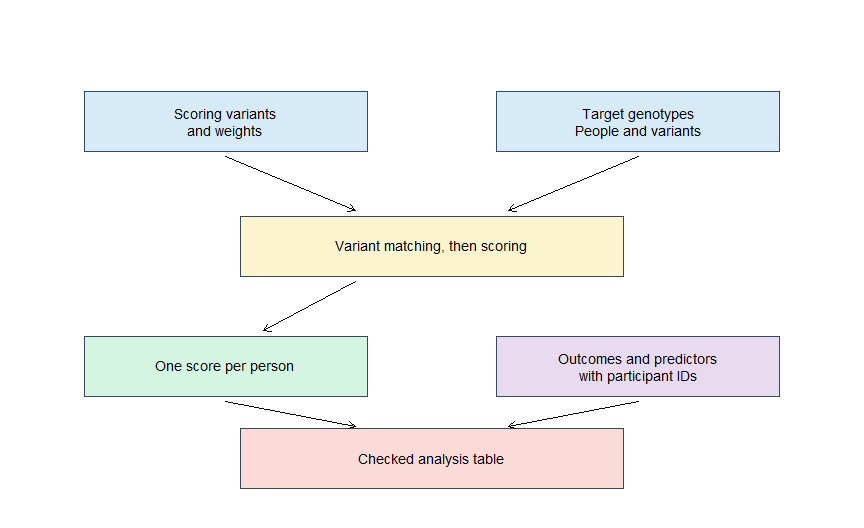
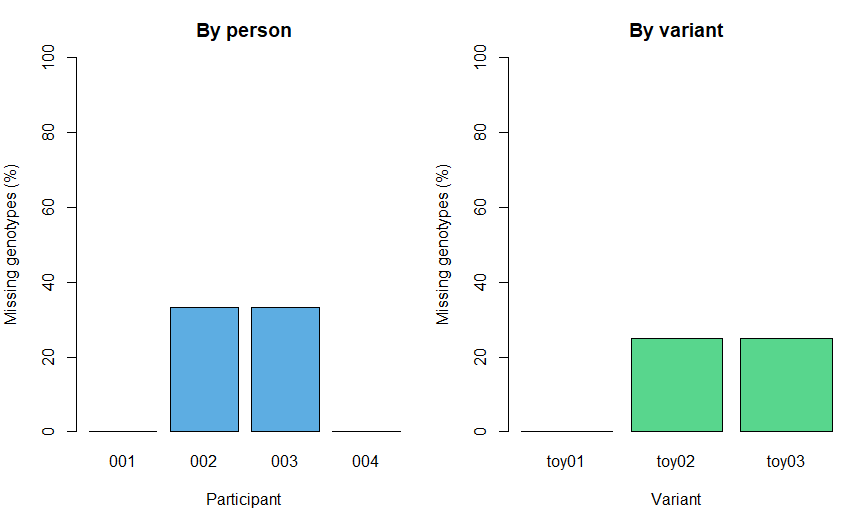

Chapter 7: Preparing the PRS Project and Input Files
================

# Before we calculate anything

Imagine receiving three files from a collaborator: genetic data, disease
outcomes and blood-pressure measurements. Each file opens. Each has
plausible values. Are they ready for a PRS analysis?

Not necessarily. One file might use a different participant identifier,
another might code controls as 1, and the scoring file might describe
positions on a different version of the human genome. A program may
still produce numbers from incompatible inputs.

Chapter 6 established the research question and evaluation plan. This
chapter turns that plan into an organized project and an **input
audit**: a recorded check that the files mean what we think they mean.

> The goal is not to get the largest number of participants through the
> pipeline. The goal is to know who and what each row represents, and
> why every input is suitable for the planned analysis.

All small tables and participant records below are **invented teaching
data**. The examples use base R plus `knitr`, with no downloads or
genomic software required for knitting. Real-input commands are clearly
separated and do not run during knitting.

# What you will produce

1.  A simple project structure with a clear place for every file.
2.  An inventory linking inputs to their source, meaning and version.
3.  A checked participant table with documented outcome coding.
4.  A basic audit of a scoring table.
5.  A readiness report showing which issues remain unresolved.

You will not yet perform full genotype QC, allele harmonization or PRS
calculation. Successfully reading a file is not evidence that those
stages have passed.

# 1. Understand the files before choosing commands

## A PRS needs two different kinds of information

A **scoring file** describes the genetic variants and their weights.
**Target genotypes** describe what the people being scored carry.
Outcomes and clinical predictors are needed when evaluating the score,
not simply calculating it.

| Input | Typical row represents | Why it matters |
|----|----|----|
| Published scoring table | A weighted variant or scoring term | Defines the score to reproduce |
| GWAS summary statistics | A variant–trait association | Input for developing weights; not necessarily the final scoring model |
| Target genotype data | A stored participant-by-variant dataset | Supplies allele counts or dosages |
| Phenotype table | A person or an explicitly defined visit/event | Supplies disease status, measurements or follow-up |
| Covariate table | A person or visit | Supplies age, blood pressure and other planned variables |
| Relatedness information | A pair of people or a group assignment | Supports relatedness handling |
| LD reference | Variants and their correlations | Required by some weight-development methods |

Applying a fixed published score does not automatically require an LD
reference. Conversely, a GWAS table is not interchangeable with a
published scoring file: final weights can have been adjusted for LD or
shrunk by a model. \[1\]

<div class="figure" style="text-align: center">


<p class="caption">

Figure 7.1: Two separate joins must be checked. Variants connect score
weights to genotypes; participant identifiers connect calculated scores
to outcomes and predictors.
</p>

</div>

The two joins answer different questions: **Is this the same genetic
variant?** and **Is this the same person?** An error in either can
invalidate later results.

## Common genotype file families

PLINK 2 uses `.pgen` for genotype data, `.pvar` for variant information
and `.psam` for sample information. PLINK 1 binary datasets use `.bed`,
`.bim` and `.fam`. The companions belong together: do not manually
reorder one independently. PLINK’s binary `.bed` is unrelated to the
text BED format used for genomic intervals. \[2\]

VCF/BCF and BGEN are other genomic formats you may receive. Use software
that understands their genotype fields and sample order. Do not open a
binary genotype file with `read.csv()` or try to treat millions of
variants as an ordinary spreadsheet. The pgsc_calc documentation
describes supported genomic inputs and preparation requirements. \[3\]

**REF, ALT and effect allele are different roles.** The effect allele is
the allele whose count receives the scoring weight. It is not
automatically ALT, minor, harmful or ancestral. Full matching is a later
step.

# 2. Set up a small, understandable project

In RStudio choose **File → New Project → New Directory → New Project**,
and name it `PRS_course`. Keep the Rmd chapters in `chapters/`. Use
plain filenames without spaces.

| Folder or file | Purpose |
|----|----|
| `chapters/` | Rmd sources and knitted Markdown |
| `chapters/figures/` | Figures generated when chapters are knitted |
| `scripts/` | Reusable R or terminal scripts |
| `data_raw/` | Unmodified input copies in the approved analysis environment |
| `data_derived/` | Files created by documented processing |
| `metadata/` | Input inventory, data dictionary and source notes |
| `results/` | Analysis outputs |
| `logs/` | Commands, software versions and processing messages |
| `README.md` | Project purpose and instructions |

For restricted cohorts, the raw data may live outside this project in
secure storage. In that case record the approved location in a private
configuration file. The public course repository should contain code,
prose and shareable teaching examples, not participant-level data or
private locations.

## Run this once in the R Console at the project root

``` r
folders <- c("chapters", "scripts", "data_raw", "data_derived",
             "metadata", "results", "logs")
invisible(lapply(folders, dir.create, recursive=TRUE, showWarnings=FALSE))
getwd()
```

`dir.create()` makes a folder. `recursive=TRUE` permits missing parent
folders. Existing folders are retained. The chunk is disabled because
reading or knitting a lesson should not silently reorganize your
project.

## Console, Terminal and Rmd are different places

| What you have | Where it belongs |
|----|----|
| `read.delim(...)` | R Console or an R chunk |
| `plink2 --version` | Terminal, with PLINK installed |
| `[Chapter 7](chapters/Chapter_07_Preparing_the_PRS_Project_and_Input_Files)` | Markdown text outside R chunks |
| YAML between `---` lines | Very top of the Rmd |

A Markdown link is not R code. Sending it to the R Console can produce
`unexpected '['`.

RStudio’s interactive working directory and the directory used while
knitting can differ. With a chapter in `chapters/`, the default knitting
directory is normally that chapter’s directory. A path such as
`../metadata/inventory.tsv` then points one level up. Check `getwd()`
when debugging; do not scatter machine-specific `setwd()` calls
throughout a chapter. \[4\]

The practicals below use a temporary teaching directory, so they do not
depend on your project layout. To publish, commit the knitted `.md` and
its generated figure files alongside the source `.Rmd`.

# 3. Record provenance: where did this input come from?

**Provenance** means the history of an input: who supplied it, which
version it is, and what processing has already happened. A filename such
as `final_new2.tsv` does not provide that history.

Record the source, access date, trait, population description, genome
build where relevant, file format, units, participant key, and known
processing. For a score, retain its identifier and accompanying
metadata. For GWAS inputs, also retain the effect scale and discovery
cohort information needed to investigate overlap. \[1,5\]

A **checksum** is a fingerprint of file bytes. If the checksum changes,
the file content changed. It does not establish correct biology or
trusted provenance. We use base R’s MD5 function for accidental-change
tracking, not security verification.

# 4. Practical: create and read a tiny input package

We use six fictional people to learn input checks. Six people are not
enough for a useful CAD prediction analysis. The outcome follows the
Chapter 6 teaching convention: `CAD5=1` means an event within five
years, `CAD5=0` means a fully observed event-free period. These examples
assume no competing deaths.

``` r
teaching_dir <- tempfile("prs_ch07_")
dir.create(teaching_dir)

participants <- data.frame(
  IID=sprintf("%03d", 1:6),
  Partition=c("Development", "Development", "Development",
              "Development", "Test", "Test"))
phenotypes <- data.frame(
  IID=c("003", "001", "006", "002", "005", "004"),
  CAD5=c(0L, 0L, 1L, 1L, 0L, 0L))
covariates <- data.frame(
  IID=c("006", "005", "004", "003", "002", "001"),
  age=c(67, 52, 48, 61, 70, 44),
  SBP=c(146, 124, 118, 138, 154, 116))

write.table(participants, file.path(teaching_dir,"participants.tsv"),
            sep="\t", row.names=FALSE, quote=FALSE)
write.table(phenotypes, file.path(teaching_dir,"phenotypes.tsv"),
            sep="\t", row.names=FALSE, quote=FALSE)
write.table(covariates, file.path(teaching_dir,"covariates.tsv"),
            sep="\t", row.names=FALSE, quote=FALSE)

read_people <- function(filename) {
  read.delim(file.path(teaching_dir,filename),
             colClasses=c(IID="character"),
             na.strings=c("NA", ""), check.names=FALSE)
}
participants <- read_people("participants.tsv")
phenotypes <- read_people("phenotypes.tsv")
covariates <- read_people("covariates.tsv")
knitr::kable(phenotypes)
```

| IID | CAD5 |
|:----|-----:|
| 003 |    0 |
| 001 |    0 |
| 006 |    1 |
| 002 |    1 |
| 005 |    0 |
| 004 |    0 |

The rows intentionally have different orders. IDs are read as character
strings so `001` remains `001`. We recognize only `NA` and an empty
field as missing in this invented format. Real missing-value codes must
come from the data dictionary; never assume that a numeric value such as
`-9` means missing in every column.

## Inspect structure, not just appearance

``` r
str(phenotypes)
#> 'data.frame':    6 obs. of  2 variables:
#>  $ IID : chr  "003" "001" "006" "002" ...
#>  $ CAD5: int  0 0 1 1 0 0
str(covariates)
#> 'data.frame':    6 obs. of  3 variables:
#>  $ IID: chr  "006" "005" "004" "003" ...
#>  $ age: int  67 52 48 61 70 44
#>  $ SBP: int  146 124 118 138 154 116
input_files <- file.path(teaching_dir,
  c("participants.tsv", "phenotypes.tsv", "covariates.tsv"))
stopifnot(all(file.exists(input_files)))
inventory <- data.frame(
  File=basename(input_files),
  Bytes=unname(file.info(input_files)$size),
  MD5=unname(tools::md5sum(input_files)),
  Source="Invented in Chapter 7",
  Participant_key="IID")
knitr::kable(inventory)
```

| File | Bytes | MD5 | Source | Participant_key |
|:---|---:|:---|:---|:---|
| participants.tsv | 103 | 002c4aee61e3e1c71bd4c446700ef52c | Invented in Chapter 7 | IID |
| phenotypes.tsv | 52 | 68445102d339c03f4859ac4ae3b5e3d6 | Invented in Chapter 7 | IID |
| covariates.tsv | 85 | 011b2ef2022209cfa0f6694137889a8a | Invented in Chapter 7 | IID |

`str()` reveals column types. A disease column containing text labels
requires an explicit mapping before modelling. The inventory documents
the exact teaching files generated in this run.

# 5. Check participant identifiers before joining

A **key** uniquely identifies a record at its intended level. Here, one
row represents one person, and IID alone is unique. In a real dataset,
the key may involve FID and IID, or person and visit. Decide this before
joining. Two records with the same IID may be a duplicate, two visits,
or two different people whose IDs are only unique within a study.

``` r
check_key <- function(d, label) {
  if (!"IID" %in% names(d)) stop(label, ": missing IID column")
  if (!is.character(d$IID)) stop(label, ": IID must be character")
  if (anyNA(d$IID) || any(!nzchar(trimws(d$IID))))
    stop(label, ": missing or blank IID")
  if (any(d$IID != trimws(d$IID)))
    stop(label, ": whitespace in IID; investigate its source")
  if (anyDuplicated(d$IID)) stop(label, ": duplicate IID")
  invisible(TRUE)
}
check_key(participants,"Participants")
check_key(phenotypes,"Phenotypes")
check_key(covariates,"Covariates")
```

We stop on duplicate IDs rather than keep an arbitrary first row.
Automatically deleting duplicates can select the wrong visit or conceal
a data error.

## Prove that the check detects an error

``` r
bad_phenotypes <- rbind(phenotypes, phenotypes[1, ])
duplicate_message <- tryCatch({
  check_key(bad_phenotypes,"Bad phenotype example")
  "No error detected"
}, error=function(e) conditionMessage(e))
duplicate_message
#> [1] "Bad phenotype example: duplicate IID"
stopifnot(grepl("duplicate IID", duplicate_message, fixed=TRUE))
```

The deliberate error is caught so knitting continues. It does not modify
our valid phenotype table.

## Audit overlap before combining values

``` r
audit_ids <- function(master, other, label) {
  data.frame(File=label,
    Master_n=length(master), Other_n=length(other),
    Matched=length(intersect(master,other)),
    Master_only=length(setdiff(master,other)),
    Other_only=length(setdiff(other,master)))
}
id_audit <- rbind(
  audit_ids(participants$IID,phenotypes$IID,"Phenotypes"),
  audit_ids(participants$IID,covariates$IID,"Covariates"))
knitr::kable(id_audit)
```

| File       | Master_n | Other_n | Matched | Master_only | Other_only |
|:-----------|---------:|--------:|--------:|------------:|-----------:|
| Phenotypes |        6 |       6 |       6 |           0 |          0 |
| Covariates |        6 |       6 |       6 |           0 |          0 |

``` r
stopifnot(all(id_audit$Master_only == 0), all(id_audit$Other_only == 0))
```

Expected result: six matched people in each file, with no unmatched IDs.
In real data, an unmatched person is a finding to investigate. It is not
automatically a justified exclusion.

## An intentional unmatched ID

``` r
mismatch <- phenotypes
mismatch$IID[mismatch$IID == "006"] <- "099"
missing_outcome_ids <- setdiff(participants$IID,mismatch$IID)
extra_outcome_ids <- setdiff(mismatch$IID,participants$IID)
knitr::kable(data.frame(Issue=c("No matching outcome","No matching participant"),
                       IID=c(missing_outcome_ids,extra_outcome_ids)))
```

| Issue                   | IID |
|:------------------------|:----|
| No matching outcome     | 006 |
| No matching participant | 099 |

``` r
stopifnot(identical(missing_outcome_ids,"006"),
          identical(extra_outcome_ids,"099"))
```

We know this was an intentionally introduced error. In real data, verify
the source record; do not assume that 099 should be renamed 006. The
next chunk uses the original, verified teaching table.

``` r
# match() returns positions in the other table for each master ID.
phenotype_index <- match(participants$IID, phenotypes$IID)
covariate_index <- match(participants$IID, covariates$IID)
stopifnot(!anyNA(phenotype_index), !anyNA(covariate_index))
analysis_input <- participants
analysis_input$CAD5 <- phenotypes$CAD5[phenotype_index]
analysis_input$age <- covariates$age[covariate_index]
analysis_input$SBP <- covariates$SBP[covariate_index]
stopifnot(identical(analysis_input$IID, participants$IID),
          nrow(analysis_input) == nrow(participants))
knitr::kable(analysis_input)
```

| IID | Partition   | CAD5 | age | SBP |
|:----|:------------|-----:|----:|----:|
| 001 | Development |    0 |  44 | 116 |
| 002 | Development |    1 |  70 | 154 |
| 003 | Development |    0 |  61 | 138 |
| 004 | Development |    0 |  48 | 118 |
| 005 | Test        |    0 |  52 | 124 |
| 006 | Test        |    1 |  67 | 146 |

Check two people by hand: **001 has CAD5=0, age=44 and SBP=116; 006 has
CAD5=1, age=67 and SBP=146.** The matches depend on IDs, not row order.

Do not use `cbind(participants, phenotypes$CAD5)` to join unrelated
files. It pairs rows by position even if they refer to different people.

# 6. Check meanings, units and missingness

## Outcome coding is not universal

| Representation | Meaning in its documented context |
|----|----|
| Our teaching CAD5: 0 / 1 | Non-event / event |
| Text such as control / case | Requires an explicit, checked mapping |
| A file using 1 / 2 | May mean control / case; verify the producing software and dictionary |
| Blank, NA or a sentinel | Missing only when the specification says so |

Never subtract 1 from every phenotype column just because one program
uses 1/2 coding. Continuous traits and other categories require
different handling.

``` r
stopifnot(is.numeric(analysis_input$CAD5),
          !anyNA(analysis_input$CAD5),
          all(analysis_input$CAD5 %in% c(0,1)))
stopifnot(is.numeric(analysis_input$age),
          is.numeric(analysis_input$SBP),
          all(is.finite(analysis_input$age)),
          all(is.finite(analysis_input$SBP)))
# The age limits come from our teaching eligibility rule.
stopifnot(all(analysis_input$age >= 40 & analysis_input$age <= 75))
# An impossible non-positive SBP is an error, not an imputation target.
stopifnot(all(analysis_input$SBP > 0))
missing_report <- data.frame(
  Variable=names(analysis_input),
  Missing=vapply(analysis_input, function(x) sum(is.na(x)), integer(1)))
knitr::kable(missing_report)
```

|           | Variable  | Missing |
|:----------|:----------|--------:|
| IID       | IID       |       0 |
| Partition | Partition |       0 |
| CAD5      | CAD5      |       0 |
| age       | age       |       0 |
| SBP       | SBP       |       0 |

``` r
knitr::kable(as.data.frame(table(analysis_input$Partition,analysis_input$CAD5)),
             col.names=c("Partition","CAD5","People"))
```

| Partition   | CAD5 | People |
|:------------|:-----|-------:|
| Development | 0    |      3 |
| Test        | 0    |      1 |
| Development | 1    |      1 |
| Test        | 1    |      1 |

Our table has no missing values. Real outlying blood-pressure values
need source review, including units, measurement timing and
transcription. Do not delete biologically unusual values merely because
they are far from the average.

The tiny test group is useful for checking joins, not performance.
Having both outcome classes is necessary for an AUC but is nowhere near
sufficient for a precise estimate.

## Keep an exclusion record

If a person is excluded later, record the reason and stage. Counts for
sequential stages should show how many remain after each step. Counts of
independent warning flags can overlap and should not be added as though
they represent different people. This matters when explaining why an
analysis population differs from the original cohort. \[5\]

# 7. Audit the scoring table before allele matching

The PGS Catalog provides published scoring files and metadata, including
harmonized files mapped to specified genome builds. Preserve the
downloaded metadata: a harmonized coordinate is not proof that your
target allele representation matches. \[6\]

Our simplified teaching table contains six **fictional biallelic SNPs**.
`toy01` and its companions are not real rs identifiers, and positions
are invented. `weight` is a final additive scoring weight for this
demonstration; it is not an odds ratio needing transformation.

``` r
score <- data.frame(
  variant_id=sprintf("toy%02d",1:6),
  chromosome=rep("1",6),
  position=c(1001L,2001L,3001L,4001L,5001L,6001L),
  effect_allele=c("A","C","G","T","A","C"),
  other_allele=c("G","T","A","C","T","G"),
  weight=c(.18,-.12,.05,.30,-.08,.10),
  stringsAsFactors=FALSE)
score_metadata <- list(
  score_id="TEACHING_ONLY_06_VARIANTS",
  genome_build="Fictional coordinates; not usable for real matching",
  weight_scale="Final additive teaching weights",
  source="Invented in Chapter 7")
knitr::kable(score)
```

| variant_id | chromosome | position | effect_allele | other_allele | weight |
|:-----------|:-----------|---------:|:--------------|:-------------|-------:|
| toy01      | 1          |     1001 | A             | G            |   0.18 |
| toy02      | 1          |     2001 | C             | T            |  -0.12 |
| toy03      | 1          |     3001 | G             | A            |   0.05 |
| toy04      | 1          |     4001 | T             | C            |   0.30 |
| toy05      | 1          |     5001 | A             | T            |  -0.08 |
| toy06      | 1          |     6001 | C             | G            |   0.10 |

A negative weight is allowed. Counting its effect allele lowers the raw
score relative to the same model with fewer copies of that allele. It
does not establish that the variant itself causally protects against
disease.

``` r
check_simple_score <- function(d) {
  needed <- c("variant_id","chromosome","position",
              "effect_allele","other_allele","weight")
  stopifnot(!anyDuplicated(names(d)), all(needed %in% names(d)), nrow(d)>0)
  stopifnot(!anyNA(d[needed]))
  stopifnot(is.character(d$variant_id),
            all(nzchar(trimws(d$variant_id))),
            all(d$variant_id == trimws(d$variant_id)),
            !anyDuplicated(d$variant_id))
  stopifnot(is.character(d$chromosome),
            all(nzchar(trimws(d$chromosome))),
            all(d$chromosome == trimws(d$chromosome)))
  stopifnot(is.numeric(d$position), all(is.finite(d$position)),
            all(d$position>0), all(d$position==floor(d$position)))
  stopifnot(is.numeric(d$weight), all(is.finite(d$weight)))
  stopifnot(all(d$effect_allele %in% c("A","C","G","T")),
            all(d$other_allele %in% c("A","C","G","T")),
            all(d$effect_allele != d$other_allele))
  # For this biallelic, same-strand schema only: flag repeated loci/allele pairs.
  pair <- vapply(seq_len(nrow(d)), function(i)
    paste(sort(c(d$effect_allele[i],d$other_allele[i])),collapse="/"),character(1))
  stopifnot(!anyDuplicated(paste(d$chromosome,d$position,pair,sep=":")))
  invisible(TRUE)
}
check_simple_score(score)
score$palindromic <- paste0(score$effect_allele,score$other_allele) %in%
  c("AT","TA","CG","GC")
knitr::kable(score[c("variant_id","effect_allele","other_allele","palindromic")])
```

| variant_id | effect_allele | other_allele | palindromic |
|:-----------|:--------------|:-------------|:------------|
| toy01      | A             | G            | FALSE       |
| toy02      | C             | T            | FALSE       |
| toy03      | G             | A            | FALSE       |
| toy04      | T             | C            | FALSE       |
| toy05      | A             | T            | TRUE        |
| toy06      | C             | G            | TRUE        |

``` r
stopifnot(sum(score$palindromic)==2)
```

The function checks our simple schema, not all valid published scores.
Real scores can include indels, multiallelic records or more complex
scoring terms. Do not force them through a SNP-only validator and call
every rejected record erroneous.

**Palindromic SNPs** have A/T or C/G allele pairs. Those pairs look the
same after strand complementation, making orientation harder to resolve
in some inputs. We flag toy05 and toy06 for investigation; we do not
automatically reverse their weights or discard them. Matching needs
trusted allele/build information and the chosen method’s documented
rules. \[1\]

## Which checks remain?

| Check completed here | Still not established |
|----|----|
| Required columns are present | The score is relevant to the intended phenotype |
| Weights are finite numbers | The weight scale was correctly documented by the source |
| Positions are positive integers | Coordinates use the same genome build as target data |
| Alleles fit the teaching schema | Target genotypes count the correct effect allele |
| Variant IDs are unique in this example | All real scoring terms have been represented correctly |
| Palindromic variants are flagged | Strand ambiguity has been resolved |

Do not change a genome-build label to fix a mismatch. Coordinate
conversion requires a documented mapping process and subsequent
variant/allele checks; some records may not map successfully.

# 8. Missing genotypes and missing variants are different

A missing genotype is an unavailable value for one person at a variant
that exists in the dataset. An absent variant is missing from the
dataset altogether.

``` r
dosage <- matrix(c(0,1,2,1, 1,NA,0,2, 2,1,NA,0),
                 nrow=4, ncol=3,
                 dimnames=list(c("001","002","003","004"),
                               c("toy01","toy02","toy03")))
knitr::kable(dosage)
```

|     | toy01 | toy02 | toy03 |
|:----|------:|------:|------:|
| 001 |     0 |     1 |     2 |
| 002 |     1 |    NA |     1 |
| 003 |     2 |     0 |    NA |
| 004 |     1 |     2 |     0 |

``` r
missing_by_person <- rowMeans(is.na(dosage))
missing_by_variant <- colMeans(is.na(dosage))
```

These entries illustrate dosage storage and missingness only. They have
not been harmonized for scoring. A zero is an observed dosage of zero
for the counted allele; `NA` is an unknown value. Replacing every `NA`
with zero invents genetic observations.

<div class="figure" style="text-align: center">


<p class="caption">

Figure 7.2: Missing genotype proportions can be summarized by
participant or variant. Denominators are three variants per person and
four people per variant in this invented example.
</p>

</div>

People 002 and 003 each have one missing value out of three (33.3%).
toy02 and toy03 each have one missing value out of four (25%).
toy04–toy06 are not columns here at all. This is why a report of zero
missing values among available columns cannot establish complete
coverage of the intended score.

In real scoring, record both variant coverage and participant-level
missingness, including what the software does with missing values.
Hard-call missingness and dosage availability are not always the same;
inspect the field and report definition. Do not apply thresholds copied
from this tiny example. \[1,7\]

# 9. First inspection of a real genotype dataset

The following is a **Terminal template** for a local PLINK 2 dataset. It
assumes the input trio exists and the output directory has been created.
It performs reports, not filtering or scoring.

``` bash
plink2 --version
plink2 --pfile data_raw/target --freq --missing --out results/input_audit
```

Run from your analysis project root with PLINK available in the
Terminal. If your executable has a different path, use that path.
`--pfile` takes the shared prefix, not the `.pgen` filename. This
command is for the uncompressed `.pvar` form; other input layouts
require their documented options.

By default, `--missing` summarizes **hard-call missingness**. An
uncertain hard call can be missing even when dosage is available.
Request and interpret the documented dosage columns if dosage
availability is your question. \[7\]

`--freq` requests allele-frequency reporting and `--missing` requests
missingness reporting. The usual reports include `.afreq`, `.smiss`,
`.vmiss` and a `.log`. Read headers and the log because fields depend on
data and options. These summaries do not establish imputation accuracy,
relatedness, sample identity or complete PRS readiness. \[7\]

Do not manually reorder `.psam` or `.pvar` to make IDs appear sorted:
their ordering must stay consistent with the genotype data. Use genomic
software to perform coordinated transformations. \[2\]

Record the PLINK version and complete command. A command completing
without error means the requested operation completed; it does not prove
that all biological assumptions are correct.

# 10. A real resource: inspecting a published score

The inspected record lists GPS_CAD, a CAD score developed with LDpred,
original build hg19, and 6,630,150 variants. Its publication is Khera et
al. (2018). These are properties of the published record, not evidence
that the score matches our target data. \[8\]

The PGS Catalog entry **PGS000013** describes a published CAD score
associated with Khera and colleagues’ work. Use it as an example of how
to inspect a score record before deciding whether to use it. \[8\]

| Question to answer from the record and paper | Why you need it |
|----|----|
| What is the reported trait? | A similarly named phenotype may have a different definition |
| Which publication and score identifier apply? | One paper can contain multiple scores |
| Which populations contributed to development and evaluation? | Applicability to a new cohort remains an empirical question |
| Which scoring file and genome build are being downloaded? | The exact input must be traceable |
| How was the score evaluated? | An association estimate is not automatically a probability model |

Do not download a different CAD score merely because its file is easier
to open and describe it as the same model. Do not infer ancestry
compatibility from the disease name. This exercise asks you to inspect
the record; no real participant genotypes are distributed here.

# 11. Save an audit that another person can understand

``` r
readiness <- data.frame(
  Check=c("Participant identifiers", "Phenotype coding", "Clinical units",
          "Simple score schema", "Real genotype integrity",
          "Genome-build compatibility", "Allele harmonization",
          "Full genotype QC", "Outcome-model evaluation"),
  Status=c("CHECKS COMPLETED", "CHECKS COMPLETED",
           "DOCUMENTED ASSUMPTION", "CHECKS COMPLETED",rep("NOT ASSESSED",5)),
  Evidence=c("Unique IDs and complete matches", "CAD5 values are 0 or 1",
             "Age years; SBP mmHg in teaching dictionary",
             "Six finite weights; two palindromic flags",
             "No real genotype files supplied",
             "Only invented positions used",
             "No score-to-target matching performed",
             "Reserved for subsequent protocols",
             "Input audit only; no fitted models"))
knitr::kable(readiness)
```

| Check | Status | Evidence |
|:---|:---|:---|
| Participant identifiers | CHECKS COMPLETED | Unique IDs and complete matches |
| Phenotype coding | CHECKS COMPLETED | CAD5 values are 0 or 1 |
| Clinical units | DOCUMENTED ASSUMPTION | Age years; SBP mmHg in teaching dictionary |
| Simple score schema | CHECKS COMPLETED | Six finite weights; two palindromic flags |
| Real genotype integrity | NOT ASSESSED | No real genotype files supplied |
| Genome-build compatibility | NOT ASSESSED | Only invented positions used |
| Allele harmonization | NOT ASSESSED | No score-to-target matching performed |
| Full genotype QC | NOT ASSESSED | Reserved for subsequent protocols |
| Outcome-model evaluation | NOT ASSESSED | Input audit only; no fitted models |

The report is reached only if the preceding stopping checks succeed.
Units and the clinical meaning of the outcome are supplied by our
invented dictionary; software cannot establish those meanings from
numeric ranges.

**NOT ASSESSED is not PASS.** Preserve that distinction in real reports.
Input auditing often ends with questions for a data provider, not with a
score.

Optional: first run the practical chunks sequentially in your current R
session (knitting alone does not guarantee these objects exist in your
Console). Then export the teaching audit from the R Console at your
project root. This block is disabled to avoid overwriting a prior report
during knitting.

``` r
dir.create("results",showWarnings=FALSE)
dir.create("metadata",showWarnings=FALSE)
write.table(analysis_input,"results/ch07_teaching_participants.tsv",
            sep="\t",row.names=FALSE,quote=FALSE)
write.table(readiness,"results/ch07_readiness.tsv",
            sep="\t",row.names=FALSE,quote=FALSE)
write.table(inventory,"metadata/ch07_input_inventory.tsv",
            sep="\t",row.names=FALSE,quote=FALSE)
writeLines(capture.output(sessionInfo()),"results/ch07_session_info.txt")
```

Temporary files created for the lesson are not a permanent input
archive. For a real project, generate the inventory from its actual
retained files, and record stable approved paths alongside sources and
versions. The exported teaching inventory identifies the illustrative
files only.

# 12. Problems you are likely to encounter

| Symptom | Likely issue | First check |
|----|----|----|
| `unexpected '['` | Markdown sent to the R Console | Place links outside code chunks |
| File not found | Path relative to a different working directory | Inspect `getwd()` and `file.exists()` |
| IID 001 becomes 1 | ID read as a number | Read the identifier column as character |
| Join increases the row count | Duplicate keys or a many-to-many relationship | Check uniqueness at the intended record level |
| CAD5 contains 2 | Different phenotype coding | Consult the dictionary before recoding |
| Many variants fail matching | Build, allele or identifier incompatibility | Inspect provenance and matching reports |
| All visible values look plausible | Semantic errors can still be present | Verify units, timing, keys and source definitions |
| PLINK is not found | Executable is not installed or not on the command path | Check the executable location in the Terminal |

# 13. Practice with answers

**1. Why are the phenotype rows shuffled in the practical?**

To show that matching depends on participant identifiers. Correct input
files do not need the same row order when joined by a verified key.

**2. A participant is present in the genotype file but absent from the
outcome file. Are they a control?**

No. Their outcome is unavailable until resolved. Absence from a file is
not evidence of absence of disease.

**3. Why is a checksum insufficient to establish that a score is
correct?**

It identifies file bytes, not whether the phenotype, build, weight
interpretation or target population is appropriate.

**4. Can you rename GRCh37 to GRCh38 in a metadata table?**

That changes a label, not coordinates. Correct conversion and subsequent
variant checks are required when conversion is justified.

**5. Are negative weights errors?**

No. The sign describes the contribution of the specified effect allele
to that scoring model.

**6. Why do we flag palindromic SNPs without immediately dropping
them?**

Whether orientation is resolvable depends on the evidence and matching
method. A flag requests investigation; it is not a universal exclusion
rule.

**7. All available genotype values are observed. Is the full score
covered?**

Not necessarily. Some required variants may be absent from the dataset.

**8. Is the six-person table ready for estimating clinical
performance?**

No. It checks data handling. Study size, independence and precision
require the Chapter 6 planning process and later evaluation protocols.

# Handover

| Item | Current state | Next action |
|----|----|----|
| Teaching input tables | Generated in temporary storage | Recreate from this chapter when needed |
| Participant audit and inventory | Exportable to documented files | Retain with your exercise notes |
| Real genotypes | Not supplied by this exercise | Obtain approved inputs before adapting commands |
| QC and harmonization | Not assessed | Study Chapters 8–9 |

The next chapter recreates a separate, larger synthetic project using a
shared R script. It does not fit a clinical model to these six people.

# What comes next?

The next stage is genotype quality control: investigating participant
and variant quality, missingness, relatedness and population structure
before matching score alleles. Keep the input audit alongside the
analysis plan so each later change is traceable.

# References

1.  Choi SW, Mak TSH, O’Reilly PF. **Tutorial: a guide to performing
    polygenic risk score analyses.** Nature Protocols.
    2020;15:2759–2772. <https://doi.org/10.1038/s41596-020-0353-1>

2.  PLINK 2 documentation. **File format reference.**
    <https://www.cog-genomics.org/plink/2.0/formats> Accessed 10
    September 2026.

3.  PGS Catalog Calculator documentation. **How do I prepare my input
    genomes?**
    <https://pgsc-calc.readthedocs.io/en/latest/how-to/prepare.html>
    Accessed 10 September 2026.

4.  Xie Y, Dervieux C, Riederer E. **R Markdown Cookbook: The working
    directory for R code chunks.**
    <https://bookdown.org/yihui/rmarkdown-cookbook/working-directory.html>

5.  Wand H, Lambert SA, Tamburro C, et al. **Improving reporting
    standards for polygenic scores in risk prediction studies.** Nature.
    2021;591:211–219. <https://doi.org/10.1038/s41586-021-03243-6>

6.  PGS Catalog. **Download information and scoring file formats.**
    <https://www.pgscatalog.org/downloads/> Accessed 10 September 2026.

7.  PLINK 2 documentation. **Basic statistics.**
    <https://www.cog-genomics.org/plink/2.0/basic_stats> Accessed 10
    September 2026.

8.  PGS Catalog. **PGS000013: Coronary artery disease.**
    <https://www.pgscatalog.org/score/PGS000013/> Associated
    publication: Khera AV, Chaffin M, Aragam KG, et al. Nature Genetics.
    2018;50:1219–1224. <https://doi.org/10.1038/s41588-018-0183-z>
