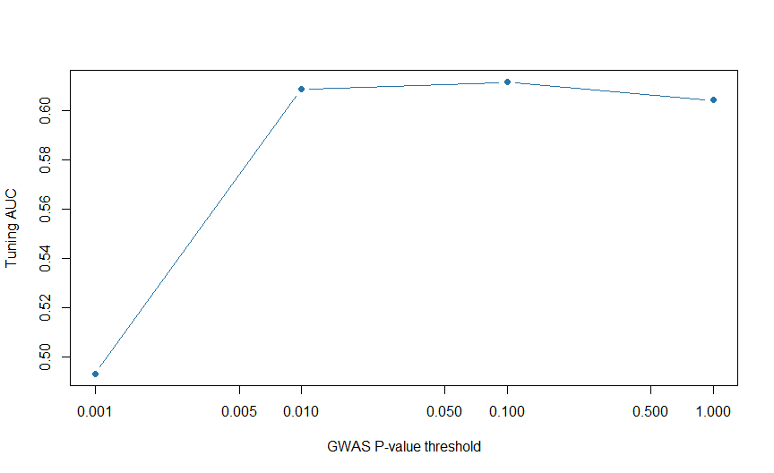

Chapter 11: Clumping and Thresholding
================

# Why not keep every small GWAS P value?

Nearby variants can carry overlapping information. Counting many
correlated signals at full marginal weight can overemphasize one region.
Clumping and thresholding (C+T) creates a simpler candidate score by
selecting representatives and applying a P-value cutoff.

**Objectives:** explain clumping, distinguish it from pruning, generate
candidate scores, and select a setting without consulting final test
outcomes. Prerequisites: Chapters 3, 6 and 8–10. This is a complete
small R demonstration, not an exact reimplementation of every PLINK
clumping rule.

# 1. Two decisions

**Clumping** generally prioritizes strongly associated variants, then
suppresses nearby variants sufficiently correlated with a selected index
variant. **Thresholding** restricts retained variants by GWAS P value.
LD pruning used for PCA usually does not prioritize GWAS association
strength; it serves another purpose.

The important settings include a physical window, an LD r-squared
threshold and a P-value threshold. None is universally optimal.
Including weaker signals can improve a highly polygenic predictor, but
it can also add noise. The best-looking setting in the test set is no
longer independently evaluated. \[1\]

# 2. Estimate discovery associations and LD independently

``` r
demo <- make_course_data()
ss <- summary_gwas(demo)
ld_rows <- which(demo$people$role=="LD_reference")
R <- cor(demo$G[ld_rows,,drop=FALSE])
stopifnot(identical(colnames(R),ss$ID),all(is.finite(R)))
knitr::kable(head(ss),digits=4)
```

| ID     | CHR |    POS | A1  | A2  |    beta |     se |      p |   n_eff |    N |
|:-------|----:|-------:|:----|:----|--------:|-------:|-------:|--------:|-----:|
| sim001 |   1 | 100000 | A   | G   |  0.1839 | 0.0754 | 0.0148 | 1621.58 | 5000 |
| sim002 |   1 | 110000 | A   | G   |  0.0713 | 0.0759 | 0.3477 | 1621.58 | 5000 |
| sim003 |   1 | 120000 | A   | G   |  0.0113 | 0.0775 | 0.8840 | 1621.58 | 5000 |
| sim004 |   1 | 130000 | A   | G   |  0.0864 | 0.0773 | 0.2631 | 1621.58 | 5000 |
| sim005 |   1 | 140000 | A   | G   |  0.0531 | 0.0763 | 0.4863 | 1621.58 | 5000 |
| sim006 |   1 | 150000 | A   | G   | -0.0132 | 0.0779 | 0.8652 | 1621.58 | 5000 |

The helper fits one logistic association per variant in discovery
people, adjusting for age and SBP. `beta` is the marginal log-odds
coefficient conditional on these covariates; it is not the joint causal
effect. `se` measures estimation uncertainty. The independent LD people
describe variant correlation, not prediction accuracy.

# 3. A transparent greedy implementation

``` r
clump_small <- function(ss,R,r2_cut=.1,window=250000) {
  order_p <- order(ss$p,ss$ID)
  kept <- integer(0)
  for(j in order_p) {
    nearby <- kept[ss$CHR[kept]==ss$CHR[j] & abs(ss$POS[kept]-ss$POS[j])<=window]
    redundant <- length(nearby)>0 && any(R[j,nearby]^2>r2_cut)
    if(!redundant) kept <- c(kept,j)
  }
  kept
}
kept <- clump_small(ss,R)
thresholds <- c(.001,.01,.1,1)
weights <- vapply(thresholds,function(t) {
  w <- rep(0,nrow(ss)); use <- kept[ss$p[kept]<=t]
  w[use] <- ss$beta[use]; w
},numeric(nrow(ss)))
colnames(weights) <- paste0("p_",thresholds)
knitr::kable(data.frame(P_threshold=thresholds,Variants=colSums(weights!=0)))
```

|         | P_threshold | Variants |
|:--------|------------:|---------:|
| p_0.001 |       0.001 |        1 |
| p_0.01  |       0.010 |       10 |
| p_0.1   |       0.100 |       17 |
| p_1     |       1.000 |       20 |

We fix the LD rule and window before examining tuning outcomes. This
demonstration handles a common ordering concept but omits production
details such as multiallelic handling and tool-specific secondary
thresholds. Its 120 variants are not a realistic genome-wide benchmark.

# 4. Select using tuning people only

``` r
it <- which(demo$people$role=="Tuning")
candidate_scores <- demo$G[it,,drop=FALSE] %*% weights
tuning_auc <- apply(candidate_scores,2,function(x) auc(demo$people$CAD5[it],x))
stopifnot(any(is.finite(tuning_auc)))
best <- which.max(tuning_auc) # Ties choose the first, more stringent threshold.
selection <- data.frame(P_threshold=thresholds,Tuning_AUC=tuning_auc,
                         Selected=seq_along(thresholds)==best)
knitr::kable(selection,digits=3)
```

|         | P_threshold | Tuning_AUC | Selected |
|:--------|------------:|-----------:|:---------|
| p_0.001 |       0.001 |      0.493 | FALSE    |
| p_0.01  |       0.010 |      0.609 | FALSE    |
| p_0.1   |       0.100 |      0.611 | TRUE     |
| p_1     |       1.000 |      0.604 | FALSE    |

``` r
selected_weights <- data.frame(ID=ss$ID,A1=ss$A1,weight=weights[,best])
```

An empty score ranks everyone equally and has AUC 0.5 when both outcome
classes exist. It is not evidence of a usable predictor. The chosen
tuning AUC is optimistic for the winner; independent testing must follow
after all choices are fixed.

<div class="figure" style="text-align: center">


<p class="caption">

Figure 11.1: Tuning AUC across prespecified synthetic C+T candidates.
This plot is for selection, not final performance reporting.
</p>

</div>

# 5. Strengths, limitations and production use

C+T is relatively easy to explain and audit, and usually has lower
computational demands than Bayesian genome-wide fitting. It loses
information by discarding correlated variants and relies on noisy
marginal coefficients. Closely linked signals and different LD patterns
can change the selected set. A more sophisticated method is not
guaranteed to improve performance in every dataset.

PLINK provides production clumping and score calculation as separate
operations. Preserve the clump membership, retained IDs, thresholds and
final weights. For a real comparison, define candidate settings
beforehand, fit any clinical combination in development data, select in
tuning data, and compare frozen candidates in a common independent test
sample. \[2\]

**Published example:** the International Schizophrenia Consortium used
polygenic scoring across significance thresholds to investigate shared
common-variant contributions to schizophrenia and bipolar disorder. The
lesson is that useful aggregate information need not be restricted to
individually genome-wide significant loci; it does not imply that every
weak association is causal. \[3\]

# Practice and handover

**Clumping versus pruning?** Clumping uses association priority; pruning
usually serves a correlation-reduction goal independent of outcome
association.

**Can you retune r-squared after viewing the final test result?** That
makes the test part of development; a new independent evaluation is
needed.

**Does this chapter find the clinically best CAD method?** No. It
demonstrates selection on a small synthetic architecture.

The object `selected_weights` is an explicit learning output. To
reproduce it, rerun this chapter from its helper inputs. The main
evaluation chapters use the separately fixed synthetic score, so method
comparisons here do not contaminate that demonstration.

# References

1.  Choi SW, Mak TSH, O’Reilly PF. Tutorial: a guide to performing
    polygenic risk score analyses. *Nature Protocols*.
    2020;15:2759–2772. <https://doi.org/10.1038/s41596-020-0353-1>
2.  PLINK 2. Report postprocessing: clumping.
    <https://www.cog-genomics.org/plink/2.0/postproc#clump>
3.  International Schizophrenia Consortium. Common polygenic variation
    contributes to risk of schizophrenia and bipolar disorder. *Nature*.
    2009;460:748–752. <https://doi.org/10.1038/nature08185>
