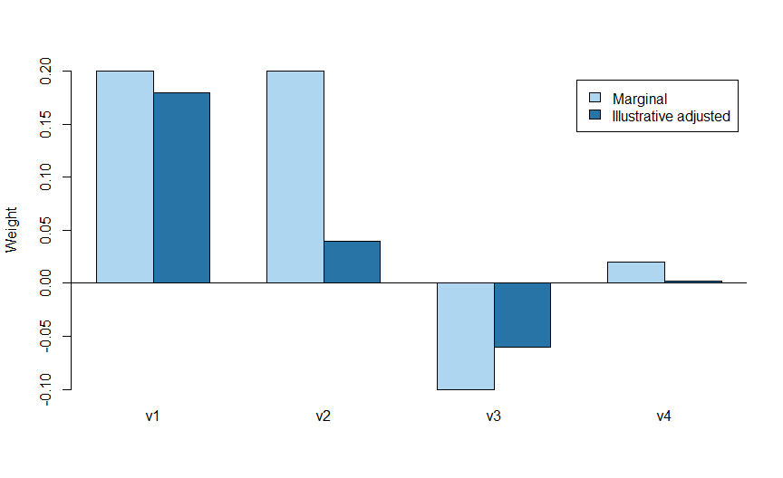

Chapter 13: PRS-CS: Continuous Shrinkage
================

# Must every uncertain variant be kept or removed?

A hard P-value cutoff makes a yes/no decision. Continuous shrinkage
allows different amounts of adjustment across variants. A weak, noisy
association can be pulled close to zero while a better-supported signal
retains more weight.

**Objectives:** explain global and local shrinkage, identify PRS-CS
inputs, distinguish fixed-phi from auto, and prepare an auditable
command. Prerequisites: Chapters 3, 9 and 12. The introductory practical
uses base R. Running PRS-CS itself requires its Python environment and
an external LD reference.

# 1. The method in plain language

PRS-CS is a Bayesian regression method using summary associations and LD
information. Its prior has a global component controlling overall
shrinkage and local components allowing variants to behave differently.
Effects within LD blocks are modelled jointly. Posterior estimates
become scoring weights. \[1\]

The global parameter is often called **phi**. A fixed-phi workflow may
compare several values using tuning outcomes. PRS-CS-auto estimates the
global shrinkage parameter from summary data. Auto still needs suitable
inputs and independent evaluation; small or weak discovery data can make
parameter learning difficult.

A posterior mean is a model-based estimate, not a guarantee of
biological causality. The effect distribution and LD approximation are
assumptions about the data. If the summary file and LD reference
disagree, shrinkage can confidently produce unsuitable weights.

# 2. A numerical analogy, not a PRS-CS implementation

``` r
example <- data.frame(Variant=paste0("v",1:4),
                      Marginal=c(.20,.20,-.10,.02),
                      Teaching_factor=c(.9,.2,.6,.1))
example$Adjusted <- example$Marginal*example$Teaching_factor
knitr::kable(example)
```

| Variant | Marginal | Teaching_factor | Adjusted |
|:--------|---------:|----------------:|---------:|
| v1      |     0.20 |             0.9 |    0.180 |
| v2      |     0.20 |             0.2 |    0.040 |
| v3      |    -0.10 |             0.6 |   -0.060 |
| v4      |     0.02 |             0.1 |    0.002 |

Two identical marginal estimates can receive different adjustments when
uncertainty or neighboring evidence differs. The factors above were
invented to illustrate that idea; PRS-CS does not calculate its
posterior means with these four fixed multipliers.

<div class="figure" style="text-align: center">


<p class="caption">

Figure 13.1: Invented shrinkage factors illustrate unequal adjustment.
These are not outputs of PRS-CS.
</p>

</div>

# 3. Input preparation is part of the method

The official implementation takes an LD reference, target BIM variant
list, summary statistics and GWAS sample size. Its reference should
match discovery ancestry. The BIM input identifies available target
variants; it does not provide tuning outcomes. Summary formats support
effect estimates with SE or P values; the SE route avoids some problems
with extremely small rounded P values. \[2\]

``` r
demo <- make_course_data(); ss <- summary_gwas(demo)
prscs_input <- data.frame(SNP=ss$ID,A1=ss$A1,A2=ss$A2,
                          BETA=ss$beta,SE=ss$se)
stopifnot(!anyDuplicated(prscs_input$SNP),
          all(is.finite(prscs_input$BETA)),all(prscs_input$SE>0))
knitr::kable(head(prscs_input),digits=4)
```

| SNP    | A1  | A2  |    BETA |     SE |
|:-------|:----|:----|--------:|-------:|
| sim001 | A   | G   |  0.1839 | 0.0754 |
| sim002 | A   | G   |  0.0713 | 0.0759 |
| sim003 | A   | G   |  0.0113 | 0.0775 |
| sim004 | A   | G   |  0.0864 | 0.0773 |
| sim005 | A   | G   |  0.0531 | 0.0763 |
| sim006 | A   | G   | -0.0132 | 0.0779 |

This demonstrates a schema only. The `sim` variants do not exist in
published LD panels, so passing this table to an ordinary 1000 Genomes
panel is inappropriate. We do not disguise invented positions as real
rsIDs to make software accept them.

# 4. An explicit external-software protocol

For an actual run, obtain the official PRS-CS test summary file and
accompanying BIM described in the repository’s Test Data section, and
its compatible European LD reference. These public method-test inputs
are separate from our synthetic cohort. Record the software commit and
reference checksum. The documented example uses 1,000 chromosome-22 SNPs
and `n_gwas=200000`; that number applies to the supplied example, not
your own study. \[2\]

Stage the files at the following locally chosen paths, then run in the
Terminal:

``` bash
python software/PRScs/PRScs.py --ref_dir=data_external/ldblk_1kg_eur --bim_prefix=data_external/prscs_test/test --sst_file=data_external/prscs_test/sumstats_se.txt --n_gwas=200000 --chrom=22 --phi=1e-2 --seed=1306 --out_dir=results/prscs_test
```

Create the output directory first. These external files are not bundled
and this command is not executed by knitting. Download and unpack only
the documented resources needed, inspect storage requirements, and
verify those exact local files exist before running. The reference panel
can be much larger than the test summary table.

Inspect posterior files for variant identifiers, allele orientation and
finite weights. Record matched counts and exclusions. Calculate scores
only after matching those output alleles to target genotype counts. A
file of posterior weights is not an evaluated disease model.

For a real fixed-phi comparison, predefine candidates, calculate
candidate scores, select using tuning participants, freeze the chosen
model and evaluate once in independent data. A chromosome-22 smoke test
cannot be called a genome-wide score. When combining chromosome sums,
check that every required chromosome was processed and participants
align.

# 5. Advantages, limitations and published evidence

PRS-CS is attractive when many uncertain effects should be modelled
jointly rather than hard-filtered. Its implementation uses LD blocks and
sampling; runtime depends on marker coverage, reference size and
iteration settings. Reproducibility requires seeds and convergence
investigation, not just the same command name.

It is unsuitable to apply without a compatible LD panel or documented
effect scale. Auto is useful when tuning outcomes are scarce, but a lack
of tuning data does not imply a lack of validation requirements. Compare
methods under the same eligible samples and metrics rather than
comparing unrelated published headline numbers.

**Published example:** Ge and colleagues introduced PRS-CS and evaluated
quantitative traits and diseases in the Partners HealthCare Biobank.
Their empirical comparison illustrates method evaluation in a specified
setting; it does not establish that PRS-CS will outperform all
alternatives in every cohort. \[1\]

# Practice and handover

**Are the four teaching multipliers PRS-CS?** No; they explain unequal
shrinkage only.

**Why can’t our simulated rs-like labels use the public reference?**
They are invented loci with invented LD, not matches to that reference.

**Does phi have to be chosen on final test AUC?** No. Use tuning data or
a documented auto strategy.

Retain the source summary file, reference identity, exact command,
matched variants, diagnostics and posterior weights. Chapter 14 asks
what changes when discovery evidence spans populations.

# References

1.  Ge T, Chen CY, Ni Y, Feng YCA, Smoller JW. Polygenic prediction via
    Bayesian regression and continuous shrinkage priors. *Nature
    Communications*. 2019;10:1776.
    <https://doi.org/10.1038/s41467-019-09718-5>
2.  Ge T and contributors. PRS-CS official repository and test-data
    instructions. <https://github.com/getian107/PRScs>
