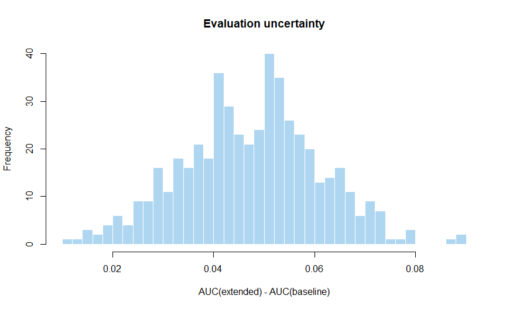

Chapter 16: Independent Prediction Evaluation
================

# Does PRS add information beyond the baseline model?

A score can be associated with disease while adding little to predictors
already available. Incremental evaluation compares a baseline model with
a model that includes the PRS, using the same independent people and
outcome definition.

**Objectives:** fit models in development data, apply fixed
preprocessing, calculate AUC and Brier score, and estimate a paired AUC
difference with uncertainty. Prerequisites: Chapters 5, 6, 10 and 15.
All practical code uses base R and the shared synthetic cohort.

# 1. Define the models and evaluation population

The baseline uses age and SBP. The extended model adds the fixed
synthetic PRS. These are teaching models, not validated clinical
calculators. We fit coefficients in 2,000 development participants and
evaluate in 2,000 separate test participants. Discovery, tuning and
LD-reference outcomes do not participate in this fitting step.

The helper uses fixed age/SBP transformations and PRS mean/SD learned in
development. The simulation assumes unrelated individuals with complete
five-year follow-up, no competing deaths and no missing predictors. If
real data violate these assumptions, replace the corresponding analysis
steps rather than silently dropping affected people.

``` r
bundle <- fit_course_models()
test <- bundle$test
stopifnot(length(intersect(bundle$train$IID,test$IID))==0)
metrics <- data.frame(Model=c("Age + SBP","Age + SBP + PRS"),
  AUC=c(auc(test$CAD5,test$p_base),auc(test$CAD5,test$p_prs)),
  Brier=c(mean((test$CAD5-test$p_base)^2),mean((test$CAD5-test$p_prs)^2)))
knitr::kable(metrics,digits=4)
```

| Model           |    AUC |  Brier |
|:----------------|-------:|-------:|
| Age + SBP       | 0.6099 | 0.0808 |
| Age + SBP + PRS | 0.6568 | 0.0793 |

The Brier score is the mean squared difference between event indicators
and predicted probabilities. Lower is better on the same outcome and
sample, but it depends on event frequency. A model that predicts low
probabilities for everyone can have a modest Brier score when events are
rare; examine more than one measure.

# 2. AUC measures ranking

AUC can be understood as the chance that a randomly chosen case receives
a higher prediction than a randomly chosen non-case, with half credit
for ties. It does not establish accurate probabilities. A value below
0.5 can indicate reversed orientation or poor ranking; do not
automatically flip a model using test outcomes and then report the
improved test value as independent.

Our rank-based function handles ties. AUC is undefined if either outcome
class is absent. It is affected by the evaluated population’s predictor
distribution, so values from different cohorts are not automatically
comparable. \[1\]

# 3. Paired uncertainty

Both models predict the same people. Resample those people together to
preserve the relationship between predictions.

``` r
boot <- paired_auc_bootstrap(test$CAD5,test$p_base,test$p_prs,B=500)
knitr::kable(data.frame(Delta_AUC=boot$delta,Lower=boot$CI[1],
                        Upper=boot$CI[2],Failed_resamples=boot$failed),digits=4)
```

|      | Delta_AUC |  Lower |  Upper | Failed_resamples |
|:-----|----------:|-------:|-------:|-----------------:|
| 2.5% |     0.047 | 0.0212 | 0.0726 |                0 |

Five hundred replicates keep this lesson manageable. For a planned final
analysis, use enough resamples to make reported limits stable, record
the seed and method, and verify any failures. This is a
percentile-bootstrap interval conditional on the fitted models. It does
not include uncertainty from drawing a different development sample.

<div class="figure" style="text-align: center">


<p class="caption">

Figure 16.1: Paired bootstrap AUC differences for fixed fitted models in
synthetic test participants. Resampling variation is not clinical
evidence.
</p>

</div>

If an interval includes zero, the evaluation is inconclusive at that
precision; it does not prove equivalence. A tiny positive difference may
be statistically clear but practically unimportant. Report magnitude,
interval and the intended use.

# 4. Internal, external and nested validation

A random holdout from the same source population provides internal
evaluation. It does not establish transfer to another healthcare
setting. External validation investigates a different eligible dataset
and requires attention to outcome definition, timing, measurement and
model implementation. \[2\]

When selecting methods or settings within limited data, nested
cross-validation can evaluate the entire development procedure: inner
training folds make choices; outer held-out folds assess them. Learned
imputation and preprocessing belong within the appropriate training
folds. Related people must be grouped appropriately, and uncertainty
should respect remaining dependence.

If a complete published probability model is frozen beforehand, an
independent cohort can be used entirely for validation; a local training
split is not automatically required. Recalibrating the model changes the
task and should be reported separately.

# 5. What a real comparison should add

Use a clinical comparator justified for the intended setting, not just
whichever variables happen to be available. Specify a primary metric,
event counts, missing-data strategy, sensitivity analyses and
sample-size justification. External-validation planning should target
precision of relevant performance measures rather than use a universal
event-count rule. \[3\]

The methodological work by Steyerberg et al. organizes performance into
different domains. Our practical applies that idea by separating
ranking, probability error and the calibration lesson that follows.
\[1\]

# Practice and handover

**Why paired resampling?** Each pair of model predictions belongs to the
same person.

**Can you fit the extended model in test data?** You can develop there,
but then its in-sample performance is not independent validation.

**Does higher AUC mean better calibration?** No.

The outputs are `metrics`, the paired interval, fixed model coefficients
and development transformation parameters. The end-to-end script in
Chapter 20 saves these reproducibly. Chapter 17 checks whether the
probabilities mean what they claim.

# References

1.  Steyerberg EW, Vickers AJ, Cook NR, et al. Assessing the performance
    of prediction models: a framework for traditional and novel
    measures. *Epidemiology*. 2010;21:128–138.
    <https://doi.org/10.1097/EDE.0b013e3181c30fb2>
2.  Riley RD, Archer L, Snell KIE, et al. Evaluation of clinical
    prediction models (part 2): how to undertake an external validation
    study. *BMJ*. 2024;384:e074820.
    <https://doi.org/10.1136/bmj-2023-074820>
3.  Riley RD, Snell KIE, Archer L, et al. Evaluation of clinical
    prediction models (part 3): calculating the sample size required for
    an external validation study. *BMJ*. 2024;384:e074821.
    <https://doi.org/10.1136/bmj-2023-074821>
