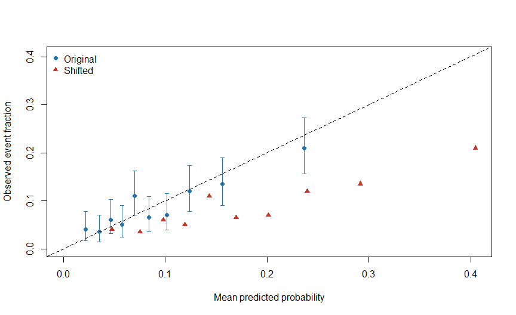

Chapter 17: Calibration and Absolute Risk
================

# What should a prediction of 20% mean?

Among comparable people assigned a probability near 20%, we would like
approximately one in five to experience the specified event over the
stated time period. **Calibration** examines agreement between predicted
probabilities and observed outcomes.

**Objectives:** distinguish calibration from ranking, demonstrate
miscalibration without changing AUC, estimate calibration intercept and
slope, and explain why a PRS alone is not absolute risk. Prerequisites:
Chapters 5 and 16.

# 1. Deliberately change the probabilities

``` r
bundle <- fit_course_models(); test <- bundle$test
p <- test$p_prs
stopifnot(all(p>0 & p<1))
p_shift <- plogis(qlogis(p)+.8)
comparison <- data.frame(Model=c("Original fitted model","Artificially shifted"),
 AUC=c(auc(test$CAD5,p),auc(test$CAD5,p_shift)),
 Mean_prediction=c(mean(p),mean(p_shift)),Observed=mean(test$CAD5),
 Brier=c(mean((test$CAD5-p)^2),mean((test$CAD5-p_shift)^2)))
knitr::kable(comparison,digits=4)
```

| Model                 |    AUC | Mean_prediction | Observed |  Brier |
|:----------------------|-------:|----------------:|---------:|-------:|
| Original fitted model | 0.6568 |          0.0934 |   0.0895 | 0.0793 |
| Artificially shifted  | 0.6568 |          0.1791 |   0.0895 | 0.0904 |

``` r
stopifnot(abs(auc(test$CAD5,p)-auc(test$CAD5,p_shift))<1e-10)
```

The shift increases every person’s predicted log odds by 0.8 while
preserving their order. AUC is identical. The shifted probabilities will
generally overpredict in this simulation, but the exact empirical
calibration values depend on the generated sample.

A score can therefore rank people well and still give misleading
probability statements. Calibration is central when thresholds drive
decisions. \[1\]

# 2. A transparent calibration plot

We form ten groups using the original probabilities. The same groups are
used for the shifted predictions because their ranks are unchanged.
Grouping is a visual summary, not a complete calibration assessment.

``` r
group <- cut(rank(p,ties.method="first"),
             breaks=seq(0,length(p),length.out=11),labels=FALSE)
calibration <- do.call(rbind,lapply(split(seq_along(p),group),function(ix) {
 y <- test$CAD5[ix]; ci <- binom.test(sum(y),length(y))$conf.int
 data.frame(N=length(ix),Mean_p=mean(p[ix]),Shift_p=mean(p_shift[ix]),
            Observed=mean(y),Lower=ci[1],Upper=ci[2])
}))
knitr::kable(calibration,digits=3)
```

|   N | Mean_p | Shift_p | Observed | Lower | Upper |
|----:|-------:|--------:|---------:|------:|------:|
| 200 |  0.022 |   0.048 |    0.040 | 0.017 | 0.077 |
| 200 |  0.035 |   0.075 |    0.035 | 0.014 | 0.071 |
| 200 |  0.047 |   0.098 |    0.060 | 0.031 | 0.102 |
| 200 |  0.057 |   0.119 |    0.050 | 0.024 | 0.090 |
| 200 |  0.070 |   0.143 |    0.110 | 0.070 | 0.162 |
| 200 |  0.084 |   0.170 |    0.065 | 0.035 | 0.109 |
| 200 |  0.102 |   0.201 |    0.070 | 0.039 | 0.115 |
| 200 |  0.124 |   0.240 |    0.120 | 0.078 | 0.173 |
| 200 |  0.156 |   0.292 |    0.135 | 0.091 | 0.190 |
| 200 |  0.237 |   0.405 |    0.210 | 0.156 | 0.273 |

The intervals describe group event fractions using a binomial
approximation: individual event probabilities can differ within each
group. They are not uncertainty intervals for individual risk, and ten
pointwise intervals do not form a simultaneous confidence band. Large
datasets can support smoother calibration curves; sparse groups remain
imprecise.

<div class="figure" style="text-align: center">


<p class="caption">

Figure 17.1: Synthetic calibration. Both prediction sets have identical
AUC; the shifted probabilities move horizontally away from the identity
line.
</p>

</div>

# 3. Intercept and slope answer related questions

Calibration-in-the-large can be assessed by fitting an intercept while
holding the prediction’s log-odds coefficient at one. A joint
calibration intercept and slope permits that coefficient to change.
Label which intercept you report.

``` r
lp <- qlogis(p)
cal_in_large <- glm(test$CAD5~1+offset(lp),family=binomial())
cal_joint <- glm(test$CAD5~lp,family=binomial())
stopifnot(cal_in_large$converged,cal_joint$converged)
knitr::kable(data.frame(
 Measure=c("Intercept with slope fixed at 1","Joint intercept","Joint slope"),
 Estimate=c(coef(cal_in_large)[1],coef(cal_joint)[1],coef(cal_joint)[2])),digits=3)
```

| Measure                         | Estimate |
|:--------------------------------|---------:|
| Intercept with slope fixed at 1 |   -0.049 |
| Joint intercept                 |   -0.538 |
| Joint slope                     |    0.768 |

An ideal calibration intercept is zero and slope one, but sampling
uncertainty matters. A slope below one often indicates predictions are
too extreme; it is not proof of one specific cause. The original model
may be misspecified or the new population may differ. These two numbers
also do not detect every nonlinear calibration problem. \[1,2\]

Fitting a recalibration equation using test outcomes is model updating.
Its apparent post-update calibration in those same people is not
independent evidence. Retain the original validation and evaluate the
update appropriately.

# 4. What absolute risk requires

The outcome and time horizon must be explicit. Our probability concerns
synthetic first CAD events within five fully observed years. It cannot
be relabelled ten-year risk. Real prospective data need event dates and
appropriate handling of loss to follow-up and death.

Case-control sampling changes the observed case fraction. A fitted
intercept from a deliberately case-enriched sample does not
automatically give population probabilities. External incidence
information and suitable methods may be needed. Marginal PRS weights
alone do not provide that information.

For time-to-event outcomes, hazard ratios are not probabilities.
Competing events matter when the target is the probability of disease
before another event prevents it. Selecting a survival or competing-risk
estimator belongs in the analysis plan.

# Practice and handover

**Can an unchanged AUC conceal worse probability estimates?** Yes, as
the shift demonstrates.

**Does slope one alone prove perfect calibration?** No; intercept and
possible nonlinear discrepancies also matter.

**Can we report recalibrated test performance as untouched validation?**
No; updating used those outcomes.

Retain the plot, group sizes, calibration model definitions and
limitations. Chapter 18 asks whether using these probabilities leads to
a worthwhile decision.

# References

1.  Van Calster B, McLernon DJ, van Smeden M, Wynants L, Steyerberg EW.
    Calibration: the Achilles heel of predictive analytics. *BMC
    Medicine*. 2019;17:230. <https://doi.org/10.1186/s12916-019-1466-7>
2.  Cox DR. Two further applications of a model for binary regression.
    *Biometrika*. 1958;45:562–565.
    <https://doi.org/10.1093/biomet/45.3-4.562>
