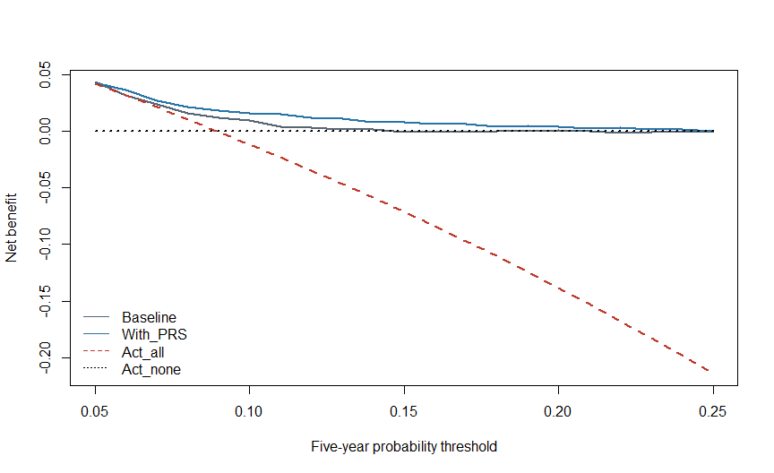

Chapter 18: Clinical Utility: Would Using the Score Help?
================

# Better prediction is not automatically better care

A model can increase AUC without changing a useful decision. Conversely,
a modest improvement near a clinically meaningful threshold could
matter. Clinical utility asks whether using predictions improves
decisions after accounting for consequences, burdens and alternatives.

**Objectives:** interpret a threshold table, explain positive predictive
value and net benefit, and distinguish decision analysis from proof of
improved outcomes. Prerequisites: Chapters 16–17. This is an advanced
interpretation chapter, not medical advice or a treatment protocol.

# 1. A threshold implies a decision

A probability threshold is the point at which a particular action
becomes worth considering. It is not the same as a PRS percentile
cutoff. A five-year disease probability of 10% is different from being
in the top 10% of a genetic score.

For teaching we use a 10% threshold for a fictional further assessment.
It is not a CAD guideline threshold. Before using a real threshold,
specify the action, benefits, harms, costs, capacity and population. Do
not search the test set for the most attractive cutoff and call it a
prespecified decision.

``` r
bundle <- fit_course_models(); d <- bundle$test
threshold <- .10
positive <- d$p_prs>=threshold
TP <- sum(positive & d$CAD5==1); FP <- sum(positive & d$CAD5==0)
FN <- sum(!positive & d$CAD5==1); TN <- sum(!positive & d$CAD5==0)
counts <- data.frame(Prediction=c("Above threshold","Below threshold"),
                    Event=c(TP,FN),No_event=c(FP,TN))
knitr::kable(counts)
```

| Prediction      | Event | No_event |
|:----------------|------:|---------:|
| Above threshold |   100 |      621 |
| Below threshold |    79 |     1200 |

``` r
measures <- data.frame(Sensitivity=TP/(TP+FN),Specificity=TN/(TN+FP),
                       PPV=if(TP+FP>0) TP/(TP+FP) else NA_real_,
                       NPV=if(TN+FN>0) TN/(TN+FN) else NA_real_)
knitr::kable(measures,digits=3)
```

| Sensitivity | Specificity |   PPV |   NPV |
|------------:|------------:|------:|------:|
|       0.559 |       0.659 | 0.139 | 0.938 |

Sensitivity is the fraction of cases above the threshold. PPV is the
fraction of flagged people who have events. Those denominators differ.
PPV depends strongly on event frequency and setting; it cannot be
transferred unchanged from a case-enriched sample to the general
population.

# 2. Net benefit weighs false positives

Decision curve analysis expresses consequences on a scale of
true-positive equivalents. Its threshold odds specify the relative
penalty for false positives. It compares a model-guided strategy with
alternatives such as acting on everyone or no one. \[1\]

``` text
Net benefit = TP/N - FP/N × threshold/(1 - threshold)
```

At a threshold of 0.10, the false-positive weight is 0.10/0.90. This is
a decision preference represented mathematically, not an empirical
estimate of treatment efficacy. The standard expression omits costs not
explicitly incorporated in its assumptions, including possible
genotyping and implementation burdens.

``` r
thresholds <- seq(.05,.25,by=.01)
curve_data <- data.frame(Threshold=thresholds)
curve_data$Baseline <- vapply(thresholds,function(t)
 net_benefit(d$CAD5,d$p_base,t),numeric(1))
curve_data$With_PRS <- vapply(thresholds,function(t)
 net_benefit(d$CAD5,d$p_prs,t),numeric(1))
prevalence <- mean(d$CAD5)
curve_data$Act_all <- prevalence-(1-prevalence)*thresholds/(1-thresholds)
curve_data$Act_none <- 0
```

<div class="figure" style="text-align: center">


<p class="caption">

Figure 18.1: Synthetic decision curves over an illustrative threshold
range. These are point estimates and do not establish real CAD clinical
utility.
</p>

</div>

Only thresholds relevant to the actual decision should support claims.
The entire displayed range is educational. A model is not useful simply
because its curve exceeds zero; compare it with meaningful alternatives,
including the baseline model.

# 3. Uncertainty at the prespecified teaching threshold

``` r
set.seed(1806)
nb_delta <- replicate(500,{
 i <- sample.int(nrow(d),replace=TRUE)
 net_benefit(d$CAD5[i],d$p_prs[i],.10)-net_benefit(d$CAD5[i],d$p_base[i],.10)
})
quantile(nb_delta,c(.025,.975))
#>        2.5%       97.5% 
#> 0.001108333 0.011000000
```

This is a pointwise paired interval conditional on the fitted models and
illustrative threshold. It is not a simultaneous confidence band over
all thresholds and does not account for uncertain treatment preferences.
Related people would require a suitable dependence-aware approach.

# 4. From a model to an intervention

A real implementation must consider whether results reach patients,
whether clinicians act appropriately, and whether benefits outweigh
harms. Calibration can change across settings. Unnecessary
investigations, anxiety, inequitable access and opportunity costs can
offset potential gains.

An impact study evaluates what happens when the tool is used in
practice. Randomized or otherwise well-designed prospective comparisons
can address questions that retrospective discrimination and decision
curves cannot resolve. Do not state that a PRS prevents disease merely
because a score predicts it.

**Published methodological example:** Vickers and Elkin introduced
decision curve analysis using clinical prediction examples in prostate
cancer. The contribution is a way to connect prediction and decision
consequences, not evidence for PRS-guided CAD treatment. \[1\]

# Practice and handover

**Why can high sensitivity coexist with low PPV?** Flagging many
non-cases can capture cases while producing many false positives.

**Is the top PRS decile a probability threshold?** No.

**Does a favorable decision curve prove treatment works?** No; utility
calculations rely on the decision context and do not substitute for
intervention evidence.

Retain the action definition, threshold rationale, baseline comparator,
counts and uncertainty. Chapter 19 examines whether conclusions survive
changes in population, measurements and score coverage.

# References

1.  Vickers AJ, Elkin EB. Decision curve analysis: a novel method for
    evaluating prediction models. *Medical Decision Making*.
    2006;26:565–574. <https://doi.org/10.1177/0272989X06295361>
2.  Steyerberg EW, Vickers AJ, Cook NR, et al. Assessing the performance
    of prediction models: a framework for traditional and novel
    measures. *Epidemiology*. 2010;21:128–138.
    <https://doi.org/10.1097/EDE.0b013e3181c30fb2>
