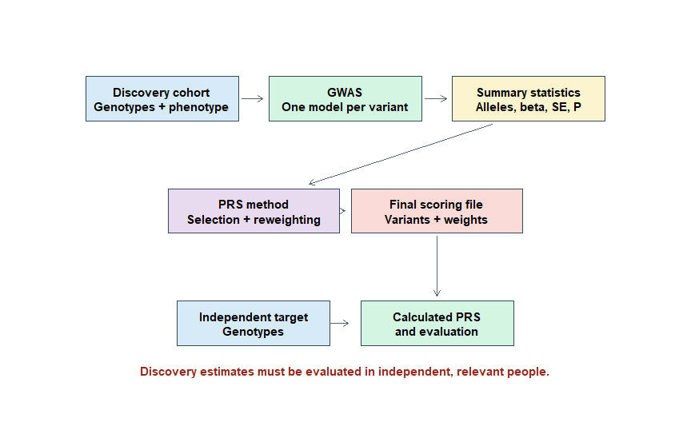
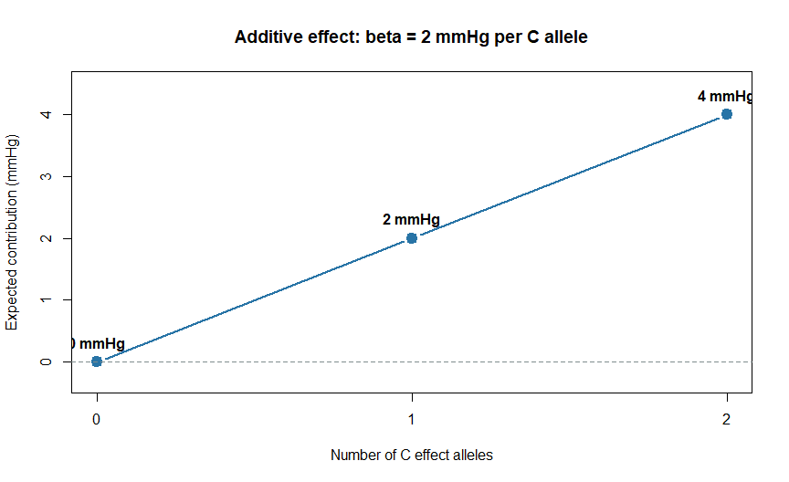
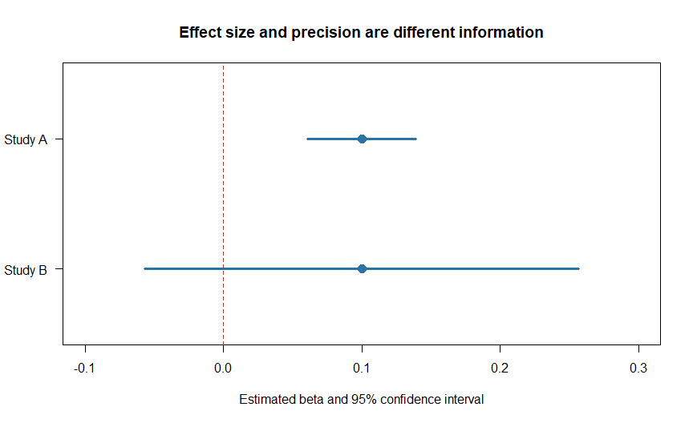
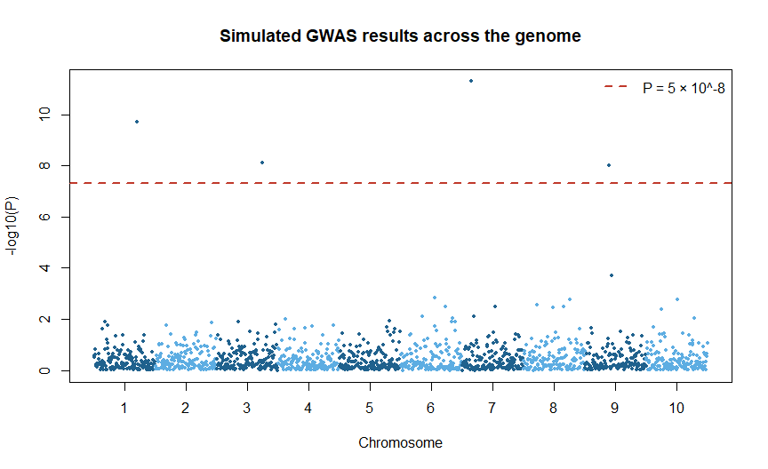

Chapter 3: From GWAS to PRS
================

# Why connect GWAS and PRS?

In Chapter 1, we learned that a polygenic risk score is a weighted sum
of genetic variants. In Chapter 2, we learned how a person’s genotype
becomes an effect-allele dosage of 0, 1, 2 or an imputed decimal value.

We now need to answer the next question:

> Where do the variant weights come from?

For most polygenic scores, the starting information comes from a
**genome-wide association study**, abbreviated as **GWAS**. A GWAS
estimates the statistical association between each genetic variant and a
defined disease or trait.

The GWAS does not itself create a finished PRS. It produces evidence
that a PRS method can use to select variants and estimate their final
weights.

> **Central idea:** GWAS provides estimated variant–phenotype
> associations. A PRS method transforms those estimates into a
> prediction model, which must then be tested in independent people.

# 1. What question does a GWAS ask?

A GWAS examines variants across the genome and asks, one variant at a
time:

``` text
Is this genetic variant statistically associated with the phenotype?
```

Depending on the phenotype, the question might be:

- Do people with allele G have a different average cholesterol level?
- Is allele T more frequent among people with coronary artery disease?
- Does each additional C allele correspond to a change in height?
- Is allele A associated with higher or lower odds of schizophrenia?

A GWAS usually evaluates hundreds of thousands or millions of variants.
For each variant, it produces an effect estimate and a measure of
uncertainty.

## 1.1 An everyday analogy

Imagine evaluating thousands of possible predictors of examination
performance. For each predictor—attendance, sleep, preparation time and
so on—you estimate:

- the direction of the relationship;
- the size of the relationship;
- the uncertainty in that estimate; and
- how compatible the observation is with no association.

GWAS follows a similar statistical idea, but the predictors are genetic
variants and the outcome is a disease or trait.

# 2. The complete path from GWAS to PRS

<div class="figure" style="text-align: center">


<p class="caption">

Figure 3.1: The complete conceptual path from a discovery GWAS to
independent PRS evaluation.
</p>

</div>

The important stages are:

1.  collect genotype and phenotype data in a discovery sample;
2.  perform GWAS;
3.  produce GWAS summary statistics;
4.  select a PRS construction method;
5.  generate a scoring file containing variants and final weights;
6.  apply those weights to target genotypes; and
7.  evaluate the score in independent data.

Skipping the final evaluation step produces a score, but not trustworthy
evidence of prediction.

# 3. What data enter a GWAS?

A GWAS needs at least:

- participant genotypes;
- a clearly defined phenotype; and
- relevant covariates.

Common covariates include:

- age;
- sex, when relevant to the design;
- genetic principal components;
- study site or genotyping batch; and
- other design-specific variables.

Covariates help control systematic differences that might otherwise
produce biased genetic associations. The correct covariates depend on
the study design and scientific question.

## 3.1 Phenotype quality matters

A very large GWAS with a poorly defined phenotype may not be better than
a somewhat smaller GWAS with a carefully measured, relevant phenotype.

Before using GWAS results, ask:

- Was disease status clinically confirmed, self-reported or inferred
  from records?
- Are cases and controls defined appropriately?
- Was the same trait definition used across contributing cohorts?
- Was a quantitative measurement taken consistently?
- Does the discovery phenotype match the target outcome?

For example, a GWAS of “any cardiovascular disease” should not
automatically be treated as equivalent to a GWAS specifically of
coronary artery disease.

# 4. Case-control GWAS

A **case-control GWAS** studies a binary outcome:

``` text
Case    = person with the defined condition
Control = person without the defined condition
```

The analysis commonly uses logistic regression. At each variant, it
estimates whether effect-allele dosage is associated with the **odds**
of being a case.

A simplified model is:

``` text
log odds of disease = intercept
                    + beta × effect-allele dosage
                    + covariate effects
```

The variant beta is on the **log-odds scale**.

## 4.1 Beta and odds ratio

For a case-control GWAS:

``` text
Odds ratio = exp(beta)

beta = log(odds ratio)
```

Interpretation:

|     Beta |     Odds ratio | Direction for the effect allele |
|---------:|---------------:|---------------------------------|
| Positive | Greater than 1 | Higher odds of the outcome      |
|     Zero |     Equal to 1 | No estimated association        |
| Negative |    Less than 1 | Lower odds of the outcome       |

## 4.2 Worked odds-ratio example

Suppose the effect allele is G and the GWAS reports:

``` text
Odds ratio per G allele = 1.20
```

The corresponding log-odds beta is:

``` r
odds_ratio <- 1.20
log_odds_beta <- log(odds_ratio)

log_odds_beta
#> [1] 0.1823216
```

Therefore:

``` text
beta = log(1.20) ≈ 0.182
```

The estimated odds multiply by 1.20 for each additional G copy, under
the fitted additive logistic model and conditional on its covariates.

## 4.3 Critical PRS rule: do not use the odds ratio directly

For an additive weighted score, use the reported beta or the natural
logarithm of the odds ratio—not the odds ratio itself.

Incorrect calculation:

``` text
Contribution = dosage × 1.20
```

Appropriate log-odds calculation:

``` text
Contribution = dosage × log(1.20)
             = dosage × 0.182
```

Why? An odds ratio of 1 represents no association. If 1 were used
directly as a weight, every null variant would add to the score. On the
log-odds scale, no association becomes log(1) = 0, which correctly
contributes zero.

## 4.4 Odds are not probability

Odds and probability are related but different:

``` text
Odds = probability / (1 - probability)

Probability = odds / (1 + odds)
```

An odds ratio of 1.20 does not mean a 20-percentage-point increase in
disease probability. The probability change depends on baseline risk and
the rest of the prediction model.

# 5. Quantitative-trait GWAS

A **quantitative trait** can take many numerical values.

Examples include:

- height;
- blood pressure;
- cholesterol concentration;
- body mass index; and
- a laboratory biomarker.

Linear regression is commonly used:

``` text
Expected trait value = intercept
                     + beta × effect-allele dosage
                     + covariate effects
```

The beta represents the estimated trait change associated with each
additional copy of the effect allele.

## 5.1 Worked quantitative example

Suppose C is the effect allele and beta is 2.0 mmHg per C allele for
systolic blood pressure.

| Genotype dosage | Expected genetic contribution from this variant |
|----------------:|------------------------------------------------:|
|               0 |                                          0 mmHg |
|               1 |                                          2 mmHg |
|               2 |                                          4 mmHg |

<div class="figure" style="text-align: center">


<p class="caption">

Figure 3.2: A simplified additive variant effect for a quantitative
trait. The points show expected means, not every person’s observed
measurement.
</p>

</div>

Real people with the same genotype will still have different blood
pressures because many other genetic and non-genetic factors contribute.

## 5.2 The beta’s units must be known

A quantitative-trait beta might represent:

- original measurement units per allele;
- standard deviations per allele;
- change in a log-transformed trait;
- change in an inverse-normal transformed trait; or
- another study-specific scale.

The column name `BETA` alone does not reveal the units. Read the GWAS
documentation and publication.

# 6. Additive genetic models

Most standard GWAS and PRS workflows use an **additive model**.

If G is the effect allele, dosage is coded:

``` text
A/A = 0
A/G = 1
G/G = 2
```

The model assumes that moving from dosage 0 to 1 has the same estimated
effect increment as moving from 1 to 2.

This is a statistical model, not a claim that biology is always
perfectly additive. Dominant, recessive and interaction effects can
exist, but standard PRS construction usually begins with additive
effects because they are scalable and well supported by common GWAS
summary statistics.

# 7. Effect allele and effect direction

Every beta, odds ratio and allele frequency must be interpreted relative
to a defined allele.

Suppose a GWAS reports:

``` text
Effect allele: G
Other allele:  A
Beta:          0.10
```

This means the estimated effect is +0.10 per additional G copy.

If the same association is written relative to A, the beta changes sign:

``` text
Effect allele: A
Other allele:  G
Beta:         -0.10
```

These two rows can describe the same underlying association. Allele
orientation—not only the numerical beta—must therefore be harmonized
before scoring.

For an odds ratio:

``` text
OR for G versus A = 1.20
OR for A versus G = 1 / 1.20 ≈ 0.833
```

An effect estimate without its effect allele is incomplete.

# 8. Standard error and confidence interval

A GWAS beta is an estimate from a sample. If a different sample were
studied, the estimate would usually differ somewhat.

The **standard error**, abbreviated as **SE**, summarizes the
statistical uncertainty of the beta estimate. Smaller SE generally means
greater precision.

An approximate 95% confidence interval for a beta is:

``` text
Lower limit = beta - 1.96 × SE
Upper limit = beta + 1.96 × SE
```

## 8.1 Same beta, different uncertainty

``` r
estimate_data <- data.frame(
  Study = c("Study A", "Study B"),
  Beta = c(0.10, 0.10),
  SE = c(0.02, 0.08)
)

estimate_data$Lower_95CI <- estimate_data$Beta - 1.96 * estimate_data$SE
estimate_data$Upper_95CI <- estimate_data$Beta + 1.96 * estimate_data$SE
estimate_data
#>     Study Beta   SE Lower_95CI Upper_95CI
#> 1 Study A  0.1 0.02     0.0608     0.1392
#> 2 Study B  0.1 0.08    -0.0568     0.2568
```

<div class="figure" style="text-align: center">


<p class="caption">

Figure 3.3: Identical beta estimates can have very different precision.
Study B’s wider confidence interval reflects greater uncertainty.
</p>

</div>

For log-odds beta, exponentiating the beta confidence limits produces an
odds-ratio confidence interval.

# 9. What does a P value mean?

The P value evaluates how incompatible the observed data are with a
specified null model, usually no association for that variant, given the
statistical assumptions.

A smaller P value indicates stronger statistical evidence against the
null model. It does **not** directly provide:

- the probability that the variant is causal;
- the probability that the finding is false;
- the size of the effect;
- the clinical importance of the association; or
- the predictive value of the variant.

## 9.1 Effect size and P value are different

A tiny effect can have a very small P value in a huge sample. A larger
estimated effect can have a non-significant P value when the sample is
small or the allele is rare.

Therefore, never rank biological or clinical importance using P values
alone.

## 9.2 Genome-wide significance

Because a GWAS tests many variants, the conventional threshold:

``` text
P < 5 × 10^-8
```

is often used to identify genome-wide significant associations for
common-variant GWAS.

This threshold is not a universal law for every design. More importantly
for PRS, a useful polygenic score may include variants that do **not**
individually reach genome-wide significance. Thousands of small,
imprecisely estimated effects may collectively contain predictive
information.

<div class="figure" style="text-align: center">


<p class="caption">

Figure 3.4: A simulated Manhattan-style plot. PRS methods may use
information beyond the few variants crossing the genome-wide
significance line.
</p>

</div>

Figure 3.4 uses simulated data and is intended only to explain the
concept.

# 10. What are GWAS summary statistics?

GWAS summary statistics contain variant-level results without containing
each participant’s complete individual-level data.

A simplified file may look like this:

| CHR |   POS | SNP        | EA  | OA  |  EAF |  BETA |   SE |       P |      N |
|----:|------:|------------|-----|-----|-----:|------:|-----:|--------:|-------:|
|   1 | 10583 | rsExample1 | G   | A   | 0.31 |  0.08 | 0.02 | 0.00006 | 120000 |
|   1 | 30923 | rsExample2 | T   | C   | 0.47 | -0.03 | 0.01 | 0.00270 | 119850 |
|   2 | 81128 | rsExample3 | A   | G   | 0.08 |  0.15 | 0.05 | 0.00270 | 118900 |

These rows are fictional.

## 10.1 Common columns

| Column | Meaning | Why PRS needs it |
|----|----|----|
| `CHR` | Chromosome | Variant identification and genome-build checks |
| `POS` or `BP` | Base-pair position | Variant matching |
| `SNP` or `ID` | Variant identifier | Matching across datasets |
| `EA`, `A1` or `ALT` | Reported effect allele, depending on documentation | Determines the counted allele |
| `OA`, `A2` or `REF` | Other allele, depending on documentation | Enables allele alignment checks |
| `EAF` | Effect-allele frequency | Quality control and ambiguity checks |
| `BETA` | Estimated per-allele effect | Candidate PRS weight or method input |
| `OR` | Per-allele odds ratio | Must usually be converted to log(OR) |
| `SE` | Standard error | Precision and method input |
| `P` | P value | Variant selection in methods such as C+T |
| `N` | Analysis sample size | Power, QC and method input |
| `N_CASE` | Number of cases | Binary-trait documentation |
| `N_CONTROL` | Number of controls | Binary-trait documentation |
| `INFO` | Imputation-quality measure | Summary-statistics quality control |

Column names are not standardized across all GWAS files. `A1` may be the
effect allele in one file but have another meaning elsewhere. Always
read the data dictionary.

## 10.2 Essential metadata not contained in one row

Before using a summary-statistics file, also identify:

- phenotype definition;
- ancestry composition;
- genome build;
- effect scale;
- statistical model;
- covariates;
- sample size and whether it varies by variant;
- imputation panel;
- variant-level QC;
- whether related people were included;
- participating cohorts;
- sample-overlap information; and
- restrictions on use.

# 11. How GWAS beta becomes a PRS weight

The process depends on the chosen PRS method.

## 11.1 Direct use after selection

Clumping and thresholding commonly:

1.  removes many correlated variants through LD clumping;
2.  selects variants using one or more P-value thresholds; and
3.  uses the corresponding GWAS beta values as weights.

The final score is approximately:

``` text
PRS = sum of effect-allele dosage × selected GWAS beta
```

## 11.2 Re-estimation or shrinkage

Methods such as LDpred2 and PRS-CS use GWAS summary statistics together
with LD information. They adjust or shrink the original marginal
estimates to produce posterior or model-adjusted weights.

Conceptually:

``` text
GWAS marginal effects + LD information + model assumptions
                           ↓
                 adjusted PRS weights
```

Therefore:

``` text
GWAS beta ≠ always the final PRS weight
```

## 11.3 Published scoring files

When using a published score from the PGS Catalog, the scoring file
already contains the final effect alleles and weights selected by the
score developers. The original GWAS summary statistics may still be
important for understanding provenance, but the user normally applies
the published scoring weights rather than rebuilding them.

# 12. Why not add every GWAS beta directly?

There are three major problems.

## 12.1 Sampling noise

Every GWAS estimate contains uncertainty. Adding millions of noisy
estimates without appropriate modelling can reduce predictive accuracy.

## 12.2 Linkage disequilibrium

Nearby variants may be correlated. Their marginal GWAS effects can
partly represent the same underlying regional signal.

If all correlated variants are treated as independent evidence, the
region may be overrepresented. PRS methods address this through
clumping, LD-aware shrinkage, joint modelling or other strategies.

## 12.3 Genetic architecture

Traits differ in:

- the number of contributing variants;
- the distribution of effect sizes;
- the contribution of rare and common variants; and
- how effects are distributed across functional regions.

Different PRS methods make different assumptions about this
architecture. No one method is guaranteed to perform best for every
trait and population.

# 13. Marginal effect versus causal effect

A standard GWAS usually tests one variant at a time while adjusting for
covariates, not for every other genomic variant.

The resulting beta is called a **marginal association estimate**. It may
reflect:

- a direct causal effect;
- correlation with a nearby causal variant;
- several correlated signals;
- residual confounding or technical bias; or
- sampling variation.

A predictive weight does not need to identify the causal variant.
However, prediction can fail when the correlation structure changes
between discovery and target populations.

This is another reason PRS should not be described as a list of
disease-causing variants.

# 14. Sample size, power and precision

Larger GWAS samples generally provide:

- smaller standard errors;
- more precise effect estimates;
- greater power to detect small associations; and
- potentially better PRS weights.

But sample size is not the only criterion. A large GWAS may still be
unsuitable if its phenotype, ancestry, quality control or population
does not match the intended analysis.

## 14.1 Why rare alleles need more information

If an effect allele is rare, few participants carry it. Its effect is
therefore usually estimated with less precision than that of a common
allele with the same sample size and measurement quality.

## 14.2 Effective sample size

For a balanced case-control GWAS, cases and controls contribute
efficiently. A severely unbalanced design may contain many participants
but less information than the total count suggests.

A commonly used effective sample-size approximation is:

``` text
Effective N = 4 / (1 / number of cases + 1 / number of controls)
```

This approximation is useful for some PRS methods, but analysts should
follow each method’s input requirements rather than replacing reported
sample sizes automatically.

## 14.3 Winner’s curse

Variants selected because they showed the strongest associations in a
finite discovery sample can have effect sizes that are overestimated in
that sample. This selection-related inflation is often called **winner’s
curse**.

Larger discovery samples, shrinkage methods and independent validation
can reduce its impact, but they do not remove the need for careful
evaluation.

# 15. Discovery, tuning and validation samples

These datasets have different jobs.

| Dataset | Main purpose | What it should not be used to claim |
|----|----|----|
| Discovery GWAS | Estimate variant associations | Final performance in new people |
| Tuning or training sample | Choose thresholds or model parameters | Unbiased final performance after choosing the best model |
| Validation or test sample | Evaluate the locked model | Further tune the model and still call the result independent |
| Application target | Calculate scores for the intended analysis | Validity without relevant external evidence |

## 15.1 Sample overlap

If the same people appear in both discovery GWAS and target evaluation,
the score may partly predict discovery-sample noise. This can inflate
the observed association or performance.

Overlap is especially concerning when:

- the target cohort contributed to the discovery GWAS;
- the overlap is large relative to the target sample;
- many weak variants are included; or
- the score is tuned and evaluated in the same people.

The safest design uses independent discovery, tuning and validation
samples whenever feasible.

# 16. Why ancestry match matters

GWAS effect estimates and PRS performance may differ across populations
because of:

- allele-frequency differences;
- LD differences;
- environmental and social contexts;
- phenotype and healthcare differences;
- unequal discovery sample sizes; and
- chance and estimation error.

A GWAS from the largest available population is not automatically the
best base dataset for every target population.

When possible, compare:

- ancestry-specific discovery GWAS;
- multi-ancestry GWAS;
- ancestry-matched LD references; and
- independent performance within each relevant target group.

Genetic ancestry is only one part of transportability. Matching ancestry
does not compensate for a mismatched phenotype or weak study design.

# 17. Fixed-effect meta-analysis and heterogeneous studies

Many large GWAS combine results from multiple cohorts through
meta-analysis.

This can increase sample size, but cohorts may differ in:

- phenotype measurement;
- recruitment;
- age distribution;
- ancestry;
- genotyping platform;
- imputation panel; and
- covariate adjustment.

A meta-analysis beta is an evidence-weighted estimate across included
studies. Before using it for PRS, inspect the study description and
heterogeneity information when available.

Large consortium results can be excellent PRS inputs, but “large” should
not be mistaken for “identical across cohorts.”

# 18. A small R demonstration

The following simulated example shows how a quantitative-trait GWAS
estimates one variant’s beta.

``` r
set.seed(2026)

n_people <- 1000
effect_allele_frequency <- 0.30
true_beta <- 1.50

genotype_dosage <- rbinom(
  n = n_people,
  size = 2,
  prob = effect_allele_frequency
)

age <- round(rnorm(n_people, mean = 50, sd = 12))
trait <- 100 + true_beta * genotype_dosage + 0.15 * age + rnorm(n_people, 0, 8)

gwas_model <- lm(trait ~ genotype_dosage + age)
summary(gwas_model)$coefficients
#>                    Estimate Std. Error   t value     Pr(>|t|)
#> (Intercept)     100.8218302 1.06316154 94.832089 0.000000e+00
#> genotype_dosage   1.3994633 0.37595841  3.722389 2.083896e-04
#> age               0.1341433 0.02049532  6.545067 9.497880e-11
```

Extract the genotype result:

``` r
coefficient_table <- summary(gwas_model)$coefficients

variant_result <- data.frame(
  Effect_allele = "G",
  Other_allele = "A",
  Beta = coefficient_table["genotype_dosage", "Estimate"],
  SE = coefficient_table["genotype_dosage", "Std. Error"],
  P = coefficient_table["genotype_dosage", "Pr(>|t|)"],
  N = n_people
)

variant_result
#>   Effect_allele Other_allele     Beta        SE            P    N
#> 1             G            A 1.399463 0.3759584 0.0002083896 1000
```

Interpretation:

- `Beta` is the estimated trait change per additional G allele;
- `SE` measures uncertainty in that estimate;
- `P` assesses evidence against the null beta of zero under the model;
  and
- `N` is the number of people included in this simulated analysis.

This is a teaching example. Real GWAS pipelines perform extensive sample
and variant QC and analyze many variants efficiently rather than fitting
this simple R model manually millions of times.

# 19. Practical protocol: selecting GWAS data for PRS

Use this checklist before downloading or processing summary statistics.

## Step 1: Define the target phenotype

Write the exact outcome and intended prediction context.

``` text
Weak definition:  heart disease
Better definition: incident coronary artery disease
```

## Step 2: Identify candidate GWAS sources

Search peer-reviewed publications, consortium resources and curated
repositories such as the NHGRI-EBI GWAS Catalog.

Record the publication, accession, data version, release date and
download location.

## Step 3: Examine phenotype compatibility

Compare:

- case definition;
- control definition;
- measurement units;
- transformation;
- age range;
- sex restrictions; and
- disease subtype.

## Step 4: Examine population compatibility

Record:

- ancestry composition;
- geographic and cohort origins;
- whether results are ancestry-specific or combined;
- target-population similarity; and
- availability of an appropriate LD reference.

## Step 5: Examine sample size

For binary outcomes, record case and control counts separately.
Determine whether sample size varies across variants.

## Step 6: Confirm the effect scale

Determine whether the file reports:

- beta for a quantitative trait;
- log-odds beta;
- odds ratio;
- hazard ratio;
- standardized effect; or
- another scale.

Never infer the scale from the column name alone.

## Step 7: Confirm allele definitions

Identify the effect allele and other allele. Confirm whether allele
frequency refers to the effect allele, alternate allele or minor allele.

## Step 8: Confirm genome build

Record GRCh37/hg19, GRCh38/hg38 or another build. Do not proceed with
positional matching while the build is unknown.

## Step 9: Review GWAS quality control

Look for information about:

- imputation quality;
- allele-frequency filters;
- missingness;
- Hardy-Weinberg equilibrium;
- population structure;
- relatedness;
- genomic inflation; and
- meta-analysis quality control.

## Step 10: Investigate sample overlap

Determine whether the target, tuning or validation cohort contributed to
the discovery GWAS.

If overlap cannot be ruled out, report this limitation and consider
alternative GWAS data or sensitivity analysis.

## Step 11: Check file completeness

Confirm that the summary statistics provide the columns required by the
selected PRS method.

For example:

- C+T needs effect estimates, P values and alleles;
- LDpred2 commonly requires effect estimates, standard errors or
  sample-size information, alleles and LD information; and
- PRS-CS requires correctly formatted summary statistics plus an
  external LD reference panel.

Exact requirements will be provided in the method-specific chapters.

## Step 12: Create a provenance record

``` r
gwas_provenance <- data.frame(
  Item = c(
    "Trait",
    "Publication",
    "GWAS accession or file version",
    "Discovery sample size",
    "Cases and controls",
    "Ancestry composition",
    "Genome build",
    "Effect scale",
    "Effect allele definition",
    "Phenotype definition",
    "Covariates",
    "Imputation panel",
    "Variant QC",
    "Sample overlap with target",
    "Usage restrictions",
    "Download date"
  ),
  Value = rep("Record before analysis", 16)
)

gwas_provenance
#>                              Item                  Value
#> 1                           Trait Record before analysis
#> 2                     Publication Record before analysis
#> 3  GWAS accession or file version Record before analysis
#> 4           Discovery sample size Record before analysis
#> 5              Cases and controls Record before analysis
#> 6            Ancestry composition Record before analysis
#> 7                    Genome build Record before analysis
#> 8                    Effect scale Record before analysis
#> 9        Effect allele definition Record before analysis
#> 10           Phenotype definition Record before analysis
#> 11                     Covariates Record before analysis
#> 12               Imputation panel Record before analysis
#> 13                     Variant QC Record before analysis
#> 14     Sample overlap with target Record before analysis
#> 15             Usage restrictions Record before analysis
#> 16                  Download date Record before analysis
```

Save this record with the project. A summary-statistics filename alone
is not sufficient provenance.

# 20. Minimum pre-PRS summary-statistics checks

Before applying a PRS method, inspect:

``` r
example_sumstats <- data.frame(
  SNP = c("rsExample1", "rsExample2", "rsExample3", "rsExample4"),
  EA = c("G", "T", "A", "C"),
  OA = c("A", "C", "G", "T"),
  BETA = c(0.08, -0.03, NA, 0.12),
  SE = c(0.02, 0.01, 0.05, -0.02),
  P = c(0.00006, 0.0027, 0.20, 1.40),
  EAF = c(0.31, 0.47, 1.20, 0.08)
)

example_sumstats
#>          SNP EA OA  BETA    SE       P  EAF
#> 1 rsExample1  G  A  0.08  0.02 0.00006 0.31
#> 2 rsExample2  T  C -0.03  0.01 0.00270 0.47
#> 3 rsExample3  A  G    NA  0.05 0.20000 1.20
#> 4 rsExample4  C  T  0.12 -0.02 1.40000 0.08
```

This fictional table intentionally contains problems.

``` r
example_sumstats$Missing_beta <- is.na(example_sumstats$BETA)
example_sumstats$Invalid_SE <- is.na(example_sumstats$SE) | example_sumstats$SE <= 0
example_sumstats$Invalid_P <- is.na(example_sumstats$P) |
  example_sumstats$P < 0 | example_sumstats$P > 1
example_sumstats$Invalid_EAF <- is.na(example_sumstats$EAF) |
  example_sumstats$EAF < 0 | example_sumstats$EAF > 1

example_sumstats
#>          SNP EA OA  BETA    SE       P  EAF Missing_beta Invalid_SE Invalid_P
#> 1 rsExample1  G  A  0.08  0.02 0.00006 0.31        FALSE      FALSE     FALSE
#> 2 rsExample2  T  C -0.03  0.01 0.00270 0.47        FALSE      FALSE     FALSE
#> 3 rsExample3  A  G    NA  0.05 0.20000 1.20         TRUE      FALSE     FALSE
#> 4 rsExample4  C  T  0.12 -0.02 1.40000 0.08        FALSE       TRUE      TRUE
#>   Invalid_EAF
#> 1       FALSE
#> 2       FALSE
#> 3        TRUE
#> 4       FALSE
```

The checks illustrate questions—not a complete QC pipeline:

- Is beta missing?
- Is SE positive?
- Is P between 0 and 1?
- Is frequency between 0 and 1?
- Are alleles valid?
- Are variant identifiers duplicated?
- Are chromosome and position valid for the stated genome build?
- Are beta, SE and P mutually consistent?

Never “repair” suspicious values silently. First consult the
documentation and data provider.

# 21. Real-life interpretation example

Suppose a large coronary artery disease GWAS reports millions of variant
associations. A PRS developer may use those results in several ways:

- C+T may retain approximately independent variants below selected
  P-value thresholds;
- LDpred2 may shrink and jointly model effects using LD information;
- PRS-CS may estimate posterior weights under a continuous-shrinkage
  model; or
- researchers may apply an already published scoring file.

All four approaches begin with genetic association evidence, but they
need not produce the same variants, weights or rankings.

The final score is evaluated in another cohort by asking whether people
with higher scores have higher coronary artery disease occurrence and
whether the PRS adds predictive information beyond specified clinical
predictors.

Even then, the PRS is not automatically ready for clinical use.
Calibration, ancestry portability, absolute risk, clinical utility and
consequences of decisions must also be evaluated.

# 22. Common mistakes

| Mistake | Why it is wrong | Correct practice |
|----|----|----|
| Using OR directly as an additive weight | OR = 1 represents no association but would add 1 per allele | Use reported beta or natural log of OR |
| Ignoring the effect allele | The beta direction depends on allele orientation | Keep effect and other alleles with every estimate |
| Treating P value as effect size | Evidence strength and effect magnitude are different | Inspect beta, SE, frequency and P together |
| Including all GWAS variants without handling LD | Correlated SNPs may represent overlapping information | Use clumping or an LD-aware method |
| Assuming GWAS beta is causal | A marginal association may tag another variant | Describe it as an association or predictive weight |
| Selecting the largest GWAS automatically | Phenotype and population mismatch can outweigh size | Evaluate relevance, quality and compatibility |
| Ignoring trait transformation | Beta units become uninterpretable | Read the phenotype and model documentation |
| Mixing genome builds | Positions may refer to different biological locations | Record and harmonize genome build |
| Using the target cohort in discovery and evaluation | Overlap can inflate performance | Use independent data or quantify and report overlap |
| Tuning and evaluating in the same dataset | Selecting the best model overfits the evaluation sample | Reserve a separate validation dataset |
| Treating a significant PRS as clinically useful | Association does not establish calibration or utility | Evaluate discrimination, calibration and decisions |
| Assuming ancestry adjustment fixes portability | Score accuracy can still differ after normalization | Validate performance within relevant populations |

# 23. Knowledge check

## Question 1

A case-control GWAS reports an odds ratio of 1.30 for allele G. Which
value is generally used as the additive log-odds weight?

A. 1.30  
B. 0.30  
C. log(1.30)  
D. 30

<details>

<summary>

Show answer
</summary>

**Answer: C.** The additive log-odds weight is the natural logarithm of
the odds ratio.

``` r
log(1.30)
#> [1] 0.2623643
```

</details>

## Question 2

Why is an odds ratio of 1 not used directly as a PRS weight?

<details>

<summary>

Show answer
</summary>

An odds ratio of 1 represents no association. If used directly, it would
incorrectly add one unit per effect allele. Its log is zero, which
correctly represents no contribution on the log-odds scale.

</details>

## Question 3

What does beta = -0.05 mean for effect allele T in a quantitative-trait
GWAS?

<details>

<summary>

Show answer
</summary>

Under the fitted model, each additional T allele is associated with an
estimated 0.05-unit decrease in the trait. The exact units depend on how
the phenotype was measured or transformed.

</details>

## Question 4

Does P = 1 × 10^-10 mean there is a 99.99999999% probability that the
variant is causal?

<details>

<summary>

Show answer
</summary>

No. A P value is not the posterior probability that a variant is causal.
The association may also reflect LD with another causal variant.

</details>

## Question 5

Why might two nearby variants have similar GWAS associations?

<details>

<summary>

Show answer
</summary>

They may be correlated through linkage disequilibrium and therefore tag
the same or related regional genetic signal.

</details>

## Question 6

Which dataset should provide the final unbiased evaluation after model
choices are locked?

A. Discovery GWAS  
B. Tuning dataset  
C. Independent validation dataset  
D. Any dataset with the highest R-squared

<details>

<summary>

Show answer
</summary>

**Answer: C.** The final model should be evaluated in an independent
validation dataset that was not used to choose its settings.

</details>

# 24. Key takeaways

1.  GWAS estimates associations between individual genetic variants and
    a defined phenotype.
2.  Case-control GWAS commonly reports log-odds beta or odds ratio;
    quantitative GWAS reports trait change per effect allele.
3.  For additive binary-trait scoring, use beta or log(OR), not the odds
    ratio itself.
4.  Every effect estimate must remain linked to its effect allele and
    other allele.
5.  Standard error measures precision, while P value measures
    statistical evidence under a null model.
6.  A small P value does not prove causation, clinical importance or
    predictive usefulness.
7.  GWAS summary statistics require metadata about phenotype, ancestry,
    build, model, QC and sample size.
8.  GWAS betas are usually marginal associations and are not always the
    final PRS weights.
9.  PRS methods differ in variant selection, LD handling and effect-size
    shrinkage.
10. Larger GWAS often improve precision, but relevance and quality
    remain essential.
11. Discovery, tuning and validation datasets have different roles.
12. Sample overlap and repeated tuning can inflate apparent PRS
    performance.
13. A score must be independently validated in populations relevant to
    its intended use.

# 25. What comes next?

Chapter 4 will show the PRS calculation itself in greater depth. We will
calculate raw, centred and standardized scores; interpret negative and
positive weights; calculate percentiles; and explain why none of these
values is automatically an absolute disease probability.

# References

1.  National Human Genome Research Institute. **Genome-Wide Association
    Studies (GWAS).** Talking Glossary of Genomic and Genetic Terms.
    Available at:
    <https://www.genome.gov/genetics-glossary/Genome-Wide-Association-Studies-GWAS>

2.  National Human Genome Research Institute. **Genome-Wide Association
    Studies Fact Sheet.** Available at:
    <https://www.genome.gov/about-genomics/fact-sheets/Genome-Wide-Association-Studies-Fact-Sheet>

3.  Visscher PM, Wray NR, Zhang Q, et al. **10 years of GWAS discovery:
    biology, function, and translation.** *American Journal of Human
    Genetics.* 2017;101:5–22.
    <https://doi.org/10.1016/j.ajhg.2017.06.005>

4.  Abdellaoui A, Yengo L, Verweij KJH, Visscher PM. **15 years of GWAS
    discovery: realizing the promise.** *American Journal of Human
    Genetics.* 2023;110:179–194.
    <https://doi.org/10.1016/j.ajhg.2022.12.011>

5.  Choi SW, Mak TSH, O’Reilly PF. **Tutorial: a guide to performing
    polygenic risk score analyses.** *Nature Protocols.*
    2020;15:2759–2772. <https://doi.org/10.1038/s41596-020-0353-1>

6.  Dudbridge F. **Power and predictive accuracy of polygenic risk
    scores.** *PLoS Genetics.* 2013;9:e1003348.
    <https://doi.org/10.1371/journal.pgen.1003348>

7.  Wray NR, Yang J, Hayes BJ, Price AL, Goddard ME, Visscher PM.
    **Pitfalls of predicting complex traits from SNPs.** *Nature Reviews
    Genetics.* 2013;14:507–515. <https://doi.org/10.1038/nrg3457>

8.  Wand H, Lambert SA, Tamburro C, et al. **Improving reporting
    standards for polygenic scores in risk prediction studies.**
    *Nature.* 2021;591:211–219.
    <https://doi.org/10.1038/s41586-021-03243-6>

9.  Lambert SA, Gil L, Jupp S, et al. **The Polygenic Score Catalog as
    an open database for reproducibility and systematic evaluation.**
    *Nature Genetics.* 2021;53:420–425.
    <https://doi.org/10.1038/s41588-021-00783-5>

10. Privé F, Arbel J, Vilhjálmsson BJ. **LDpred2: better, faster,
    stronger.** *Bioinformatics.* 2020;36:5424–5431.
    <https://doi.org/10.1093/bioinformatics/btaa1029>

11. Ge T, Chen CY, Ni Y, Feng YCA, Smoller JW. **Polygenic prediction
    via Bayesian regression and continuous shrinkage priors.** *Nature
    Communications.* 2019;10:1776.
    <https://doi.org/10.1038/s41467-019-09718-5>

12. Sollis E, Mosaku A, Abid A, et al. **The NHGRI-EBI GWAS Catalog:
    knowledgebase and deposition resource.** *Nucleic Acids Research.*
    2023;51:D977–D985. <https://doi.org/10.1093/nar/gkac1010>

13. NHGRI-EBI GWAS Catalog. **GWAS Catalog.** Available at:
    <https://www.ebi.ac.uk/gwas/>
