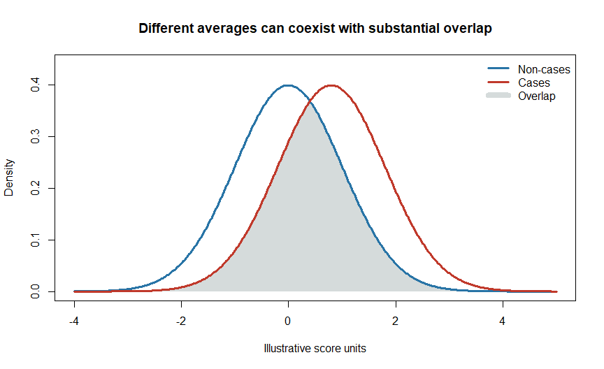
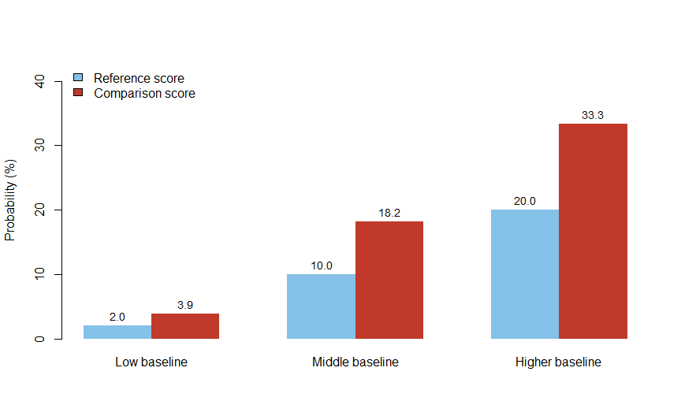
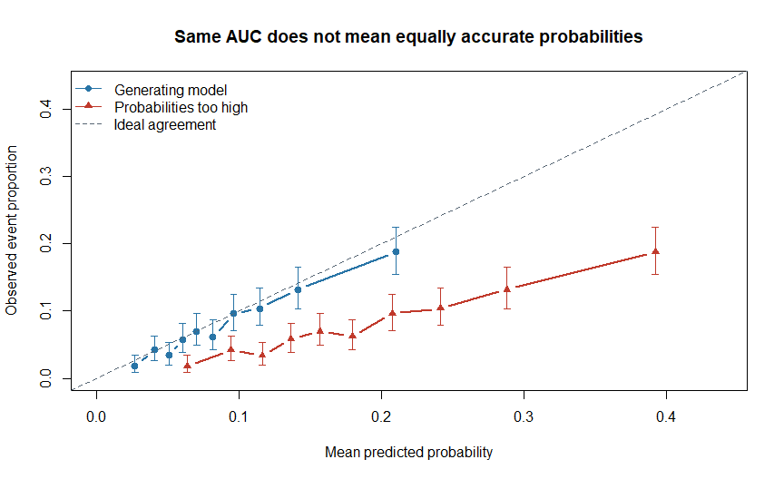
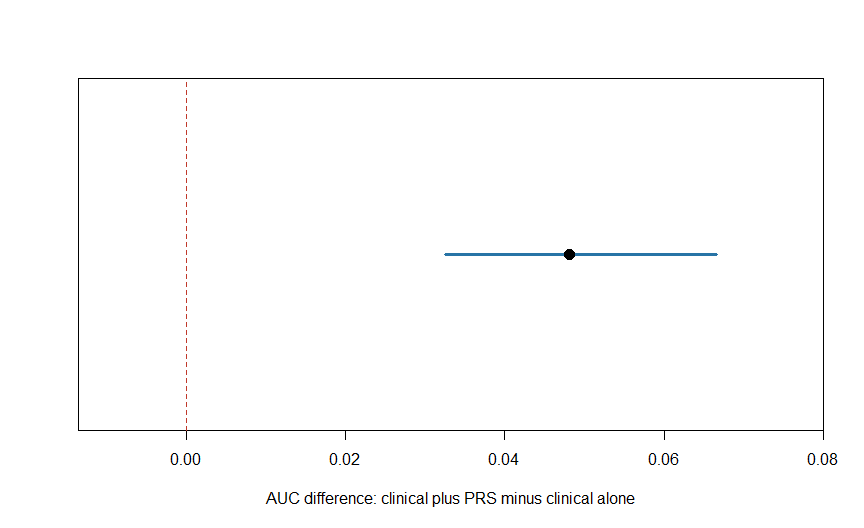

Chapter 5: What Does a Polygenic Risk Score Tell Us?
================

# From a number to a defensible interpretation

Chapter 4 explained how to calculate a PRS. This chapter asks what we
can reasonably say after calculating it.

We will follow Meera, a fictional adult without diagnosed coronary
artery disease, who receives this report:

> Your coronary artery disease PRS is at the 95th percentile.

Does this mean a 95% chance of disease? Should treatment change? Can a
person with a low score ignore other risk factors? None of those
questions can be answered by the percentile alone.

For Meera, we need to answer four questions in order: Where does she
rank? Does this score predict disease in a relevant population? Can an
appropriate model estimate her absolute risk? Would using that estimate
improve a decision?

**Learning route:** Read Sections 1–5 for the core concepts, Section 7
for a simple numerical example, and Sections 10–12 for evidence and
reporting. Sections 6 and 8 are guided R practicals. The brief advanced
material in Section 9 can be revisited later.

A useful interpretation connects the score to its reference population,
validation evidence and intended purpose. This chapter builds that
connection without assuming prior clinical prediction knowledge.

> **Central idea:** A PRS describes a model-specific genetic predictor.
> Turning it into a probability or a useful decision requires additional
> evidence.

All numerical examples and R-generated data below are fictional teaching
examples. Published research is identified separately. The R chunks run
sequentially and require only base R, knitr and rmarkdown; no genotype
files are needed.

# 1. Four outputs that answer different questions

| Output | Meaning | What it does not establish |
|----|----|----|
| Raw PRS = 0.38 | Weighted sum for a particular scoring model | A 38% disease probability |
| PRS Z-score = 1.5 | 1.5 reference SDs above the reference mean | A universal risk category |
| PRS percentile = 95 | Approximately 95% of reference scores are at or below this score, using that convention | A 95% probability of disease |
| Predicted ten-year risk = 12% | Estimated event probability from a specified risk model over ten years | Certainty about the individual’s outcome |

The four entries are independent illustrations, not four equivalent
results for one person. A percentile requires a reference distribution.
A disease probability requires a risk model with an outcome definition
and, for future events, a time horizon. \[1,2\]

The reference group also matters. A percentile from a case-enriched
research sample is not automatically a percentile in the general
population. Scores from different PRS models are not made equivalent
merely by expressing both as percentiles.

# 2. What does a high PRS mean?

For a validated disease score oriented so that higher values predict
greater susceptibility, a high PRS indicates relatively greater measured
genetic susceptibility within the relevant comparison population.

Meera’s percentile establishes her numerical rank. Whether that rank
indicates increased disease susceptibility requires relevant validation
and confirmation of the score’s direction.

The word **measured** matters. A score does not capture every inherited
influence. It may miss rare variants, poorly measured regions and
effects not represented by the development data. Nor does it summarize
all environmental and clinical influences.

A high score does not establish that disease is present. A low score
does not rule out disease or remove the relevance of symptoms, family
history or clinical measurements. \[1,3\]

## Why cases and non-cases overlap

If genetic susceptibility were the only determinant and measured
perfectly, separation might be straightforward. In practice, outcome
groups overlap substantially.

<div class="figure" style="text-align: center">


<p class="caption">

Figure 5.1: Schematic overlapping score distributions. These curves are
invented, not an estimate of any particular disease’s PRS performance.
</p>

</div>

Both curves integrate to one; their heights do not indicate how common
the disease is. The figure shows why a group-level difference cannot
diagnose every individual.

# 3. Relative association needs a comparison

Suppose an independent study reports:

``` text
Odds ratio per 1 reference SD higher PRS = 1.50
```

In a fitted logistic model, this means that the estimated odds multiply
by 1.50 for a one-unit increase in that standardized score, holding
included covariates constant. It does not mean a 50-percentage-point
increase in probability.

Under a linear log-odds model, the comparison between two scores is:

``` text
OR comparing Z_A with Z_B = exp(gamma × (Z_A - Z_B))
gamma = log(OR per SD)
```

``` r
or_per_sd <- 1.50
z_a <- 2
z_b <- -1
contrast_or <- exp(log(or_per_sd) * (z_a - z_b))
contrast_or
#> [1] 3.375
```

The comparison spans three reference SDs, giving an odds ratio of 3.375.
The result assumes the fitted relationship remains appropriate over that
score range. It is not evidence that changing someone’s PRS would
causally change their risk.

A report also needs a confidence interval, covariate list (the other
variables included in the model), population description and the
reference used to define one SD. An odds ratio per SD alone is not a
complete performance assessment. \[2\]

## Odds ratio, risk ratio and hazard ratio

| Measure | Comparison | Important distinction |
|----|----|----|
| Odds ratio | Odds of the outcome | Can differ substantially from a risk ratio for common outcomes |
| Risk ratio | Probabilities over the same defined period | Requires comparable outcome and follow-up definitions |
| Hazard ratio | Instantaneous event rates among those still at risk | Is not a ratio of cumulative probabilities |

Use the measure actually estimated. Do not relabel a hazard ratio or
odds ratio as a probability multiplier.

# 4. Absolute risk adds the missing context

Consider an odds ratio of 2 for a specified PRS contrast. The arithmetic
below converts a reference probability into a comparison probability:

``` text
Comparison probability = OR × reference probability /
                         (1 - reference probability + OR × reference probability)
```

The reference probability must describe the same outcome, time horizon
and covariate profile at the reference score. Overall population
prevalence is not generally a substitute for that conditional
probability.

``` r
probability_from_or <- function(p, odds_ratio) {
  stopifnot(is.numeric(p), all(is.finite(p)), all(p >= 0 & p <= 1),
            length(odds_ratio) == 1L, is.finite(odds_ratio), odds_ratio > 0)
  odds_ratio * p / (1 - p + odds_ratio * p)
}
reference_p <- c(0.02, 0.10, 0.20)
comparison_p <- probability_from_or(reference_p, 2)
risk_table <- data.frame(
  Reference_percent = 100 * reference_p,
  Comparison_percent = round(100 * comparison_p, 2),
  Difference_percentage_points = round(100 * (comparison_p - reference_p), 2)
)
knitr::kable(risk_table)
```

| Reference_percent | Comparison_percent | Difference_percentage_points |
|------------------:|-------------------:|-----------------------------:|
|                 2 |               3.92 |                         1.92 |
|                10 |              18.18 |                         8.18 |
|                20 |              33.33 |                        13.33 |

Two percent becomes about 3.92%; 20% becomes about 33.33%. The relative
odds contrast is the same, but the probability differences are very
different.

<div class="figure" style="text-align: center">


<p class="caption">

Figure 5.2: Fictional probability comparisons under OR = 2. The same
odds ratio produces different absolute changes.
</p>

</div>

For Meera, multiplying a general population disease rate by a published
PRS odds ratio would not provide a valid personal estimate. A
probability model must first be developed or calibrated in suitable
data: it estimates a baseline level and coefficients for the predictors
together. In prospective data, its baseline reflects observed events and
follow-up; survival models also account for observation time. The model
is then evaluated in separate people.

This is probability arithmetic, not a clinical calculator. For future
events, a validated model may also require incidence rates, competing
mortality and appropriate treatment of follow-up and censoring. A
case-control sample’s fraction of cases does not directly estimate
population incidence. \[3\]

# 5. Four separate questions about usefulness

| Question | Term | Example |
|----|----|----|
| Is the PRS related to the outcome? | Association | Higher scores are associated with higher disease odds |
| Does it rank people who experience an event above those who do not? | Discrimination | Compare ROC AUC |
| Do predicted probabilities agree with observed frequencies? | Calibration | Among predictions near 10%, about 10% experience the event |
| Does using it improve a specified decision? | Clinical utility | Better decisions after considering benefits, harms and costs |

A small association P value answers only the first question. A
statistically convincing score may add little predictive information to
an existing model. A good ranking can coexist with inaccurate
probabilities. \[2,3\]

## 5.1 Discrimination and AUC

For a binary outcome, ROC AUC measures the probability that a randomly
selected case has a higher predicted score than a randomly selected
non-case, counting ties as half. An AUC of 0.70 means about 70% of such
pairs are correctly ordered. It does not mean 70% of people receive a
correct diagnosis.

The ROC curve compares sensitivity with false-positive rate across
possible thresholds. AUC = 0.5 corresponds to chance-level ordering; AUC
= 1 represents perfect ordering in the evaluated sample. AUC depends on
the population and case mix—the range of ages, disease severity and
other characteristics among the people evaluated. \[8\] For
time-to-event data, use metrics that handle time and censoring rather
than treating people with incomplete follow-up as disease-free.
Censoring means observation ends before we know whether the event
occurs. Competing mortality means someone can die from another cause
before experiencing the event of interest.

## 5.2 Calibration \[9\]

Suppose a model predicts a 10% event probability for 1,000 comparable
people. Calibration asks whether roughly 100 experience the defined
event during the specified period. It does not require knowing in
advance which 100.

A model can rank people correctly while exaggerating every probability.
We will demonstrate this using simulated data.

# 6. R practical: identical ranking, different probabilities

We generate an evaluation dataset from a known logistic relationship.
Simulation is useful here because we know the generating probabilities.
In real data those probabilities are unknown, so we assess calibration
using observed outcomes and appropriate uncertainty.

The ‘correct’ predictor below is specified by the simulation, not fitted
to its outcomes. This avoids presenting training performance as
independent validation.

``` r
set.seed(505)
n <- 5000
prs_z <- rnorm(n)
true_probability <- plogis(-2.5 + 0.65 * prs_z)
outcome <- rbinom(n, size = 1, prob = true_probability)

pred_correct <- true_probability
pred_overestimated <- plogis(qlogis(pred_correct) + 0.9)

auc_rank <- function(y, score) {
  stopifnot(length(y) == length(score), all(y %in% c(0, 1)),
            all(is.finite(score)))
  n1 <- sum(y == 1)
  n0 <- sum(y == 0)
  stopifnot(n1 > 0, n0 > 0)
  ranks <- rank(score, ties.method = "average")
  (sum(ranks[y == 1]) - n1 * (n1 + 1) / 2) / (n1 * n0)
}
metrics <- data.frame(
  Model = c("Generating model", "Probabilities too high"),
  AUC = c(auc_rank(outcome, pred_correct), auc_rank(outcome, pred_overestimated)),
  Brier_score = c(mean((outcome - pred_correct)^2),
                  mean((outcome - pred_overestimated)^2))
)
knitr::kable(metrics, digits = 4)
```

| Model                  |    AUC | Brier_score |
|:-----------------------|-------:|------------:|
| Generating model       | 0.6804 |      0.0717 |
| Probabilities too high | 0.6804 |      0.0854 |

``` r
stopifnot(isTRUE(all.equal(metrics$AUC[1], metrics$AUC[2])))
```

The AUCs are identical because the transformation preserves ranking. The
**Brier score** is the mean squared difference between predicted
probability and the 0/1 outcome; smaller is better in a comparable
evaluation sample. It measures overall probability error, not
calibration alone, and is influenced by outcome frequency.

<div class="figure" style="text-align: center">


<p class="caption">

Figure 5.3: Calibration in simulated evaluation data. The second model
keeps the same ranking but overestimates probabilities. Vertical bars
show pointwise 95% binomial intervals; each group contains 500 people.
</p>

</div>

Each group contains 500 people. The vertical bars are pointwise exact
binomial 95% intervals for the observed group event proportion, used
here as a teaching approximation; individuals within a group have
slightly different generating probabilities. They do not represent
uncertainty in individual predictions or simultaneous coverage of the
whole curve. Even the generating model will show sampling fluctuations.

Points below the diagonal indicate overprediction. A real evaluation
should include uncertainty intervals and more detailed calibration
assessment; ten grouped points alone can hide important errors. These
examples do not establish performance for a real PRS.

# 7. A threshold changes the question

A continuous score ranks people. A threshold divides them into groups
for a specified purpose. ‘Top 5%’ is a rank-based definition, not a
universally justified treatment threshold.

Consider this fictional population of 10,000 people followed for the
same period:

| Group           | Event | No event |  Total |
|-----------------|------:|---------:|-------:|
| Above threshold |   150 |      850 |  1,000 |
| Below threshold |   350 |    8,650 |  9,000 |
| Total           |   500 |    9,500 | 10,000 |

``` r
TP <- 150; FP <- 850; FN <- 350; TN <- 8650
threshold_results <- data.frame(
  Measure = c("Sensitivity", "Specificity", "Positive predictive value", "Negative predictive value"),
  Percent = 100 * c(TP/(TP+FN), TN/(TN+FP), TP/(TP+FP), TN/(TN+FN))
)
knitr::kable(threshold_results, digits = 2)
```

| Measure                   | Percent |
|:--------------------------|--------:|
| Sensitivity               |   30.00 |
| Specificity               |   91.05 |
| Positive predictive value |   15.00 |
| Negative predictive value |   96.11 |

- **Sensitivity: 30%.** The threshold identifies 150 of 500 eventual
  cases.
- **Specificity: about 91.1%.** It places 8,650 of 9,500 non-cases below
  threshold.
- **Positive predictive value: 15%.** Of 1,000 people above threshold,
  150 experience the event.
- **Negative predictive value: about 96.1%.** Most below threshold do
  not experience it, but 350 cases still occur there.

This example shows both enrichment and substantial missed disease. The
high group has a 15% event rate, while the low group has about 3.89%;
the risk ratio is about 3.86. Yet 85% of the high group remain
event-free during the period.

Predictive values depend on disease frequency in the intended
population. Values estimated directly from an artificially case-enriched
sample do not automatically apply in routine practice. Lowering a
threshold generally increases sensitivity while reducing specificity; a
useful threshold depends on the consequences of acting or not acting.

# 8. Does adding PRS improve an existing model?

Compare an existing model with the same model plus PRS:

``` text
Baseline model: age + relevant clinical predictors
Extended model: age + the same clinical predictors + PRS
```

Develop and tune models without using the final test outcomes. Evaluate
both models in the same independent people, with the same outcome and
follow-up definition. Otherwise differences may reflect the samples
rather than the added PRS. \[2\]

**Optional terminology for later chapters.** For a quantitative trait,
incremental R-squared describes additional variation explained under the
stated definition. For binary outcomes, pseudo-R-squared measures are
not interchangeable with ordinary linear-model R-squared. Neither says
what fraction of one person’s disease is genetic.

For disease prediction, examine discrimination, calibration and
probability error together. Include confidence intervals. Avoid
interpreting a tiny AUC increase without considering uncertainty,
decision thresholds and whether other information already captures much
of the predictive signal.

## 8.1 Guided practical: clinical information alone versus clinical information plus PRS

For Meera, the useful question is whether PRS adds information beyond
what is already known. Here we demonstrate the comparison with fictional
data. The outcome is an event during a fixed follow-up period, fully
observed for everyone. This deliberately omits censoring and competing
events so we can focus on model comparison.

We treat the PRS as already calculated using externally developed
weights. We are fitting the model that combines that score with clinical
information, not developing SNP weights. `age10` expresses age in
ten-year units around age 50; `bp10` expresses systolic pressure in
ten-mmHg units around 120.

``` r
set.seed(506)
make_cohort <- function(n) {
  age10 <- runif(n, -1, 3)
  bp10 <- rnorm(n, 1, 1.4)
  prs <- rnorm(n)
  probability <- plogis(-3.3 + 0.55 * age10 + 0.35 * bp10 + 0.6 * prs)
  data.frame(age10, bp10, prs, event = rbinom(n, 1, probability))
}
training <- make_cohort(4000)
test <- make_cohort(4000)
clinical <- glm(event ~ age10 + bp10, family = binomial(), data = training)
clinical_prs <- glm(event ~ age10 + bp10 + prs, family = binomial(), data = training)
stopifnot(clinical$converged, clinical_prs$converged)
p_base <- predict(clinical, newdata = test, type = "response")
p_plus <- predict(clinical_prs, newdata = test, type = "response")
comparison <- data.frame(
  Model = c("Clinical predictors", "Clinical predictors plus PRS"),
  AUC = c(auc_rank(test$event, p_base), auc_rank(test$event, p_plus)),
  Brier = c(mean((test$event - p_base)^2), mean((test$event - p_plus)^2)),
  Mean_prediction = c(mean(p_base), mean(p_plus)),
  Observed_event_fraction = mean(test$event)
)
knitr::kable(comparison, digits = 4)
```

| Model | AUC | Brier | Mean_prediction | Observed_event_fraction |
|:---|---:|---:|---:|---:|
| Clinical predictors | 0.705 | 0.0975 | 0.1123 | 0.1172 |
| Clinical predictors plus PRS | 0.753 | 0.0932 | 0.1112 | 0.1172 |

The models see training outcomes only. Their settings are fixed before
test evaluation. Compare AUC for ranking, Brier score for overall
probability error, and the mean prediction against the observed fraction
for a limited check of overall calibration. Agreement of those means
does not establish calibration throughout the risk range.

Because we intentionally generated an additional PRS contribution,
improvement is plausible in this simulation. Real PRS data may show
smaller, uncertain or absent gains. Do not choose a simulation seed to
obtain a preferred conclusion.

## 8.2 How uncertain is the improvement?

A paired bootstrap resamples the same test participants for both models.
This preserves the relationship between their predictions. Here we
estimate uncertainty in the AUC difference for the two fixed fitted
models.

``` r
set.seed(507)
boot_difference <- replicate(300, {
  i <- sample.int(nrow(test), replace = TRUE)
  if (length(unique(test$event[i])) < 2) {
    NA_real_
  } else {
    auc_rank(test$event[i], p_plus[i]) - auc_rank(test$event[i], p_base[i])
  }
})
stopifnot(sum(is.finite(boot_difference)) > 250)
difference <- comparison$AUC[2] - comparison$AUC[1]
interval <- quantile(boot_difference, c(0.025, 0.975), na.rm = TRUE)
knitr::kable(data.frame(AUC_difference = difference,
  Lower_95 = unname(interval[1]), Upper_95 = unname(interval[2])), digits = 4)
```

| AUC_difference | Lower_95 | Upper_95 |
|---------------:|---------:|---------:|
|         0.0481 |   0.0326 |   0.0666 |

Three hundred replicates keep this demonstration short; a research
analysis needs adequate replicates and a justified uncertainty method.
This interval describes test-sample uncertainty conditional on the
trained models. It does not include the full variability of training the
models, estimating SNP weights, or moving to another population.

<div class="figure" style="text-align: center">


<p class="caption">

Figure 5.4: Simulated improvement in test AUC after adding PRS, with a
paired bootstrap percentile interval conditional on the fitted models.
</p>

</div>

If an interval includes zero, a suitable conclusion is: ‘This analysis
did not demonstrate a clear improvement in discrimination; the estimate
remains imprecise.’ That does not prove the score has no value. If the
interval excludes zero, consider the size of the improvement and its
consequences rather than declaring clinical usefulness from significance
alone. \[8\]

# 9. Looking ahead: clinical utility is a decision question

A model becomes useful when its information improves a defined decision
enough to justify its costs and harms. Relevant consequences might
include extra screening, unnecessary procedures, missed disease,
treatment burden or anxiety.

**Decision-curve analysis** compares strategies using net benefit across
threshold probabilities. The threshold represents a trade-off between
missing an event and taking unnecessary action. Net benefit is not
simply prediction accuracy. It requires clinically meaningful thresholds
and suitable validation data. \[4\]

A decision curve is supporting evidence, not proof that implementation
improves patient outcomes. Prospective evaluation may be needed. A PRS
research association alone does not specify a treatment recommendation.

# 10. Published example: coronary artery disease

Meera asks whether a high percentile has been linked to disease in
published research. Khera and colleagues provide one example. Their
result below concerns disease status in a study population, not Meera’s
ten-year probability. \[5\]

| Evidence item | Published information |
|----|----|
| Study | Khera et al., Nature Genetics, 2018; Table 3 |
| Evaluation | UK Biobank testing dataset, 288,978 participants; primarily European ancestry |
| Outcome | Coronary artery disease status |
| Comparison | Top 5% of CAD score distribution versus remaining 95% |
| Adjusted odds ratio | 3.34 |
| 95% confidence interval | 3.12–3.58 |
| Adjustment | Age, sex, genotyping array and first four ancestry principal components |

The comparison is with the remaining 95%, not the average person or the
bottom 5%. It is an odds ratio, not a risk ratio or personal event
probability. This supports stratification in the studied setting, but
does not establish clinical benefit or unchanged performance in another
population. Meera’s numerical percentile alone does not justify
assigning this odds ratio to her.

The coronary artery disease score is recorded as **PGS000013** in the
PGS Catalog. Use the entry to identify the publication, development
populations, scoring file and evaluation evidence. Catalog inclusion
provides documentation; it is not an automatic clinical endorsement.
\[6\]

For an Indian target dataset, investigate evidence relevant to its
ancestry composition, recruitment, outcome definitions and genotype
processing. A broad population label alone cannot establish suitability.

# 11. Sources of uncertainty

| Source | What can be uncertain? | What to examine |
|----|----|----|
| Genotype measurement | Counted or imputed alleles | QC and imputation quality |
| Scoring model | Variants and estimated weights | Development design and independent evidence |
| Variant coverage | Whether the intended score was reproduced | Missing variants and alignment exclusions |
| Reference distribution | Percentile and standardized position | Reference size, population and processing |
| Outcome model | Association and predicted probabilities | Confidence intervals and calibration |
| Transfer to a new setting | Performance for the intended use | External evaluation and subgroup results |

An association confidence interval is not an individual probability
interval. Likewise, a percentile has sampling uncertainty because its
reference distribution was estimated. Avoid displaying more decimal
places than the evidence supports. \[1,2\]

Ancestry normalization can change score distributions without
eliminating differences in prediction accuracy. Validate relevant groups
rather than inferring equal performance from similar-looking
distributions. \[1,7\]

# 12. Practical protocol: write an interpretation

1.  **Identify the model.** Record the score ID, version, phenotype and
    weight source.
2.  **Check calculation quality.** Confirm allele alignment, coverage
    and missing-data handling.
3.  **Name the output.** State raw score, reference-standardized score
    or percentile explicitly.
4.  **Name the reference.** Document population, sample size and
    processing; report the percentile tie convention.
5.  **Check validation relevance.** Identify independent evidence for
    the outcome and target setting.
6.  **State the comparison.** For a relative estimate, give the
    reference category or score difference, measure and uncertainty.
7.  **Check the probability model.** Report absolute risk only when the
    model, time horizon and calibration support it.
8.  **Separate evidence from action.** Explain what is known about
    decision usefulness and what remains unestablished.
9.  **Preserve provenance.** Save commands, versions, reference
    parameters and the exact report text. \[2\]

## Example wording for a percentile-only result

> This person’s score is at the 95th percentile of the specified
> reference distribution, meaning that approximately 95% of reference
> scores are at or below it. The result indicates a relatively high
> value for this scoring model. It does not provide a 95% probability of
> disease. An absolute-risk estimate would require an appropriate
> validated risk model.

Add the actual score ID and reference description before using this
text. If relevant validation is absent, say so rather than assuming that
high numerical rank establishes high disease risk in that population.

## Example wording for a validation result

> In the independent evaluation cohort, each one-reference-SD increase
> in PRS was associated with an odds ratio of \[estimate\], with a 95%
> confidence interval of \[limits\], adjusted for \[covariates\]. The
> baseline and extended models had AUCs of \[values\]. Calibration was
> assessed using \[method\]. These results apply to \[population and
> outcome definition\].

The brackets are fields to complete from results, not values to invent.

# 13. Common misunderstandings

| Claim | Correction |
|----|----|
| ‘95th percentile means 95% disease risk’ | Percentile is position in a reference distribution |
| ‘OR = 2 means twice the probability’ | OR compares odds; probability depends on baseline |
| ‘High AUC means correct probabilities’ | Ranking and calibration are different |
| ‘A significant association proves clinical usefulness’ | Utility depends on decisions and consequences |
| ‘Low PRS rules out disease’ | Other genetic and non-genetic factors remain |
| ‘R-squared is the genetic fraction of my disease’ | It describes variation across a sample under a specified metric |
| ‘Normalization guarantees portability’ | Relevant validation is still needed |
| ‘Top 5% is a natural treatment boundary’ | It is a chosen rank threshold requiring justification |

# 14. Practice and answers

**1. A report gives a raw score of 0.80. Can you report an 80%
probability?**

No. The value is a weighted sum on the model’s scale.

**2. An OR is 1.4 per reference SD. What is the comparison over two SDs
under a linear log-odds model?**

1.4 squared = 1.96. This is an odds ratio, conditional on the model and
covariates.

**3. Two models have identical AUC but different predicted
probabilities. Is that possible?**

Yes. A monotonic transformation can preserve ranking while changing
calibration, as in the simulation.

**4. A high-score group contains most cases. Does this establish a
useful screening strategy?**

No. We also need the group’s size, false positives, event probabilities
and the consequences of screening.

**5. Does a low PRS cancel a strong family history?**

No. Family history can reflect additional genetic and shared
environmental information.

**6. Why use simulated data here?**

We can deliberately change calibration while preserving ranking and know
the generating probabilities. Real data are needed to establish actual
performance.

# 15. Key takeaways

A score’s meaning depends on its model, reference and validation
setting. Percentiles describe rank; relative measures require a
comparison; absolute risk requires a suitable probability model.
Association, discrimination, calibration and utility answer separate
questions. Report uncertainty and avoid turning group-level evidence
into certainty about one person.

The next stage of the course will move from interpretation to planning
an analysis: defining the research question, datasets and evaluation
design before choosing and running a PRS method.

# References

1.  PGS Catalog Calculator. **Interpreting polygenic scores.**
    <https://pgsc-calc.readthedocs.io/en/latest/explanation/interpret.html>

2.  Wand H, Lambert SA, Tamburro C, et al. **Improving reporting
    standards for polygenic scores in risk prediction studies.** Nature.
    2021;591:211–219. <https://doi.org/10.1038/s41586-021-03243-6>

3.  Lewis CM, Vassos E. **Polygenic risk scores: from research tools to
    clinical instruments.** Genome Medicine. 2020;12:44.
    <https://doi.org/10.1186/s13073-020-00742-5>

4.  Vickers AJ, Elkin EB. **Decision curve analysis: a novel method for
    evaluating prediction models.** Medical Decision Making.
    2006;26:565–574. <https://doi.org/10.1177/0272989X06295361>

5.  Khera AV, Chaffin M, Aragam KG, et al. **Genome-wide polygenic
    scores for common diseases identify individuals with risk equivalent
    to monogenic mutations.** Nature Genetics. 2018;50:1219–1224.
    <https://doi.org/10.1038/s41588-018-0183-z>

6.  PGS Catalog. **PGS000013: Coronary artery disease.**
    <https://www.pgscatalog.org/score/PGS000013/>

7.  Martin AR, Kanai M, Kamatani Y, Okada Y, Neale BM, Daly MJ.
    **Clinical use of current polygenic risk scores may exacerbate
    health disparities.** Nature Genetics. 2019;51:584–591.
    <https://doi.org/10.1038/s41588-019-0379-x>

8.  Steyerberg EW, Vickers AJ, Cook NR, et al. **Assessing the
    performance of prediction models: a framework for traditional and
    novel measures.** Epidemiology. 2010;21:128–138.
    <https://doi.org/10.1097/EDE.0b013e3181c30fb2>

9.  Van Calster B, McLernon DJ, van Smeden M, Wynants L, Steyerberg EW.
    **Calibration: the Achilles heel of predictive analytics.** BMC
    Medicine. 2019;17:230. <https://doi.org/10.1186/s12916-019-1466-7>
