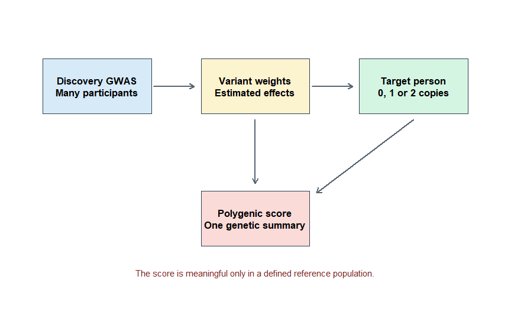
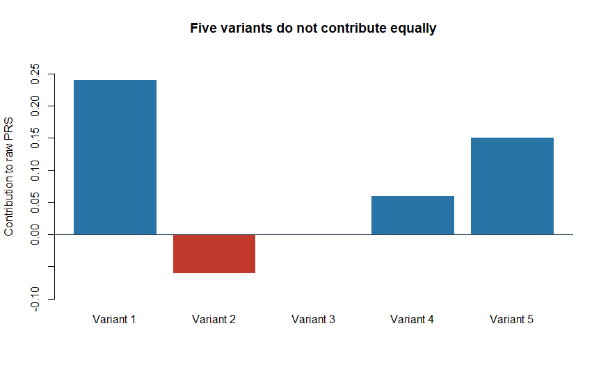
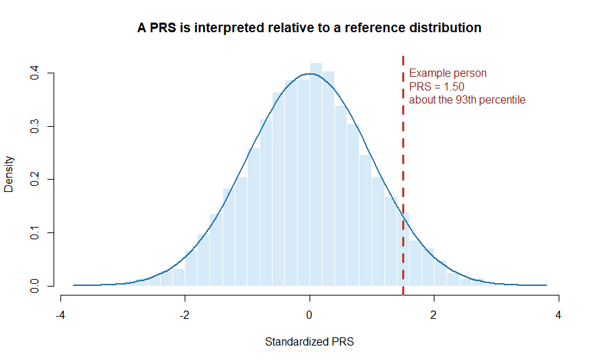

Chapter 1: What Is a Polygenic Risk Score?
================

# Why begin with the idea rather than the software?

Polygenic risk score analysis involves unfamiliar terms, large genetic
datasets and several software tools. It is tempting to begin by running
a command. That approach can produce a number, but it does not guarantee
that the number is correct or meaningful.

Before calculating a score, we must understand:

- what is being added together;
- where the information came from;
- what the final score represents;
- what the score cannot tell us; and
- why the same score may not work equally well in every population.

This chapter builds that foundation.

> **Central idea:** A polygenic risk score summarizes part of a person’s
> inherited genetic susceptibility to a trait or disease. It can help
> predict an outcome, but the score itself is not a disease probability,
> diagnosis or proof of causation.

# 1. Breaking down the name

The term **polygenic risk score**, abbreviated as **PRS**, contains
three ideas.

| Word | Simple meaning | Scientific meaning |
|----|----|----|
| **Polygenic** | Influenced by many genetic differences | The phenotype is influenced by variants at many positions across the genome |
| **Risk** | Susceptibility, not certainty | For disease scores, the aim is to predict susceptibility; the numerical score itself is not an absolute probability |
| **Score** | Many pieces of information summarized as one number | A weighted sum of a person’s effect-allele dosages |

The broader term **polygenic score**, or **PGS**, can be used for
diseases and non-disease traits such as height. **Polygenic risk score**
is commonly used when the outcome is a disease or other adverse health
outcome. The literature does not always use these terms consistently, so
both abbreviations will appear in scientific papers.

# 2. Why do we need a PRS?

## 2.1 Many common diseases are not controlled by one gene

Some rare disorders can be strongly influenced by a harmful variant in a
single gene. Many common diseases, however, do not follow such a simple
pattern.

Coronary artery disease, type 2 diabetes, breast cancer and
schizophrenia are examples of **complex diseases**. Their occurrence may
be influenced by:

- many genetic variants;
- age;
- lifestyle and behaviour;
- environmental exposures;
- medical history;
- social conditions; and
- chance.

For a complex disease, an individual genetic variant usually changes
susceptibility only slightly. Combining information from many variants
can therefore be more informative than examining one common variant at a
time.

## 2.2 A classroom analogy

Imagine predicting a student’s final examination performance.

Knowing how many hours the student slept last night may provide some
information, but it would not tell the full story. Preparation,
attendance, previous knowledge, health and examination conditions may
all contribute.

A PRS works on a similar principle, but it summarizes **genetic
information only**:

- each genetic variant is one small piece of information;
- some pieces receive more weight than others;
- the weighted pieces are added; and
- the total is compared with totals from other people.

The analogy has an important limitation: a PRS does not normally include
lifestyle, age or clinical measurements. A complete disease-risk model
may need to combine those factors with the PRS.

# 3. Where does the information come from?

Researchers first conduct a **genome-wide association study**, usually
abbreviated as **GWAS**. A GWAS compares genetic variants across many
people and estimates whether each variant is statistically associated
with a disease or trait.

For each analysed variant, a GWAS can report an **effect estimate**: the
estimated direction and size of its association with the outcome. A PRS
method then selects variants and assigns their final **weights**. Some
methods use GWAS estimates directly; others adjust them to account for
correlated variants and uncertain estimates. A GWAS effect estimate and
a final PRS weight are therefore not always the same. \[3\]

For a disease GWAS, an odds ratio usually needs to be converted to its
natural logarithm before use as an additive weight. When applying a
published scoring file, follow its documented weight scale instead of
transforming its weights again.

The general flow is shown below.

<div class="figure" style="text-align: center">


<p class="caption">

Figure 1.1: A simplified path from a discovery GWAS to an individual’s
polygenic risk score.
</p>

</div>

This workflow contains two different groups:

- The **discovery GWAS** supplies association estimates used to develop
  the scoring model.
- The **target sample** contains the people whose scores will be
  calculated.

Keeping these roles separate is important. If the same people are
improperly used to discover, select and evaluate a score, its apparent
performance may be exaggerated. Later chapters will explain independent
tuning and evaluation in detail. \[3,6\]

# 4. What is being counted?

An **allele** is a version of a DNA sequence at a particular position.
The pair of alleles a person carries is their **genotype**. In this
chapter, we use positions on autosomes—the chromosomes other than X and
Y—where a person ordinarily has two copies, one inherited from each
biological parent.

For a selected **effect allele**, a person’s genotype can often be coded
as:

| Effect-allele dosage | Simple interpretation           |
|---------------------:|---------------------------------|
|                    0 | No copies of the effect allele  |
|                    1 | One copy of the effect allele   |
|                    2 | Two copies of the effect allele |

With imputed genetic data, the dosage may be a decimal such as 0.12,
0.97 or 1.84. The dosage is the expected number of effect-allele copies,
calculated from estimated genotype probabilities. It does not mean that
a person literally possesses a fraction of an allele. For example,
equally likely genotypes with 0 and 2 copies give a dosage of 1; that is
less certain than knowing the person has exactly 1 copy.

The phrase **effect allele** is safer than automatically calling it a
**risk allele**. Its weight can be:

- positive, meaning that the allele raises the score;
- negative, meaning that the allele lowers the score; or
- close to zero, meaning that its estimated contribution is small.

Furthermore, the allele used in a score is not necessarily causal. It
may be correlated with another nearby variant that is closer to the
biological mechanism.

# 5. The basic PRS calculation

For each variant, two values are combined:

1.  the person’s effect-allele dosage; and
2.  the weight assigned to that variant.

The contributions are then added.

``` text
Contribution of one variant = effect-allele dosage × variant weight

PRS = contribution of variant 1
    + contribution of variant 2
    + ...
    + contribution of variant M
```

Here, **M** is the number of variants included in the score.

This is a conceptual formula. The units of the score depend on how the
original weights were estimated and transformed. A raw PRS should
therefore not be interpreted automatically as a probability.

## 5.1 A five-variant example

Consider a fictional five-variant score made for teaching. These weights
are invented and must not be used to assess anyone’s health. For one
person, the calculation is:

``` r
score_data <- data.frame(
  Variant = c("Variant 1", "Variant 2", "Variant 3", "Variant 4", "Variant 5"),
  Effect_allele = c("A", "G", "T", "C", "A"),
  Dosage = c(2, 1, 0, 2, 1),
  Weight = c(0.12, -0.06, 0.09, 0.03, 0.15)
)

score_data$Contribution <- score_data$Dosage * score_data$Weight
score_data
#>     Variant Effect_allele Dosage Weight Contribution
#> 1 Variant 1             A      2   0.12         0.24
#> 2 Variant 2             G      1  -0.06        -0.06
#> 3 Variant 3             T      0   0.09         0.00
#> 4 Variant 4             C      2   0.03         0.06
#> 5 Variant 5             A      1   0.15         0.15

raw_prs <- sum(score_data$Contribution)
raw_prs
#> [1] 0.39
```

The same calculation written by hand is:

``` text
PRS = (2 × 0.12) + (1 × -0.06) + (0 × 0.09) + (2 × 0.03) + (1 × 0.15)
    = 0.24 - 0.06 + 0.00 + 0.06 + 0.15
    = 0.39
```

The contribution of each variant can be displayed visually.

<div class="figure" style="text-align: center">


<p class="caption">

Figure 1.2: Contribution of each variant to the example person’s raw
PRS. A negative weight lowers the score.
</p>

</div>

## 5.2 What does 0.39 mean?

By itself, very little.

The value **0.39** is not automatically:

- a 39% chance of disease;
- a 39% increase in risk;
- a clinical diagnosis;
- the number of harmful variants; or
- proof that the included variants cause the disease.

To interpret it, we need information about the score’s construction and
its distribution in a relevant reference population.

# 6. A score becomes useful through comparison

Raw scores can differ substantially between scoring methods. One score
might commonly range from -1 to 1, while another might range from -10 to
10. This does not mean that the second score is better or represents
greater disease risk.

Researchers commonly transform a raw PRS into a **standardized score**:

``` text
Standardized PRS = (person's raw PRS - reference mean) / reference standard deviation
```

A standardized score describes distance from the reference mean:

- 0 means equal to the reference mean;
- +1 means one standard deviation above the reference mean;
- -1 means one standard deviation below the reference mean.

A percentile gives another type of comparison. A person at the 90th
percentile has a higher score than approximately 90% of people in the
chosen reference group. It does **not** mean that the person has a 90%
probability of disease.

<div class="figure" style="text-align: center">


<p class="caption">

Figure 1.3: A hypothetical PRS distribution. The highlighted person has
a relatively high score, but the figure does not provide an absolute
disease probability.
</p>

</div>

The distribution in Figure 1.3 is a separate simulated example; its
value of 1.50 was not calculated from the five-variant score of 0.39. A
bell-shaped distribution is convenient for illustration, but
standardizing a score does not make its distribution normal.

The distribution in Figure 1.3 is simulated for teaching. Real
distributions depend on the score, dataset, genetic ancestry,
quality-control procedures and method of standardization.

# 7. What exactly can a PRS tell us?

A properly developed and validated PRS may tell us:

- how a person’s measured genetic susceptibility compares with that of a
  defined reference group;
- whether groups with higher scores had higher average occurrence of a
  disease in a validation study;
- how much predictive information the score adds to a specified model;
  and
- whether the score may help separate a population into broad risk
  groups.

The interpretation is conditional on important details:

- Which disease or trait was studied?
- Which population was used to develop the score?
- Which population was used to validate it?
- Which variants and weights were included?
- What outcome definition and follow-up period were used?
- How well was the model calibrated—that is, did predicted probabilities
  agree with observed disease occurrence?
- Does the target person resemble the validation population?

# 8. What can a PRS not tell us?

## 8.1 It is not a diagnosis

A high PRS does not mean that a person currently has the disease.
Diagnosis usually requires clinical history, examination, laboratory
measurements, imaging or other disease-specific evidence.

## 8.2 It is not destiny

People with high PRSs may remain disease-free, while people with low
PRSs may develop disease. Genetic susceptibility is only one contributor
to many complex outcomes.

## 8.3 It is not usually an absolute probability

A raw or standardized PRS does not, by itself, answer:

> “What is my chance of developing this disease in the next ten years?”

Absolute-risk estimation also requires information such as baseline
incidence, age, sex, competing events and sometimes clinical or
environmental risk factors.

## 8.4 It does not prove causation

A PRS is mainly a prediction tool built from statistical associations.
It does not prove that every included variant—or even the score
itself—causes the outcome.

This distinguishes PRS from Mendelian randomization:

| Polygenic risk score | Mendelian randomization |
|----|----|
| Main purpose is prediction or risk stratification | Main purpose is causal inference |
| Combines variants to predict a trait or disease | Uses genetic variants as instruments for an exposure |
| A predictive variant need not be causal | Instruments must satisfy causal assumptions |
| Evaluated using predictive performance and calibration | Evaluated using causal estimates and sensitivity analyses |

## 8.5 It is not automatically transferable between populations

Allele frequencies (how common alleles are), linkage disequilibrium or
**LD** (correlation between variants), environmental contexts and GWAS
representation differ across populations. A score developed in one
ancestry group may lose accuracy or become poorly calibrated in another.

This is not a minor technical issue. It is central to valid and
equitable PRS analysis. Genetic ancestry describes patterns of inherited
variation; it is not interchangeable with nationality or self-identified
ethnicity. An ancestry label alone does not establish that a score will
perform well for an individual. \[8\]

# 9. PRS, a single-gene variant and family history

These sources of information overlap, but they are not interchangeable.

| Feature | Single high-impact variant | Polygenic risk score | Family history |
|----|----|----|----|
| Genetic information | Usually one gene or variant | Many variants across the genome | Shared genes are partly represented indirectly |
| Non-genetic information | Usually not included | Usually not included | May partly reflect shared environment and behaviour |
| Typical effect | Can be large for some disorders | Each variant is usually small; combined effect may be informative | Depends on relatives, disease and family structure |
| Result | Variant classification and condition-specific interpretation | Relative genetic susceptibility or a model-based risk estimate | Observed disease pattern within a family |
| Can it replace the others? | No | No | No |

A person can therefore have:

- a high-impact pathogenic variant and a low PRS;
- no detected high-impact variant but a high PRS;
- a strong family history with an average measured PRS; or
- no family history despite elevated genetic susceptibility.

# 10. A real-life example: coronary artery disease

Coronary artery disease affects the arteries supplying blood to the
heart. It is influenced by many genetic and non-genetic factors. A
coronary artery disease PRS may combine the effects of numerous variants
to identify people with relatively higher inherited susceptibility.

In research, investigators can ask whether people in the upper tail of
the PRS distribution develop coronary artery disease more often than
people near the middle. The score may also be studied alongside age,
blood pressure, cholesterol, smoking, diabetes and family history.

**Published research example.** Khera and colleagues (2018) developed
and validated scores for five common diseases. Their coronary artery
disease score identified a group comprising about 8% of the study
population with substantially elevated disease susceptibility. This was
evidence of risk stratification in the studied population, not an
individual absolute probability or proof that PRS-guided care improves
health outcomes. \[9\]

**Teaching example.** Consider two hypothetical people with equally high
coronary artery disease PRSs:

| Person | Age | Smoking | Blood pressure | PRS  |
|--------|----:|---------|----------------|------|
| A      |  25 | No      | Normal         | High |
| B      |  70 | Yes     | High           | High |

The PRS indicates high **relative genetic susceptibility** for both. It
does not imply that their current or short-term absolute risks are
equal. Their ages and clinical risk factors are very different.

This example shows why a PRS should complement—not replace—appropriate
clinical information. Whether it improves patient outcomes must be
demonstrated in the intended healthcare setting.

# 11. Why can two PRS methods give different answers?

Different methods may make different decisions about:

- which variants to include;
- how to handle correlated variants;
- how strongly to shrink uncertain effect estimates (reduce their
  magnitude to limit overfitting);
- which discovery GWAS to use;
- which linkage disequilibrium reference to use; and
- whether settings are selected using a tuning dataset (data used to
  choose the model before its final evaluation).

Consequently, two methods can produce different raw scores, rankings and
predictive performance for the same people. A more complicated method is
not automatically better. Every method must be evaluated in independent,
relevant data.

Later chapters will cover:

- published fixed scores;
- clumping and thresholding;
- LDpred2;
- PRS-CS;
- penalized regression;
- SBayesR and MegaPRS;
- multi-ancestry approaches; and
- multi-trait and functionally informed approaches.

# 12. First practical protocol: inspect before calculating

Before applying any published PRS, record the following information.

## Step 1: Define the intended outcome

Write the exact disease or trait. “Heart disease” is too broad if the
score was developed specifically for coronary artery disease.

## Step 2: Identify the score source

Record the publication, score identifier, scoring-file version and
download date. A resource such as the PGS Catalog can provide structured
information about published scores. Catalog inclusion documents a score;
it is not an endorsement for clinical use. \[5,10\]

## Step 3: Identify the development population

Record the discovery GWAS sample size, ancestry composition, age range,
sex composition and phenotype definition when available.

## Step 4: Identify the validation population

Record where the score was tested independently. Do not assume that
development performance equals external performance.

## Step 5: Inspect the scoring file

At minimum, confirm that it contains:

- a variant identifier or genomic position;
- the effect allele;
- the variant weight;
- the genome build; and
- documentation of how the score was developed.

Some of this information is in file headers or accompanying
documentation rather than a column in every row. Before calculation, the
effect allele in the scoring file must match the allele counted in the
target data; otherwise, the software can return an incorrect score
without an obvious error.

## Step 6: Ask what the output represents

Determine whether the published result is:

- a raw weighted score;
- a standardized score;
- a percentile;
- an odds ratio per standard deviation;
- a relative-risk category; or
- an absolute-risk prediction from a larger model.

## Step 7: Decide whether the score is suitable

Consider phenotype match, ancestry, genotype coverage, genome build,
validation evidence and the intended use. Do not select a score simply
because it contains the largest number of variants.

## A reusable inspection table

``` r
score_checklist <- data.frame(
  Item = c(
    "Outcome",
    "Score identifier and version",
    "Discovery GWAS",
    "Development population",
    "Independent validation population",
    "Genome build",
    "Number of variants",
    "Effect allele defined",
    "Weight scale",
    "Reported performance",
    "Intended use",
    "Important limitations"
  ),
  Information = rep("Record before analysis", 12)
)

score_checklist
#>                                 Item            Information
#> 1                            Outcome Record before analysis
#> 2       Score identifier and version Record before analysis
#> 3                     Discovery GWAS Record before analysis
#> 4             Development population Record before analysis
#> 5  Independent validation population Record before analysis
#> 6                       Genome build Record before analysis
#> 7                 Number of variants Record before analysis
#> 8              Effect allele defined Record before analysis
#> 9                       Weight scale Record before analysis
#> 10              Reported performance Record before analysis
#> 11                      Intended use Record before analysis
#> 12             Important limitations Record before analysis
```

# Running this chapter in RStudio

Save this file in your repository’s `chapters` folder. Install
`rmarkdown` and `knitr` once if needed, open the Rmd file in RStudio,
and click **Knit**. The document generates its teaching data internally;
no genetic data download is required.

Knit runs the R code blocks and creates a Markdown file plus PNG
figures. Commit the generated Markdown and the `figures` folder
alongside the Rmd source so the images appear on GitHub. Write chapter
links in Markdown text, outside R code blocks; do not run those links in
the R console.

# 13. Common misunderstandings

| Misunderstanding | Correct interpretation |
|----|----|
| “My PRS is 0.62, so my disease risk is 62%.” | A raw score is not automatically a probability. |
| “I am at the 90th percentile, so I have a 90% chance of disease.” | The percentile describes position in a reference score distribution. |
| “A high PRS means I will definitely develop the disease.” | PRS describes susceptibility, not certainty. |
| “A low PRS means I am protected.” | Low genetic susceptibility does not remove environmental, clinical or unmeasured genetic risk. |
| “All variants in my PRS cause the disease.” | Variants may be predictive because of association or correlation with nearby variants. |
| “The score worked in one cohort, so it works everywhere.” | Performance and calibration must be checked in the intended population. |
| “A statistically significant PRS must be clinically useful.” | Statistical association, prediction and clinical utility are different questions. |
| “More variants always produce a better score.” | Variant quality, weights, LD modelling, population match and validation matter more than the count alone. |

# 14. Knowledge check

## Question 1

Why are many variants combined in a PRS?

A. Every included variant causes the disease  
B. Common complex traits are often influenced by many variants with
small effects  
C. A person’s environment is encoded in every variant  
D. Combining variants automatically gives an absolute probability

<details>

<summary>

Show answer
</summary>

**Answer: B.** Many complex traits have polygenic architectures.
Combining multiple small genetic contributions can capture more
susceptibility than considering one common variant alone.

</details>

## Question 2

A person is at the 95th PRS percentile. What does this mean?

A. The person has a 95% chance of disease  
B. The person already has the disease  
C. The person has a higher score than approximately 95% of the selected
reference group  
D. The score is 95% accurate

<details>

<summary>

Show answer
</summary>

**Answer: C.** A percentile describes relative position in a specified
reference distribution. It is not an absolute disease probability.

</details>

## Question 3

Which statement is scientifically correct?

A. PRS proves that every included variant is causal  
B. PRS replaces clinical examination  
C. PRS is unaffected by the population used for development  
D. PRS summarizes measured genetic susceptibility and should be
interpreted with population and validation information

<details>

<summary>

Show answer
</summary>

**Answer: D.** The validity of a PRS depends on its source,
construction, validation and intended target population.

</details>

## Question 4

Suppose a person has one copy of an effect allele and the variant weight
is -0.08. What is that variant’s contribution?

<details>

<summary>

Show answer
</summary>

``` text
Contribution = 1 × -0.08 = -0.08
```

The variant lowers this particular raw score by 0.08 units.

</details>

# 15. Key takeaways

1.  A PRS combines information from many genetic variants into one
    number.
2.  Each variant’s contribution is its effect-allele dosage multiplied
    by its weight.
3.  The weights usually come from GWAS results or a model trained using
    genetic data.
4.  A raw PRS is not automatically a percentage or absolute disease
    probability.
5.  A percentile reports position within a defined reference population.
6.  A PRS predicts part of genetic susceptibility; it does not diagnose
    disease or prove causation.
7.  Population match, ancestry, phenotype definition and independent
    validation are essential.
8.  PRS should usually complement rather than replace clinical,
    environmental and family-history information.

# 16. What comes next?

Chapter 2 will introduce the genetic foundations needed for PRS: DNA,
chromosomes, SNPs, alleles, genotypes, effect alleles, allele frequency
and imputed dosage. No prior genetics knowledge will be assumed.

# References

1.  National Human Genome Research Institute. **Polygenic Risk Scores.**
    National Institutes of Health. Available at:
    <https://www.genome.gov/Health/Genomics-and-Medicine/Polygenic-risk-scores>

2.  National Human Genome Research Institute. **Polygenic Risk Score
    (PRS).** Talking Glossary of Genomic and Genetic Terms. Available
    at:
    <https://www.genome.gov/genetics-glossary/Polygenic-Risk-Score-PRS>

3.  Choi SW, Mak TSH, O’Reilly PF. **Tutorial: a guide to performing
    polygenic risk score analyses.** *Nature Protocols.*
    2020;15:2759–2772. <https://doi.org/10.1038/s41596-020-0353-1>

4.  Lewis CM, Vassos E. **Polygenic risk scores: from research tools to
    clinical instruments.** *Genome Medicine.* 2020;12:44.
    <https://doi.org/10.1186/s13073-020-00742-5>

5.  Lambert SA, Gil L, Jupp S, et al. **The Polygenic Score Catalog as
    an open database for reproducibility and systematic evaluation.**
    *Nature Genetics.* 2021;53:420–425.
    <https://doi.org/10.1038/s41588-021-00783-5>

6.  Wand H, Lambert SA, Tamburro C, et al. **Improving reporting
    standards for polygenic scores in risk prediction studies.**
    *Nature.* 2021;591:211–219.
    <https://doi.org/10.1038/s41586-021-03243-6>

7.  Torkamani A, Wineinger NE, Topol EJ. **The personal and clinical
    utility of polygenic risk scores.** *Nature Reviews Genetics.*
    2018;19:581–590. <https://doi.org/10.1038/s41576-018-0018-x>

8.  Martin AR, Kanai M, Kamatani Y, Okada Y, Neale BM, Daly MJ.
    **Clinical use of current polygenic risk scores may exacerbate
    health disparities.** *Nature Genetics.* 2019;51:584–591.
    <https://doi.org/10.1038/s41588-019-0379-x>

9.  Khera AV, Chaffin M, Aragam KG, et al. **Genome-wide polygenic
    scores for common diseases identify individuals with risk equivalent
    to monogenic mutations.** *Nature Genetics.* 2018;50:1219–1224.
    <https://doi.org/10.1038/s41588-018-0183-z>

10. Polygenic Score Catalog. **About the PGS Catalog.** EMBL-EBI.
    Available at: <https://www.pgscatalog.org/about/>
