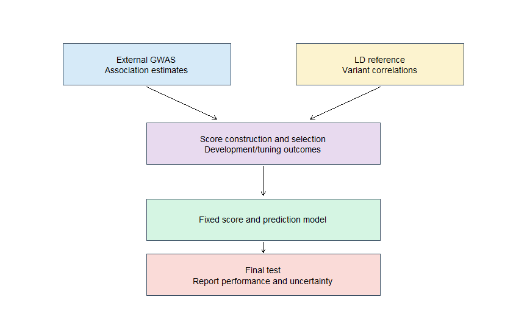
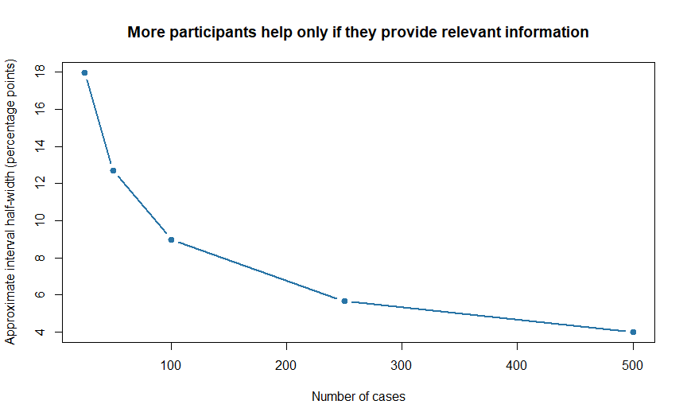
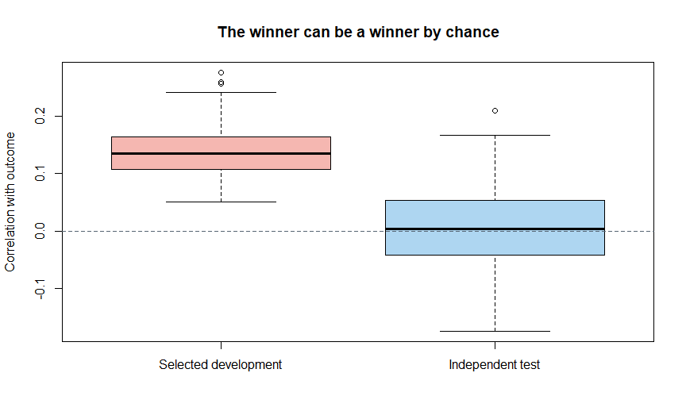

Chapter 6: Planning a Polygenic Risk Score Analysis
================

# Start with the question

Chapters 1–5 explained what a PRS is, how it is calculated and how to
interpret it. We now move toward a complete analysis. The first task is
to decide what question the analysis should answer and whether the
available data can answer it.

A command can calculate a score even when the study design is
unsuitable. For example, using a coronary artery disease susceptibility
score to predict medication response asks a different question from the
one used to develop the score. It may be a legitimate research question,
but the original validation does not establish that it will work.

> **Central idea:** Define the outcome, data roles and evaluation rules
> before choosing a score based on its performance.

This chapter uses a fictional coronary artery disease project. All
participant records and simulation results are invented. The R
practicals require no genotype download and use base R. They demonstrate
planning decisions, not a complete genetic QC pipeline.

# Your four outputs

Work through the core sections to produce: **a research question, a
dataset-role map, a completed evaluation plan, and a checked dataset
manifest**. The optional demonstrations explain why some planning rules
matter; you can return to them after completing the plan.

This is a planning chapter. It supplies executable teaching checks and a
model specification, while genotype processing and full performance
evaluation belong in later protocols.

# 1. One project, several possible questions

Imagine a research team has genotypes and clinical records from adults
in an Indian cohort. The team wants to study coronary artery disease, or
CAD: disease affecting the arteries supplying blood to the heart.

“Calculate CAD PRS” describes an operation. It does not yet describe the
scientific aim.

| Aim | Example question | Essential additional information |
|----|----|----|
| Calculate a score | Can we reproduce this published scoring model? | Scoring file, target genotypes and harmonization metadata |
| Test association | Is PRS associated with CAD status in this cohort? | Outcome, covariates and an appropriate statistical design |
| Compare prediction | Does adding PRS improve a clinical model? | Development data or a fixed model, and independent evaluation data |
| Predict future events | Does it predict first CAD events within ten years? | Baseline disease status, event dates and follow-up |
| Assess transportability | Does performance differ across relevant target groups? | Adequate group-specific outcomes, QC and uncertainty estimates |

A score can be calculated without phenotype data. Its association or
predictive performance cannot be evaluated without outcomes. Association
is also not proof of causation. \[1,2\]

## A question we can work with

> In a fictional cohort of adults aged 40–75 without CAD at baseline,
> does adding one fixed CAD PRS to age and baseline systolic blood
> pressure improve prediction of a first CAD event within five years?

For this beginner exercise, **every person’s five-year outcome is known
and no competing deaths occur**. This is a simulation assumption, not a
recommendation to discard real participants with incomplete follow-up.
Age and blood pressure form an intentionally small teaching comparator,
not a validated clinical risk calculator.

The main analysis uses logistic regression, which models the probability
of a binary outcome. We compare predictions in the same held-out people.
The complete decisions appear in Section 11.

If only existing case-control status is available, ask about CAD case
status instead. Probabilities from an artificially case-enriched sample
do not automatically estimate population disease risk.

## Extension: ten-year prediction with incomplete observation

A real prospective question might ask whether PRS improves prediction of
first CAD within ten years. This additionally requires dates, a defined
prediction horizon, and methods addressing censoring and competing
death. Do not convert the beginner logistic example into a survival
analysis simply by renaming its outcome.

# 2. Write the outcome definition before opening the scoring software

| Field | Decision to document |
|----|----|
| Outcome | CAD rather than an unspecified “heart disease” category |
| Ascertainment | Clinical adjudication, diagnosis codes, self-report or a documented combination |
| Baseline | Date at which predictors become available and follow-up begins |
| Existing disease | How people with CAD before baseline are identified |
| Event | Which diagnoses or procedures count, with code lists where relevant |
| Follow-up end | Event, loss to observation, death or study end |
| Prediction horizon | Five years in the fully observed teaching example; choose a justified horizon in real data |

**Incident disease** means new disease after baseline. **Prevalent
disease** means disease already present at the relevant assessment.
Combining them without explanation changes the question.

**Censoring** means observation ends before we know whether the event
occurs later. Someone observed event-free for two years cannot simply be
labelled a ten-year non-case. **Competing death** means death from
another cause can prevent a future CAD event. Survival methods can
handle censoring under appropriate assumptions. Estimating the
probability of CAD before competing death also requires a suitable
competing-risk approach; ordinary survival calculations that censor
deaths are not automatically the desired absolute risk.

For an educational binary-outcome exercise, it is acceptable to assume
fully observed outcomes over a fixed period. State that simplification
explicitly. Real follow-up data usually require more careful treatment.

# 3. Choose the route: apply a score or develop weights

These routes share genotype QC and harmonization but differ in the
information required.

| Route | What is fixed? | What you need | Main limitation |
|----|----|----|----|
| Apply a published score | Variant weights and score definition | Scoring file and compatible target genotypes | Published performance may not transfer |
| Build from external GWAS | Discovery association estimates | Summary statistics, method-specific inputs, often LD and tuning data | More opportunities for incompatible inputs and overfitting |
| Develop from individual-level data | Depends on the modelling plan | Large development sample with genotypes and phenotype | Data and computational demands can be substantial |

For a first applied project, evaluating a relevant published score is
often a manageable route. This is a starting point, not evidence that it
is always the best scientific choice. A methods-comparison project needs
a different design.

Choosing the best of twenty published scores using your cohort’s
outcomes is model selection. Those outcomes can no longer provide an
untouched final evaluation of the winner. \[1,2\]

## Does this route require development data?

| Task | Role of local outcomes | Need a local training/test split? |
|----|----|----|
| Calculate a fixed published PRS | None | No |
| Evaluate a completely fixed prediction model | Evaluate its predictions | Not necessarily: the eligible independent cohort can serve as the evaluation sample |
| Fit a PRS coefficient, select scores, or combine PRS with clinical predictors | Develop or select a model | Use appropriate internal validation and/or a separate evaluation sample |

A **fixed PRS** is not necessarily a **fixed probability model**. The
latter also fixes coefficients, intercept or baseline risk, predictor
transformations and preprocessing. Refitting any of these is model
development or updating. Report the original model’s validation
separately from results after updating. \[6\]

# 4. Give every dataset a job

| Dataset | Job | Common misunderstanding |
|----|----|----|
| Discovery GWAS | Estimate variant–outcome associations | It is not automatically an independent test of the resulting PRS |
| LD reference | Represent correlation between variants for the method | It does not supply clinical outcomes or validate performance |
| Development/training | Fit a prediction model or estimate parameters | Training performance is usually optimistic |
| Tuning | Choose settings, thresholds or competing scores | Calling it “validation” does not make final performance unbiased |
| Final test | Evaluate decisions already fixed | Repeatedly changing the model after testing consumes this independence |
| Score reference | Define a mean, SD or percentile distribution | It is not necessarily a disease-risk calibration population |

One dataset may serve more than one compatible role, but that reuse must
be explicit. For example, a training cohort can define the PRS mean and
SD subsequently applied to test participants. Outcome-driven model
choices must stay out of final test data.

Some software calls tuning data “validation”; other writing reserves
that word for final evaluation. Always state what the data were actually
used for. \[1,2\]

<div class="figure" style="text-align: center">


<p class="caption">

Figure 6.1: A simplified design using external GWAS and target
development/test data. The final test evaluates a fixed model; its
outcomes do not feed model selection.
</p>

</div>

The diagram covers summary-statistics-based construction. A fixed
published score can enter at the fixed-score stage if there is no new
outcome-based selection. Fitting coefficients that combine it with
clinical predictors still requires development data or a previously
specified model.

# 5. Compatibility has several parts

## Phenotype and effect scale

Check that the GWAS trait is relevant, its effect allele is defined, and
its coefficients have the documented scale. Logistic-GWAS log-odds
coefficients, odds ratios and quantitative-trait betas cannot be treated
interchangeably. Do not transform weights in a published scoring file a
second time without instructions.

## Genome build and alleles

Record build, chromosome, position and allele representation. A shared
rs identifier does not replace allele checks. Record how strand
ambiguity, duplicate records and multiallelic sites will be handled.

## Ancestry and LD

Genetic ancestry describes patterns of inherited variation, not
nationality. An Indian cohort may contain substantial genetic diversity;
an administrative label alone does not identify an appropriate LD or
score reference.

For methods such as LDpred2, the LD reference should reflect the
ancestry of the discovery GWAS. Matching only the target ancestry is
insufficient if discovery ancestry differs. Multi-ancestry inputs
require methods and reference strategies designed for them. \[3\]

Evaluate performance in relevant target groups with uncertainty. Similar
standardized score distributions do not guarantee equal predictive
accuracy. \[4\]

## Genotype coverage

Check how much of the score is actually available after QC and
alignment. A percentage matched is insufficient: missing variants can
differ in importance. Record missingness by participant as well as
absent variants across the dataset.

# 6. Independence is a property to investigate

**Sample overlap** occurs when the same participants contribute to
discovery and evaluation. Scores may then benefit from patterns specific
to those participants rather than generalizable signal.

Check consortium cohort lists, GWAS supplementary tables and cohort
contributions. When available, use discovery statistics excluding your
target cohort. Different file identifiers do not prove that the people
differ. Close relatives across datasets can also compromise an intended
independent evaluation. \[1\]

**Data leakage** occurs when information from the evaluation data enters
development in a way that would not be available in the intended use.
This includes selecting settings using test outcomes and learning
preprocessing from test predictors when assessing prediction for future
individual patients. The details of the intended application matter.

| Example | Why it matters | Planned response |
|----|----|----|
| Choose a PRS threshold on test AUC | The final metric influenced model selection | Select in development/tuning data |
| Try many scores and report the best test result | Chance performance contributes to the winner | Prespecify the score or reserve new testing data |
| Fit clinical imputation using all data | Test distribution information enters fitted preprocessing | Estimate preprocessing in training data for prospective prediction |
| Use cholesterol measured after the event | Information would not exist at prediction time | Use appropriately timed predictors |
| Put siblings in different random partitions | Shared inherited information crosses partitions | Group relatives for splitting |
| Repeatedly inspect test results while revising code choices | Test data become part of development | Separate genuine bug fixes from model changes and document both |

Not every joint operation is leakage. Applying a fixed allele-matching
rule or prespecified technical QC is different from choosing a rule
because it improves outcome prediction. Write which transformations are
learned, from which data, and when.

# 7. R practical: keep families together when splitting

A random row split can place relatives in both training and test data.
Here we split fictional family groups instead. In real data, groups
should reflect relatedness information; an administrative family ID can
miss relatives.

``` r
set.seed(606)
family_sizes <- rep(c(1,2,3), length.out = 120)
people <- data.frame(
  IID = sprintf("P%03d", seq_len(sum(family_sizes))),
  Family_group = rep(sprintf("F%03d", 1:120), family_sizes)
)
family_order <- sample(unique(people$Family_group))
training_families <- family_order[1:84]
people$Partition <- ifelse(people$Family_group %in% training_families,
                           "Development", "Test")
stopifnot(length(intersect(
  people$Family_group[people$Partition == "Development"],
  people$Family_group[people$Partition == "Test"])) == 0)
knitr::kable(as.data.frame(table(people$Partition)),
             col.names = c("Partition", "Participants"))
```

| Partition   | Participants |
|:------------|-------------:|
| Development |          167 |
| Test        |           73 |

We assigned 70% of families to development. Because family sizes differ,
exactly 70% of participants need not be assigned there. Seventy/thirty
is a teaching choice, not a universally optimal split.

Within development data, use appropriate internal validation for any
tuning. Keep relatives together there too. Group-level allocation may
need to consider event counts and site balance. A family-aware split
still does not prove independence from the discovery GWAS.

Keeping relatives in the same partition also does not make them
independent *within* that partition. Depending on the analysis, related
participants may require a model or uncertainty calculation that
accounts for dependence, such as resampling whole family groups. Site
clustering can matter too. The main worked protocol below instead
assumes unrelated participants; this family exercise teaches an
alternative design issue.

# 8. Plan precision before committing the dataset

There is no universal minimum number of people for a useful PRS
analysis. Requirements depend on event frequency, model complexity,
expected predictive performance, subgroup analyses and the precision
needed. Model development and external validation have different
sample-size objectives. Development needs enough information to estimate
the model reliably; validation needs enough information to estimate its
performance precisely. \[5,7\]

A cohort with 20,000 participants and 40 events can be less informative
for a disease prediction question than a smaller cohort with many more
events. Ancestry-specific estimates need adequate information within
each group, not merely a large total cohort.

For the main protocol, the primary quantity is the paired difference in
AUC. Plan its precision using plausible event rates, performance and
correlation between the two models’ predictions. A simulation can
generate independent development and test cohorts under several
plausible scenarios, fit both planned models, and assess interval widths
over repetitions. Its assumptions must be justified; there is no
universal sample count to copy. Also plan precision for calibration and
any subgroup claims. \[7\]

## Optional intuition exercise: sensitivity at a fixed threshold

This exercise is **not** the sample-size justification for our AUC
comparison. Suppose a classification threshold was fixed beforehand and
sensitivity is 0.30. A simple binomial approximation gives:

``` text
Approximate SE of sensitivity = sqrt(sensitivity × (1 - sensitivity) / number of cases)
```

``` r
cases <- c(25, 50, 100, 250, 500)
assumed_sensitivity <- 0.30
half_width <- 1.96 * sqrt(assumed_sensitivity * (1-assumed_sensitivity) / cases)
precision <- data.frame(Cases = cases,
  Approximate_95CI_half_width_percentage_points = round(100 * half_width, 1))
knitr::kable(precision)
```

| Cases | Approximate_95CI_half_width_percentage_points |
|------:|----------------------------------------------:|
|    25 |                                          18.0 |
|    50 |                                          12.7 |
|   100 |                                           9.0 |
|   250 |                                           5.7 |
|   500 |                                           4.0 |

<div class="figure" style="text-align: center">


<p class="caption">

Figure 6.2: Approximate uncertainty decreases as case counts increase.
This illustrates sensitivity precision only; it is not a PRS study
sample-size calculator.
</p>

</div>

At small counts or extreme proportions, this normal approximation is
inadequate; use suitable interval methods. A formal calculation for the
actual study should address its primary performance measure, event rate
and design. Do not use a simple “ten events per variable” rule as a
complete justification.

# 9. Optional demonstration: selecting the best result can create an illusion

Suppose twenty candidate scores contain no true predictive signal. If we
choose whichever has the largest correlation with an outcome, its
observed development correlation will tend to be positive just by
selection.

The simulation below creates unrelated random scores and outcomes. It
selects in development data and evaluates the selected score in
independent test data. It demonstrates selection bias, not real genetic
architecture. Real candidate PRSs are often correlated; twenty
independent scores illustrate the mechanism, not the expected amount of
optimism in a particular PRS comparison.

``` r
set.seed(607)
repetitions <- 150
candidates <- 20
selected_results <- replicate(repetitions, {
  development_scores <- matrix(rnorm(200*candidates), nrow=200)
  test_scores <- matrix(rnorm(200*candidates), nrow=200)
  development_outcome <- rnorm(200)
  test_outcome <- rnorm(200)
  development_r <- as.numeric(cor(development_scores, development_outcome))
  selected <- which.max(development_r)
  c(Selected_development = development_r[selected],
    Independent_test = cor(test_scores[,selected], test_outcome))
})
knitr::kable(data.frame(Mean_correlation = rowMeans(selected_results)), digits=3)
```

|                      | Mean_correlation |
|:---------------------|-----------------:|
| Selected_development |            0.140 |
| Independent_test     |            0.004 |

<div class="figure" style="text-align: center">


<p class="caption">

Figure 6.3: Selecting among random candidates raises apparent
development performance. Independent evaluation exposes the lack of
signal across repetitions.
</p>

</div>

The test mean should fluctuate near zero. A particular test result can
still be positive or negative by chance. Reusing that test result to
select another score turns it into tuning data.

Nested cross-validation is one option when a separate test set is
impractical: inner folds select settings and outer folds evaluate the
whole selection process. All outcome-informed steps belong inside the
appropriate training folds. A random split within one cohort is internal
evaluation, not proof of transportability to a new healthcare setting.
\[1,2\]

# 10. Prespecify what will count as evidence

For the CAD project, choose the primary objective and metric before
comparing results.

| Objective | Possible primary result | Supporting results |
|----|----|----|
| Association | Adjusted OR per defined PRS SD with interval | Robustness to relevant covariates and population structure |
| Incremental binary prediction | Difference in test AUC, with paired uncertainty | Calibration and probability error |
| Quantitative prediction | Difference in test prediction error or R-squared | Calibration of predicted versus observed values |
| Future-event prediction | A specified time-dependent performance measure | Calibration at the time horizon and censoring assumptions |

No single metric establishes clinical usefulness. Report both positive
and inconclusive findings. Trying many diseases, score methods,
subgroups and thresholds creates multiple comparisons; distinguish
confirmatory analyses from exploratory ones and use an appropriate
multiplicity strategy.

Write the baseline clinical model explicitly. “Adjusted for covariates”
is insufficient. Covariates for confounding control and predictors for
prospective prediction serve different purposes; a variable can be
appropriate for one aim and inappropriate for another.

# 11. A completed teaching protocol

This is a **fictional, fully observed five-year cohort**. Its
deliberately simple model is for learning, not clinical deployment. It
assumes unrelated participants from one recruitment setting, a fixed
score obtained independently of the cohort, complete baseline
predictors, and usable genotypes for every score variant. The R
illustrations do not establish power for a real project.

| Decision | Prespecified teaching choice |
|----|----|
| Population | Adults 40–75, no CAD at baseline; unrelated participants |
| Outcome | CAD5 = 1 for a first adjudicated myocardial infarction or coronary revascularization during five years; otherwise 0; all outcomes observed and no competing deaths in this fictional exercise |
| Score | One fixed externally derived CAD score; no local comparison of competing scores or thresholds |
| Baseline predictors | Age in years and systolic blood pressure (SBP) in mmHg, measured at baseline |
| Baseline model | Logistic regression: CAD5 ~ age10 + sbp10 |
| Extended model | Logistic regression: CAD5 ~ age10 + sbp10 + PRS_z |
| Transformations | age10 = (age - 60)/10; sbp10 = (SBP - 120)/10; PRS_z uses development mean and SD |
| Functional form | Linear terms on the log-odds scale; no interactions or variable selection in this exercise |
| Allocation | Random 70% development / 30% test, fixed seed 606; illustrative allocation, not an optimality claim |
| Primary metric | Test AUC(extended) minus test AUC(baseline), evaluated in the same participants |
| Primary uncertainty | 2,000 paired test-participant bootstrap resamples; 2.5th and 97.5th percentiles of AUC differences; fixed fitted models |
| Supporting evaluation | Brier score for each model; calibration intercept and slope where estimable; a calibration plot with uncertainty |
| Missing information | The simulation requires complete predictors, outcome and score; stop if assumptions fail rather than silently deleting people or inventing values |
| Thresholds and subgroups | No classification threshold or confirmatory subgroup comparisons in this first exercise |
| Interpretation | A positive AUC difference indicates better ranking here; it does not alone establish useful probabilities or clinical benefit |

**What uncertainty is included?** Resampling the test participants
estimates evaluation uncertainty conditional on the fitted models. It
does not include variation from obtaining a different development
sample. If the goal is to evaluate the entire development procedure,
resampling or nested validation must include that procedure. Bootstrap
samples containing only one outcome class cannot yield an AUC; record
such failures and reconsider feasibility if they occur frequently.

**What does an inconclusive interval mean?** If the interval includes
zero, the evaluation does not clearly distinguish the models’ ranking
performance at that precision. It does not prove equivalence or
demonstrate that the PRS is useless. A small positive difference also
does not establish clinical importance.

## Model specification in R

The following chunk is deliberately disabled: `development` and `test`
will be prepared from checked data in the later analysis protocol. It
shows precisely what will be fitted, not fabricated output.

``` r
required <- c("CAD5", "age", "SBP", "PRS")
stopifnot(all(required %in% names(development)),
          all(required %in% names(test)))
stopifnot(all(vapply(development[required], is.numeric, logical(1))),
          all(vapply(test[required], is.numeric, logical(1))))
stopifnot(all(is.finite(as.matrix(development[required]))),
          all(is.finite(as.matrix(test[required]))),
          all(development$CAD5 %in% c(0, 1)),
          all(test$CAD5 %in% c(0, 1)),
          length(unique(development$CAD5)) == 2,
          length(unique(test$CAD5)) == 2)
prs_mean <- mean(development$PRS)
prs_sd <- sd(development$PRS)
stopifnot(is.finite(prs_sd), prs_sd > 0)
prepare_predictors <- function(d) {
  d$age10 <- (d$age - 60) / 10
  d$sbp10 <- (d$SBP - 120) / 10
  d$PRS_z <- (d$PRS - prs_mean) / prs_sd
  d
}
development <- prepare_predictors(development)
test <- prepare_predictors(test)
model_base <- glm(CAD5 ~ age10 + sbp10, data=development,
                  family=binomial())
model_prs <- glm(CAD5 ~ age10 + sbp10 + PRS_z, data=development,
                 family=binomial())
stopifnot(model_base$converged, model_prs$converged,
          all(is.finite(coef(model_base))),
          all(is.finite(coef(model_prs))))
test$p_base <- predict(model_base, newdata=test, type="response")
test$p_prs <- predict(model_prs, newdata=test, type="response")
```

Review fitting warnings, separation and calibration even if these guards
pass. Do not use test performance to revise the functional form and then
describe the same results as untouched testing.

## What must change for real data?

| Teaching simplification | Real-project decision |
|----|----|
| Complete predictors | Choose a justified missing-data method; learn prediction-time preprocessing in development data and apply it consistently |
| Every scoring variant available | Specify coverage and genotype-missingness rules using the score documentation; audit which variants are absent |
| Unrelated participants | Define relatedness handling and account for remaining clustering in uncertainty |
| One recruitment setting | Investigate site and genotyping batch effects and transportability |
| Fully observed five-year outcome | Use suitable time-to-event methods if observation is incomplete; do not discard censored people to imitate this exercise |
| Age and SBP comparator | Choose the clinical comparator relevant to the actual question, with all required predictors and coefficients documented |

## Covariates: explain their job

For an association study, age, sex, ancestry principal components and
technical factors may help address relevant structure or measurement
differences. The needed adjustment depends on the study; there is no
universal number of principal components.

For prediction, explain whether each variable would be available when a
new person’s prediction is made. Compare models on the same people and
use the same justified non-PRS predictors in both. An association model
adjusted for ancestry is not automatically a validated clinical
prediction model. Evaluate calibration and discrimination within
adequately supported populations; standardizing PRS does not remove
population differences in performance. \[2,4\]

# 12. R practical: create a dataset manifest and protocol record

A **manifest** is a table describing the files and their roles. It helps
another researcher understand what was used without guessing from
filenames.

``` r
manifest <- data.frame(
  Role = c("Scoring file", "Target genotypes", "Phenotypes", "Covariates",
           "Relatedness groups", "Score reference"),
  File = c("score.tsv", "target.pgen + target.pvar + target.psam",
           "phenotypes.tsv", "covariates.tsv", "relatedness_groups.tsv",
           "reference_parameters.tsv"),
  Version_or_date = rep("TO_COMPLETE", 6),
  Build_or_units = rep("TO_COMPLETE", 6),
  Source = rep("TO_COMPLETE", 6),
  Participant_key = c("Not applicable", rep("IID", 4), "Not applicable"),
  Row_structure = rep("TO_COMPLETE", 6),
  Missing_codes = rep("TO_COMPLETE", 6),
  Checksum = rep("TO_COMPLETE", 6)
)
knitr::kable(manifest)
```

| Role | File | Version_or_date | Build_or_units | Source | Participant_key | Row_structure | Missing_codes | Checksum |
|:---|:---|:---|:---|:---|:---|:---|:---|:---|
| Scoring file | score.tsv | TO_COMPLETE | TO_COMPLETE | TO_COMPLETE | Not applicable | TO_COMPLETE | TO_COMPLETE | TO_COMPLETE |
| Target genotypes | target.pgen + target.pvar + target.psam | TO_COMPLETE | TO_COMPLETE | TO_COMPLETE | IID | TO_COMPLETE | TO_COMPLETE | TO_COMPLETE |
| Phenotypes | phenotypes.tsv | TO_COMPLETE | TO_COMPLETE | TO_COMPLETE | IID | TO_COMPLETE | TO_COMPLETE | TO_COMPLETE |
| Covariates | covariates.tsv | TO_COMPLETE | TO_COMPLETE | TO_COMPLETE | IID | TO_COMPLETE | TO_COMPLETE | TO_COMPLETE |
| Relatedness groups | relatedness_groups.tsv | TO_COMPLETE | TO_COMPLETE | TO_COMPLETE | IID | TO_COMPLETE | TO_COMPLETE | TO_COMPLETE |
| Score reference | reference_parameters.tsv | TO_COMPLETE | TO_COMPLETE | TO_COMPLETE | Not applicable | TO_COMPLETE | TO_COMPLETE | TO_COMPLETE |

These are example filenames, not files supplied with this chapter. Add
discovery statistics and LD-reference entries when developing weights.
Record download dates, versions, checksums where feasible, phenotype
code lists and software commands. \[2\]

## Practical: check identities before joining files

An identifier is a label, not a measurement: keep it as character text
so leading zeros survive. In a real PLINK project, use a verified unique
key, which may require both FID and IID. Our teaching files use globally
unique IID values. Repeated visits require a different row structure and
an explicit baseline-selection rule.

``` r
scores <- data.frame(IID=c("P001", "P002", "P003", "P004"),
                     PRS=c(0.2, -0.4, 0.7, 0.1))
phenotypes <- data.frame(IID=c("P001", "P002", "P003", "P005"),
                        CAD5=c(0L, 1L, 0L, 1L))
check_ids <- function(d) {
  stopifnot("IID" %in% names(d), is.character(d$IID),
            !anyNA(d$IID), all(nzchar(trimws(d$IID))),
            identical(d$IID, trimws(d$IID)), !anyDuplicated(d$IID))
  invisible(TRUE)
}
check_ids(scores)
check_ids(phenotypes)
join_audit <- data.frame(
  Item=c("Score records", "Phenotype records", "Matched people",
         "Score only", "Phenotype only"),
  N=c(nrow(scores), nrow(phenotypes),
      length(intersect(scores$IID, phenotypes$IID)),
      length(setdiff(scores$IID, phenotypes$IID)),
      length(setdiff(phenotypes$IID, scores$IID))))
knitr::kable(join_audit)
```

| Item              |   N |
|:------------------|----:|
| Score records     |   4 |
| Phenotype records |   4 |
| Matched people    |   3 |
| Score only        |   1 |
| Phenotype only    |   1 |

``` r
# Keep all IDs visible while investigating mismatches.
audited_join <- merge(scores, phenotypes, by="IID", all=TRUE)
knitr::kable(audited_join)
```

| IID  |  PRS | CAD5 |
|:-----|-----:|-----:|
| P001 |  0.2 |    0 |
| P002 | -0.4 |    1 |
| P003 |  0.7 |    0 |
| P004 |  0.1 |   NA |
| P005 |   NA |    1 |

``` r
# Demonstrate that duplicate identifiers are detected without stopping knitting.
duplicate_example <- rbind(scores, scores[1, ])
duplicate_detected <- inherits(try(check_ids(duplicate_example), silent=TRUE),
                              "try-error")
stopifnot(duplicate_detected)
```

Expected audit: **4 score records, 4 phenotype records, 3 matches, 1
score-only and 1 phenotype-only record**. P004 and P005 need
investigation. A missing outcome is not a control, and an absent PRS is
not a score of zero. Do not silently use an inner join that hides these
losses. Record the resolution and repeat these checks when adding
covariates.

``` r
protocol <- data.frame(
  Decision = c("Question", "Population", "Outcome and horizon", "Score ID/version",
    "Baseline model", "Discovery overlap", "Development/test allocation",
    "Missing data", "Primary metric", "Uncertainty method", "Subgroups",
    "Exploratory analyses", "Protocol date"),
  Plan = rep("TO_COMPLETE", 13)
)
knitr::kable(protocol)
```

| Decision                    | Plan        |
|:----------------------------|:------------|
| Question                    | TO_COMPLETE |
| Population                  | TO_COMPLETE |
| Outcome and horizon         | TO_COMPLETE |
| Score ID/version            | TO_COMPLETE |
| Baseline model              | TO_COMPLETE |
| Discovery overlap           | TO_COMPLETE |
| Development/test allocation | TO_COMPLETE |
| Missing data                | TO_COMPLETE |
| Primary metric              | TO_COMPLETE |
| Uncertainty method          | TO_COMPLETE |
| Subgroups                   | TO_COMPLETE |
| Exploratory analyses        | TO_COMPLETE |
| Protocol date               | TO_COMPLETE |

Optional export, after editing the fields:

``` r
dir.create("analysis_plan", showWarnings = FALSE)
write.table(manifest, "analysis_plan/dataset_manifest.tsv",
            sep="\t", row.names=FALSE, quote=FALSE)
write.table(protocol, "analysis_plan/protocol.tsv",
            sep="\t", row.names=FALSE, quote=FALSE)
```

The export chunk is disabled so knitting does not overwrite a completed
plan. The templates contain no personal data. Public GitHub repositories
should contain code, documentation and shareable teaching data; keep
restricted participant data in their approved environment.

# 13. Which tools will we use?

R remains the teaching and analysis language. Genomic tools will handle
tasks better suited to their data formats and algorithms.

| Task | Tool role in this course |
|----|----|
| Inspect tables, fit outcome models, evaluate predictions | R |
| Genotype filtering, format handling and weighted scoring | PLINK, with version-specific commands |
| LDpred2 modelling | R/bigsnpr |
| PRS-CS modelling | Its documented Python workflow |
| Apply documented published scores at scale | A suitable scoring pipeline such as pgsc_calc |
| Run and record commands | Terminal/Bash and version-controlled scripts |

This chapter does not choose a winning algorithm. Later method chapters
will explain input requirements, assumptions, pros and cons. Start with
a manageable pilot to check files and resource requirements before
scaling up. A dense matrix of millions of variants can exceed laptop
memory; genotype tools avoid treating the full dataset as an ordinary
spreadsheet.

# 14. Before proceeding

You are ready for data preparation when you can answer:

- What exact question are we answering?
- What outcome and time period do the data support?
- Are we applying fixed weights or developing/selecting a score?
- Which data make each modelling decision?
- How will discovery overlap and relatedness be investigated?
- Which reference supports LD and which supports score interpretation?
- What is the primary evaluation, and how will uncertainty be reported?
- What findings would be too imprecise to support a conclusion?

An unresolved item is a planning task, not a reason to invent a default
after seeing the results. The editable template is a record for your own
project; Section 11 supplies the completed teaching example.

# Real research example: separating score selection from testing

Khera and colleagues studied genome-wide scores for several common
diseases, including CAD. They used external GWAS evidence and LD
information to construct candidate scores, selected scores in a UK
Biobank validation subset, and evaluated them in a separate testing
subset. Their terminology illustrates why we should describe each
dataset’s actual role: the selection subset served a tuning purpose.
\[8\]

For CAD, Table 3 compares the top 5% of scores with the remaining 95%:
the adjusted odds ratio was 3.34 (95% CI 3.12–3.58), adjusting for age,
sex, genotyping array and four ancestry principal components. This is a
disease-status association, not a ten-year absolute-risk estimate or a
demonstration of incremental clinical utility. The analysis primarily
involved European-ancestry participants; it cannot establish performance
in the fictional Indian cohort. \[8\]

**Planning lesson:** Separate construction, selection and evaluation;
then match the claim to the study design. Do not borrow a published
performance estimate as the expected result for a new population.

# 15. Practice with answers

**1. You have target genotypes but no phenotypes. Can you calculate and
validate a PRS?**

You can calculate a compatible score. You cannot evaluate outcome
prediction in those people without phenotype information.

**2. You test fifteen published scores and report the highest AUC in the
same cohort. What changed?**

The cohort participated in selection. The winner needs evaluation that
accounts for the selection process, such as properly nested validation
or new independent data.

**3. Why is 50,000 participants not enough information to judge
feasibility?**

Event counts, follow-up, outcome quality, model complexity, subgroup
sizes and desired precision remain unknown.

**4. A person has no event after two years of observation. Can they be a
ten-year non-case?**

Not without further information. Their observation is incomplete for
that horizon.

**5. Does a family-aware split eliminate discovery GWAS overlap?**

No. It addresses relatedness across the local partitions. Discovery
overlap requires a separate investigation.

**6. Why use random scores in the selection demonstration?**

We know they contain no true signal, allowing us to show how choosing
the best apparent result alone creates optimism.

# 16. What comes next?

The analysis plan tells us what data and evidence we need. The next
stage is preparing the project and checking the input datasets before
score calculation. Keep the plan versioned: justified changes are
allowed, but record when and why they occurred and whether outcomes had
already been examined.

# References

1.  Choi SW, Mak TSH, O’Reilly PF. **Tutorial: a guide to performing
    polygenic risk score analyses.** Nature Protocols.
    2020;15:2759–2772. <https://doi.org/10.1038/s41596-020-0353-1>

2.  Wand H, Lambert SA, Tamburro C, et al. **Improving reporting
    standards for polygenic scores in risk prediction studies.** Nature.
    2021;591:211–219. <https://doi.org/10.1038/s41586-021-03243-6>

3.  Privé F. **Polygenic scores and inference using LDpred2.** bigsnpr
    documentation.
    <https://privefl.github.io/bigsnpr/articles/LDpred2.html>

4.  Martin AR, Kanai M, Kamatani Y, Okada Y, Neale BM, Daly MJ.
    **Clinical use of current polygenic risk scores may exacerbate
    health disparities.** Nature Genetics. 2019;51:584–591.
    <https://doi.org/10.1038/s41588-019-0379-x>

5.  Riley RD, Ensor J, Snell KIE, et al. **Calculating the sample size
    required for developing a clinical prediction model.** BMJ.
    2020;368:m441. <https://doi.org/10.1136/bmj.m441>

6.  Riley RD, Archer L, Snell KIE, et al. **Evaluation of clinical
    prediction models (part 2): how to undertake an external validation
    study.** BMJ. 2024;384:e074820.
    <https://doi.org/10.1136/bmj-2023-074820>

7.  Riley RD, Snell KIE, Archer L, et al. **Evaluation of clinical
    prediction models (part 3): calculating the sample size required for
    an external validation study.** BMJ. 2024;384:e074821.
    <https://doi.org/10.1136/bmj-2023-074821>

8.  Khera AV, Chaffin M, Aragam KG, et al. **Genome-wide polygenic
    scores for common diseases identify individuals with risk equivalent
    to monogenic mutations.** Nature Genetics. 2018;50:1219–1224.
    <https://doi.org/10.1038/s41588-018-0183-z>
